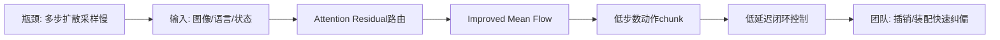
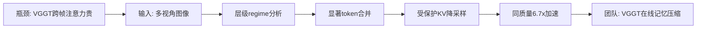
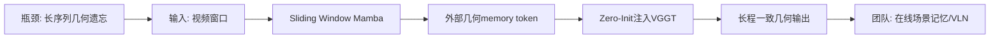
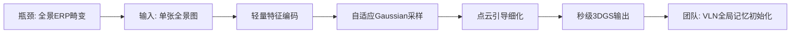

# 科研晨报：具身模型、VGGT 空间理解与全景在线记忆

## 今日主线

今天的核心变化不是“更大的 VLA”，而是三类更接近落地的问题：

1. **具身模型正在从模型论文转向运行时与低延迟控制**：Embodied.cpp 和 ReactVLA 都指向同一个判断——真实机器人瓶颈不只是成功率，而是 batch-1、闭环、多频率、异步推理和动作刷新延迟。
2. **VGGT 系列正在进入工程化阶段**：RegimeVGGT 关注训练-free 加速，Mamba-VGGT 关注长序列几何记忆。这两条线都直接影响“VGGT 能否接入机器人在线场景记忆”。
3. **全景 feed-forward 3D 表示值得重点跟踪**：FastPano3D 从单张全景图直接生成 3DGS，虽然还不是 streaming/VLN 系统，但对“全景输入 → 快速场景记忆 → VLN/EQA”是明确的技术信号。

---

## 5条简报

### 1. Embodied.cpp: A Portable Inference Runtime of Embodied AI Models on Heterogeneous Robots

**一句话结论**：这不是新 VLA，而是面向 VLA/WAM 真实部署的 C++ 运行时；对低延迟、边缘端、多机器人平台部署非常关键。

**为什么值得关注**：目前大部分 VLA/WAM 代码仍停留在 Python 研究栈，真实机器人部署时需要处理多频控制、batch-1 低延迟推理、传感器/状态输入适配、action head 插件和硬件后端差异。Embodied.cpp 将 embodied model 的执行路径拆成 input adapters、sequence builders、backbone execution、head plugins、deployment adapters 五层，并在 HY-VLA、pi0.5 以及 WAM block 上做了验证。论文报告两个 VLA 部署分别达到 100.0% 和 91.0% 任务成功率，WAM benchmark 中将 block memory 从 312.2 MiB 降到 88.1 MiB。来源：[arXiv](https://arxiv.org/abs/2607.02501)，[GitHub](https://github.com/SEU-PAISys/Embodied.cpp)。

**是否开源**：代码已公开，仓库为 `SEU-PAISys/Embodied.cpp`；模型权重、数据是否完整公开需要进一步检查仓库。

**所需算力**：训练算力不适用或未知；重点是推理部署。论文强调异构硬件、边缘端、batch-1、低延迟 fused inference。WAM block memory 从 312.2 MiB 降到 88.1 MiB，说明它更像部署层优化，而不是模型能力提升。

**输入/输出**：输入是视觉、语言、机器人状态等 embodied 接口；输出是 VLA 动作或 WAM 中间/预测模块结果。它提供的是运行时抽象，而非固定模型。

**核心 insight**：VLA/WAM 的落地需要统一“运行时合同”：多频率闭环执行、低延迟 batch-1 推理、可扩展 embodied I/O，而不是仅仅把模型放进推理服务。

**思路来源与前序瓶颈**：从 OpenVLA、pi0、pi0.5、GROOT、WAM 等模型快速发展而来。前序瓶颈是每个模型都有自己的 Python glue code，跨机器人、跨硬件、跨 action head 难复用；它把这一问题抽象成 runtime/system 问题。

**对团队启发**：如果团队后续同时跑 StarVLA、pi0.x、VLA-Adapter、VGGT memory、WAM-lite，不应让每个学生各写一套部署代码。可以设计一个小型组内 `robot_policy_runtime`：统一 camera/state/action chunk 接口，保留 IR/偏振/触觉/全景输入 adapter，为真实抓取、插销、装配任务减少工程碎片化。

#### 总览图（Mermaid）

---

### 2. ReactVLA: Fast and Lightweight Reactive Robot Manipulation via Improved Mean Flow Action Generation

**一句话结论**：ReactVLA 把 diffusion-style VLA 的多步采样压到 one/few-step action generation，目标是让 VLA 进入反应式闭环控制。

**为什么值得关注**：扩散式 VLA 的优势是动作分布表达能力强，但多步 denoising 会带来推理延迟。ReactVLA 用 improved Mean Flow action generator 替代多步采样，并引入 Attention Residuals 做动态深度特征路由。论文报告在 LIBERO、RoboIMI 和真实机械臂任务上超过同规模 VLA baseline，相比领先 VLA 模型推理速度提升超过 4×，真实策略延迟低于 38.6 ms。来源：[arXiv](https://arxiv.org/abs/2606.14255)，[项目页](https://game-loader.github.io/ReactVLA/)。

**是否开源**：项目页已公开；代码、模型、数据是否完整开放未在当前检索结果中确认。

**所需算力**：训练算力未知；从方法看，主要成本在训练 diffusion/flow action head 与 VLA backbone。推理侧主打 one/few-step，低于 38.6 ms 的真实策略延迟说明适合闭环 reactive manipulation。

**输入/输出**：输入是多模态观测、语言和机器人状态；输出是动作 chunk 或连续动作。核心输出不是未来图像，而是低延迟动作生成。

**核心 insight**：机器人 action chunk 是低维控制目标，不一定需要图像生成中那套复杂多步采样；用 Mean Flow 直接学习从噪声动作到目标动作的传输，可以在保留多模态动作分布的同时压低延迟。

**思路来源与前序瓶颈**：从 Diffusion Policy、π0、SmolVLA 等扩散/流式 action head 发展而来。前序瓶颈是多步采样在桌面操作中可接受，但在移动目标、插销纠偏、接触瞬态控制中延迟过高。

**对团队启发**：插销、装配、透明/反光物体抓取不只需要“看懂”，还需要快速纠偏。可把 ReactVLA 思路转成组内课题：在同一 VLA backbone 上比较 diffusion 10-step、one-step、Mean Flow、action chunk overlap，对比成功率、time-to-success、接触失败恢复次数。

#### 总览图（Mermaid）

---

### 3. RegimeVGGT: Layer-Wise Spatially Preserving Redundancy Removal for VGGT

**一句话结论**：RegimeVGGT 是 VGGT 的训练-free 加速方案，核心是发现不同层的几何功能不同，然后按层做 U-shaped compression。

**为什么值得关注**：VGGT 的价值在于一次前向传播恢复 dense 3D scene structure，但 cross-frame attention 的二次复杂度限制长序列和多视角扩展。RegimeVGGT 通过 spectral、probing、causal 分析把 VGGT 层划成三个 regime：浅层缺少跨视角结构，中层负责跨视角对齐，深层对 dense geometry 有冗余但对 pose 仍关键。方法包括 Saliency-Guided Banded Merging 和 Selectively Protected K/V Downsampling，在匹配重建质量下报告 6.7× 加速。来源：[arXiv](https://arxiv.org/abs/2606.18439)。

**是否开源**：当前检索未确认代码、模型或数据公开。

**所需算力**：训练-free，几乎不需要重新训练；推理算力显著降低。对已有 VGGT pipeline 来说，这是可以优先复现的低成本工程优化。

**输入/输出**：输入仍是多视角图像；输出仍是 VGGT 风格的 camera、depth、point map 或 dense geometry。改变的是 token/KV 计算路径。

**核心 insight**：VGGT 的每一层不是等价的，不能简单均匀 token pruning。要保护边缘/几何显著 token、camera/register token、pose-critical path，同时在冗余层压缩 dense geometry 计算。

**思路来源与前序瓶颈**：从 VGGT、FastVGGT/FlashVGGT 类加速工作发展而来。前序方法多从统一 token/attention 裁剪出发，忽略层级功能差异，容易损伤 pose 或 cross-view alignment。

**对团队启发**：陈瑞阳方向如果要做 stream feed-forward reconstruction，不一定先改架构；可以先做 VGGT token budget profiling：哪些层对 camera pose、point map、semantic memory、action-relevant geometry 最敏感。这个分析可以直接变成一篇“VGGT for robot memory compression”的实验型工作。

#### 总览图（Mermaid）

---

### 4. Mamba-VGGT: Persistent Long-Sequence Video Geometry Grounded Transformer via External Sliding Window Mamba Memory

**一句话结论**：Mamba-VGGT 针对长视频 VGGT 的几何遗忘与累积漂移，引入外部 Sliding Window Mamba memory 来传播全局几何先验。

**为什么值得关注**：VGGT 在高质量 3D 重建上很强，但长序列时全局 attention 不可承受，通常只能截断窗口，导致 catastrophic geometric forgetting 和 trajectory drift。Mamba-VGGT 用 Sliding Window Mamba 维护外部 memory token，并通过 Zero-Init Spatial Memory Injector 把长期几何记忆注入 patch token，目标是在不破坏预训练 VGGT 空间特征的情况下增强长程一致性。来源：[arXiv](https://arxiv.org/abs/2605.17478)。

**是否开源**：当前检索未确认代码、模型或数据公开。

**所需算力**：训练/微调成本未知；推理侧理论上通过 selective state-space memory 避免全局 quadratic attention，适合长序列，但实际显存和延迟需要复现确认。

**输入/输出**：输入是长序列视频或连续多视角帧；输出仍是 VGGT 风格几何结果，如相机、深度、点图/稠密结构。中间表示是外部 Mamba memory token。

**核心 insight**：在线几何系统不需要每次都全局重算 attention；可以把跨窗口几何一致性压缩进持久 memory，再注入当前窗口。

**思路来源与前序瓶颈**：从 VGGT 的 feed-forward 3D foundation model 与 Mamba/SSM 长序列建模发展而来。前序瓶颈是窗口化 VGGT 对长场景会忘记早期结构，直接全局 attention 又显存爆炸。

**对团队启发**：这篇和陈瑞阳方向高度相关。可以考虑一个更轻量的组内版本：不一定训练 Mamba-VGGT，而是先做 `VGGT window + compact 3D memory`，把历史窗口压缩成 3DGS/点云/semantic anchors，再给下一窗口做 pose 或 object-level consistency constraint。

#### 总览图（Mermaid）

---

### 5. FastPano3D: Feed-Forward Indoor Panoramic 3D Reconstruction from a Single Image

**一句话结论**：FastPano3D 用单张全景图直接生成可渲染 3D Gaussian 表示，是“全景输入 → 秒级 3D 记忆”的重要信号。

**为什么值得关注**：全景图天然有 360° 覆盖，但 equirectangular projection distortion 和空间非均匀特征分布会让直接生成 3DGS 很难。FastPano3D 采用轻量 feature encoder、自适应 Gaussian sampling 和 point-cloud-guided refinement，不依赖 test-time optimization，从单张全景图重建室内 3DGS。论文报告数秒内完成高保真重建，相比 Pano2Room 等 prior SOTA 推理快 156×，参数量约为一半。来源：[arXiv](https://arxiv.org/abs/2606.30352)。

**是否开源**：当前检索未确认代码、模型或数据公开。

**所需算力**：训练算力未知；推理侧主打 feed-forward、单图、秒级，无 per-scene optimization。对机器人在线系统来说，真正风险在于单图几何幻觉、尺度可靠性、动态物体和可行走/可操作区域精度。

**输入/输出**：输入是单张室内全景图；输出是 renderable 3D Gaussian representation。中间包含轻量图像特征、自适应 Gaussian sample、点云引导 refinement。

**核心 insight**：全景图虽然有 ERP 畸变，但它一次性覆盖全局场景；只要设计适合全景的采样和 refinement，单张全景图可能比多张透视图更适合快速建立“全局场景初始记忆”。

**思路来源与前序瓶颈**：从 Pano2Room、panoramic 3DGS、feed-forward 3DGS 和单图室内重建发展而来。前序瓶颈是全景重建常依赖多视图监督或逐场景优化，难以服务实时机器人和 VLN。

**对团队启发**：全景模态可以作为 VLN/EQA 的 memory initializer：机器人进房间先用 360 相机建立粗 3DGS/semantic map，再由普通 RGB wrist camera 或 head camera 做局部更新。可延展为“single panorama → VGGT/3DGS memory → language-guided navigation/action”的轻量系统。

#### 总览图（Mermaid）

---

## 三条主线映射

| 主线 | 今日覆盖 | 关键判断 |
|---|---|---|
| 具身模型 | Embodied.cpp、ReactVLA | 低延迟不只是 action head 问题，也包括运行时、batch-1、异步、多频闭环与硬件适配。|
| 场景理解模型 | RegimeVGGT、Mamba-VGGT | VGGT 正从“能重建”进入“能加速、能长序列、能作为机器人记忆底座”的阶段。|
| 生成感知模型 | Mamba-VGGT、FastPano3D | 生成/重建模型需要从离线优化转向 feed-forward、online memory 和可被 VLN/VLA 消费的紧凑状态。|
| 横向全景模态 | FastPano3D | 全景的真正增益在于全局覆盖和初始场景记忆，但要警惕 ERP 畸变、尺度漂移和单图 hallucination。|

---

## 组会讨论题

1. **我们的 VLA 部署是否应该先统一 runtime，而不是继续每个模型单独写接口？** 讨论是否建立组内统一 camera/state/action chunk/multimodal adapter。
2. **ReactVLA 类 one/few-step action head 是否适合插销任务？** 插销任务的瓶颈可能不是语义理解，而是接触后的快速纠偏和失败恢复。
3. **VGGT 接入机器人记忆时，应该压缩哪些信息？** camera pose、point map、object anchor、semantic relation、affordance token，哪些是 action-relevant？
4. **长序列 VGGT 是该用 Mamba memory，还是用显式 3DGS/点云 memory？** 前者更端到端，后者更可控、可调试。
5. **全景图应该用于 VLN 的初始化，还是用于持续在线更新？** 单张全景建全局记忆很诱人，但在线更新需要处理动态物体、尺度和局部精度。

---

## 可延展选题

1. **组内 Runtime 选题**：构建一个轻量 `EmbodiedRuntime`，支持 StarVLA、pi0.x、VLA-Adapter、VGGT-memory，统一 RGB/IR/偏振/触觉/全景 adapter，目标不是发大模型论文，而是形成可复用真机平台。
2. **低延迟插销 benchmark**：以插销/装配为任务，比较 diffusion 10-step、one-step diffusion、Mean Flow、action chunk overlap、async execution correction，指标使用 success rate + time-to-success + recovery count。
3. **VGGT Layer Profiling for Robot Memory**：复现 RegimeVGGT 的 layer sensitivity 思路，但指标换成机器人空间问题：遮挡判断、可达性、接触点、物体重定位、EQA 答题一致性。
4. **VGGT + Explicit Memory**：用 VGGT 处理局部窗口，用 3DGS/point cloud/semantic anchors 存历史，再把历史 memory 作为下一窗口的 pose prior 或 spatial token。
5. **Panorama-to-VLN Memory**：单全景图生成粗 3DGS/semantic map，再接语言导航 planner；重点评测全景相比普通 perspective 是否减少 FoV gap 和重复探索。

---

## 音频版旁白稿

今天的科研晨报围绕三条线展开：具身模型的低延迟部署，VGGT 系列的空间理解工程化，以及全景 feed-forward 重建对在线场景记忆的启发。

今天第一条值得关注的是 Embodied.cpp。它不是提出一个新的 VLA，而是把问题拉回到真实机器人部署本身。现在很多 VLA 和 WAM 论文在 benchmark 上效果不错，但一到真机，就会遇到 Python 栈碎片化、batch-1 推理慢、多频控制难对齐、不同机器人接口不统一的问题。Embodied.cpp 的价值在于，它把 embodied model 的执行路径抽象成输入适配、序列构建、主干执行、动作头插件和部署适配五层。这个方向提醒我们，团队后续如果同时使用 StarVLA、pi0、VLA-Adapter、VGGT memory 和 WAM-lite，不应该让每个学生各写一套真机部署代码，而应该尽早建立统一的机器人策略运行时。

第二条是 ReactVLA。它关注的是 diffusion-style VLA 的核心痛点：多步采样带来的延迟。对于图像生成，多步 denoising 很自然；但对于机器人动作，输出往往只是低维 action chunk，不一定需要复杂的多步采样。ReactVLA 用 improved Mean Flow 做 one-step 或 few-step action generation，并结合 Attention Residuals 做动态特征路由。它的目标不是让模型更大，而是让 VLA 能进入反应式闭环控制。对我们的插销、装配、透明物体抓取来说，这个问题非常关键，因为这些任务的失败往往发生在接触瞬间，系统必须快速纠偏，而不是等一个多秒级 reasoning 或 denoising 过程结束。

第三条是 RegimeVGGT。VGGT 已经证明 feed-forward 3D foundation model 可以从多视角图像中恢复相机、深度和稠密几何，但它的 cross-frame attention 随视角数增长很快。RegimeVGGT 的重要之处在于，它没有简单做统一剪枝，而是分析不同层在几何建模中的角色：浅层还没有稳定跨视角结构，中层负责对齐，深层对 dense geometry 有冗余但对 pose 仍然关键。因此它按层做 U-shaped compression，同时保护几何显著 token、camera token 和 pose-critical path。对我们来说，这不只是一个加速方法，也是一种研究 VGGT 内部表征的方法。后续如果做机器人空间记忆压缩，可以借鉴这种 layer profiling 思路。

第四条是 Mamba-VGGT。它的问题更接近陈瑞阳正在做的方向：长序列、在线场景更新和几何记忆。普通 VGGT 在长视频上不能无限做全局 attention，只能切窗口；但切窗口会带来几何遗忘和轨迹漂移。Mamba-VGGT 引入外部 Sliding Window Mamba memory，把跨窗口的几何先验压缩成持久记忆，再注入当前窗口的 patch token。这个方案给我们的启发是，在线重建不一定每次都全局重算，也不一定只靠显式点云或 3DGS；还可以设计 latent memory，在窗口之间传递对机器人决策有用的几何状态。

第五条是 FastPano3D。它从单张全景图直接生成可渲染的 3D Gaussian 表示，目标是秒级室内三维场景重建。全景图的优势是一次性覆盖整个房间，缺点是 equirectangular distortion 和空间非均匀采样。FastPano3D 的做法是用轻量特征编码、自适应 Gaussian sampling 和点云引导 refinement，绕开逐场景优化。它现在还不是一个 VLN 在线系统，但方向非常值得关注：机器人进入一个房间后，能否先用一张 360 图建立粗略 3D 记忆，再用局部相机持续更新？这可能比单纯依赖普通 perspective 图像更适合长程导航和 EQA。

今天组会可以集中讨论三个问题。第一，我们是否应该把 VLA 部署栈统一起来，形成组内可复用 runtime。第二，插销和装配任务是否应重点比较 one-step、few-step 和多步 diffusion action head，而不只是比较最终成功率。第三，VGGT 接入 VLA 或 VLN 时，应该输出什么中间表示：点云、3DGS、对象级 anchor，还是 action-relevant spatial token。我的建议是，短期可以从两个小实验开始：一个是低延迟插销 benchmark，另一个是 VGGT window 加显式 3D memory 的在线场景更新 baseline。

---

## 今日已覆盖论文列表

1. Embodied.cpp: A Portable Inference Runtime of Embodied AI Models on Heterogeneous Robots
2. ReactVLA: Fast and Lightweight Reactive Robot Manipulation via Improved Mean Flow Action Generation
3. RegimeVGGT: Layer-Wise Spatially Preserving Redundancy Removal for Visual Geometry Grounded Transformer
4. Mamba-VGGT: Persistent Long-Sequence Video Geometry Grounded Transformer via External Sliding Window Mamba Memory
5. FastPano3D: Feed-Forward Indoor Panoramic 3D Reconstruction from a Single Image
