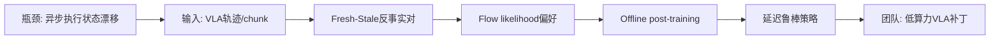
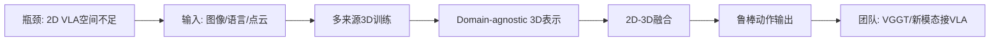
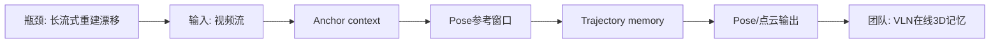
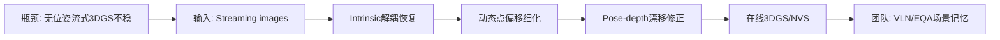

# 科研晨报：低延迟 VLA、三维增强动作模型与在线 3D 记忆

## 今日主线

今天的简报继续避开昨天已经覆盖的 Embodied.cpp、ReactVLA、RegimeVGGT、Mamba-VGGT 和 FastPano3D，重点转向五个新的技术条目。

1. **低延迟 VLA 正在分化为三条路线**：不是单纯压缩模型，而是分别从 speculative inference、delay-robust post-training、future-state/asynchronous execution 等角度解决“模型推理时世界已经变化”的问题。
2. **3D 输入正在成为 VLA 鲁棒性的明确增益来源**：Any3D-VLA 不是简单把 depth 拼进去，而是系统比较 simulator、sensor、model-estimated point clouds，并尝试学习 domain-agnostic 3D representation。
3. **生成感知模型的关键问题从 offline NVS 转向 online memory**：LingBot-Map 关注 streaming camera/point cloud，FreeStreamGS 关注 unposed streaming inputs 下的 online feed-forward 3DGS；二者分别代表“几何状态流”和“可渲染场景记忆流”。
4. **全景模态今天不重复昨天的 FastPano3D**：没有将同一篇全景论文连续重复；今天只在延展选题中保留“全景作为 VLN 初始化记忆”的跟踪判断。

---

## 5条简报

### 1. Realtime-VLA FLASH: Speculative Inference Framework for Diffusion-based VLAs

**一句话结论**：FLASH 把 diffusion-based VLA 的“每次都跑完整推理”改成 lightweight draft + main action expert parallel verification，在不明显牺牲任务表现的前提下降低平均推理延迟。

**为什么值得关注**：diffusion-based VLA 的核心问题是动作生成延迟高，尤其在需要频繁 replanning 的任务里会拖慢闭环。FLASH 引入轻量 draft model 产生候选动作，再用主模型 Action Expert 做并行验证，并设置 phase-aware fallback 机制，只在必要时回退到完整推理。论文报告在 LIBERO 上将许多 58.0 ms 的 full-inference round 替换为 7.8 ms speculative round，使任务级平均推理延迟降到 19.1 ms，约 3.04× speedup，并在真实 conveyor-belt sorting 上验证了实际意义。来源：[arXiv](https://arxiv.org/abs/2605.13778)，[GitHub](https://github.com/dexmal/realtime-vla-flash)，[项目页](https://dexmal.github.io/realtime-vla-flash/)。

**是否开源**：代码已公开，仓库为 `dexmal/realtime-vla-flash`；项目页和 GitHub 均已可访问。模型权重、训练数据是否完整开放需要进一步检查仓库 release。

**所需算力**：训练/微调成本未知；推理端的关键数据是 speculative round 约 7.8 ms、任务级平均 19.1 ms。由于方法依赖轻量 draft + 主模型验证，适合已有 dVLA pipeline 的推理加速，不一定需要重新训练完整大模型。

**输入/输出**：输入是多视角视觉、语言指令和机器人状态；输出是 diffusion VLA 的动作。中间表示是 draft action candidates 以及 Action Expert verification 结果。

**核心 insight**：VLA 动作生成可以借鉴大语言模型 speculative decoding，但机器人不能只追求 token throughput；它必须保证候选动作在当前阶段和物理状态下仍可靠，因此需要 phase-aware fallback。

**思路来源与前序瓶颈**：它大概率从 speculative decoding、Diffusion Policy、π0/π0.5、action chunking VLA 发展而来。前序瓶颈是完整 diffusion inference 延迟高，而 naïve speculative decoding 又没有充分考虑动作阶段和机器人状态变化。

**对团队启发**：可以把 FLASH 作为插销/装配任务的“推理运行机制 baseline”：比较 full diffusion、draft-only、draft+verification、phase-aware fallback，在 time-to-success、replan 次数、接触后纠偏成功率上做评测。

#### 总览图（Mermaid）

---

### 2. DEFLECT: Delay-Robust Execution via Flow-matching Likelihood-Estimated Counterfactual Tuning for VLA Policies

**一句话结论**：DEFLECT 不直接加速模型，而是把异步执行造成的 stale observation 问题转化为无标签偏好学习，让 VLA 对推理延迟更鲁棒。

**为什么值得关注**：很多 VLA 部署采用 asynchronous inference：机器人执行上一段 action chunk，同时模型计算下一段动作。但这会导致 observation-action misalignment——模型看到的是推理开始前的状态，真正执行时环境已经向前演化。论文报告 naïve asynchronous rollover 在 Kinetix 中当 inference cycle 覆盖 7 个控制步时会从 89% 成功率跌到 1% 以下。DEFLECT 构造 frozen reference policy 下的 fresh/stale counterfactual action pairs，用 flow-matching likelihood-ratio surrogate 作为偏好信号，无需人工标签、reward model 或在线 rollout，在高延迟区间带来 +6.4 success-rate gain，并在双臂 conveyor pick-and-place 和 reactive whack-a-mole 上验证。来源：[arXiv](https://arxiv.org/abs/2605.19294)，[HTML](https://arxiv.org/html/2605.19294v1)。

**是否开源**：论文页面给出 anonymized review code 链接；是否已转为正式 GitHub 仓库、权重/数据是否公开，目前未确认。

**所需算力**：训练侧是 offline post-training，不需要在线机器人 rollout；成本取决于 frozen reference policy 的推理次数和 flow-matching likelihood scoring。推理侧理论上是 near drop-in upgrade，不增加明显运行时结构开销。

**输入/输出**：输入是已有 VLA policy、延迟条件下的 observation/action chunk 轨迹；输出是 delay-robust 的 VLA policy。中间监督信号来自 fresh/stale counterfactual preference pairs。

**核心 insight**：真实机器人里的“延迟”不只是系统工程问题，也可以变成策略训练信号。模型应该学会区分哪些动作在 stale context 下仍可靠，哪些动作需要被惩罚。

**思路来源与前序瓶颈**：它承接 flow-matching VLA、offline preference optimization、asynchronous action chunk execution。前序瓶颈是许多方法只压低平均推理时间，但没有显式训练 policy 承受执行状态漂移。

**对团队启发**：这非常适合做“低算力 VLA 的鲁棒性补丁”。如果 8×4090 训练不了大 VLA，可以用已有 StarVLA/pi0.x/VLA-Adapter 作为 reference，构造 stale/fresh 对比，专门面向透明抓取、插销接触、传送带抓取等延迟敏感任务做 offline tuning。

#### 总览图（Mermaid）

---

### 3. Any3D-VLA: Enhancing VLA Robustness via Diverse Point Clouds

**一句话结论**：Any3D-VLA 明确把 point cloud 作为 VLA 的增强模态，并系统处理 simulator、sensor 和 model-estimated 3D 之间的 domain gap。

**为什么值得关注**：普通 VLA 主要吃 2D image，复杂遮挡、空间关系、抓取位姿和弱纹理物体操作时容易缺少几何支撑。Any3D-VLA 做了一个重要的 pilot study：显式把视觉输入 lift 到 point clouds 后，3D representation 能和 2D representation 互补。进一步，它把 simulator point cloud、sensor point cloud 和 model-estimated point cloud 纳入统一训练 pipeline，学习 domain-agnostic 3D representation，并与 2D 表征融合。论文和代码页面均强调其目标是提升 VLA robustness、缓解 sim-to-real gap。来源：[arXiv](https://arxiv.org/abs/2602.00807)，[GitHub](https://github.com/XianzheFan/Any3D-VLA)，[项目页](https://xianzhefan.github.io/Any3D-VLA.github.io)。

**是否开源**：代码已公开，仓库为 `XianzheFan/Any3D-VLA`；GitHub 页面标注 ICML 2026，MIT License。权重、完整数据集和真实控制接口完整度需要进一步检查。

**所需算力**：训练成本未在检索摘要中明确给出；从方法看，需要 VLA backbone + 3D branch/fusion module 的训练或微调。推理侧需要 point cloud 来源：真实 depth sensor、仿真点云，或用模型估计 3D，这会增加前处理成本，但可能换取更强鲁棒性。

**输入/输出**：输入是 2D 图像、语言指令、机器人状态以及多来源 point clouds；输出是机器人动作。中间表示是 domain-agnostic 3D representation 与 2D feature fusion。

**核心 insight**：VLA 中 3D 信息的价值不只是“加 depth”，而是要让不同来源的 3D 表示在训练时互相对齐，减少真实传感器、仿真和估计点云之间的尺度/噪声差异。

**思路来源与前序瓶颈**：它从 SpatialVLA、GraspVLA、3D-aware manipulation 和 point-cloud policy 路线发展而来。前序瓶颈是 3D 数据少、传感器域差大、估计 depth/point cloud 噪声会破坏动作策略。

**对团队启发**：这篇可直接映射到“VGGT/DUSt3R/MASt3R 输出能否作为 VLA 3D branch”的问题。团队可以把 point cloud 来源换成 VGGT point map、红外深度、偏振辅助表面法线、触觉接触点，评测这些模态相比 RGB 是否真正提高透明/反光/弱纹理物体操作。

#### 总览图（Mermaid）

---

### 4. Geometric Context Transformer for Streaming 3D Reconstruction

**一句话结论**：LingBot-Map 是真正面向 streaming 的 feed-forward 3D foundation model，用 compact geometric context 解决坐标锚定、局部几何和长程漂移。

**为什么值得关注**：Streaming 3D reconstruction 要从视频流中恢复 camera pose 和 point cloud，同时满足几何准确性、时间一致性和计算效率。LingBot-Map 的 Geometric Context Transformer 同时引入 anchor context、pose-reference window 和 trajectory memory，分别处理 coordinate grounding、dense geometric cues 和 long-range drift correction。论文摘要报告在 518×378 输入分辨率下可达约 20 FPS，并支持超过 10,000 帧长序列。来源：[arXiv](https://arxiv.org/abs/2604.14141)，[GitHub](https://github.com/robbyant/lingbot-map)，[项目页](https://technology.robbyant.com/lingbot-map)，[Hugging Face](https://huggingface.co/robbyant/lingbot-map)。

**是否开源**：代码已公开，仓库为 `robbyant/lingbot-map`；Hugging Face 页面提供安装说明，并推荐 FlashInfer/paged KV cache attention。模型/数据开放情况可通过项目页继续核查。

**所需算力**：训练成本未知；推理侧公开信息显示 518×378 分辨率约 20 FPS，且使用 paged KV cache attention 提升 streaming efficiency。对 8×4090 团队而言，优先复现推理与小规模微调比从头训练更合理。

**输入/输出**：输入是视频流或连续图像序列；输出是 camera pose、point cloud/3D geometry。中间状态包括 anchor context、pose-reference window、trajectory memory。

**核心 insight**：在线 3D foundation model 不需要把所有历史帧都放入全局 attention；可以把历史拆成坐标锚、短期姿态参考窗口和长程轨迹记忆三类上下文。

**思路来源与前序瓶颈**：它延续 DUSt3R/MASt3R/VGGT 类 feed-forward geometry foundation model，也吸收 SLAM 的状态管理思想。前序瓶颈是 feed-forward 模型处理短序列强，但长视频会遇到显存、漂移和坐标系不稳定。

**对团队启发**：这篇非常适合作为陈瑞阳方向的外部 baseline：`VGGT window + trajectory memory + compact anchor context`。如果后续做 VLN 在线记忆，可以让 LingBot-Map/VGGT 输出几何 memory，再由语言 planner 读取 object anchor、free space、frontier 和已探索轨迹。

#### 总览图（Mermaid）

---

### 5. FreeStreamGS: Online Feed-forward 3D Gaussian Splatting from Unposed Streaming Inputs

**一句话结论**：FreeStreamGS 把 online feed-forward reconstruction 从 depth/point cloud 推进到可渲染 3DGS，重点解决 unposed streaming inputs 下的内参偏移、尺度抖动和 pose-depth drift。

**为什么值得关注**：已有 feed-forward 3DGS 多假设离线图像序列，能看到未来帧，或需要稳定相机/几何；但真实机器人和 VLN 更接近 streaming、unposed、无法访问未来帧。FreeStreamGS 指出 NVS 比 streaming depth/point cloud 更敏感：Gaussian scale 和 pose-geometry alignment 的小偏差会在长时间流中累积为明显渲染 artifact。方法提出 Decoupled Intrinsic Recovery Head 来消除累积 camera intrinsic bias 和 scene scale jitter，并用 Dynamic Point Refinement Offset 放松刚性反投影，修正 coupled pose-depth drift。来源：[arXiv](https://arxiv.org/abs/2606.03254)，[Hugging Face paper page](https://huggingface.co/richardchencccc/FreeStreamGS)。

**是否开源**：论文与 Hugging Face paper page 已公开；当前检索未确认正式 GitHub 代码、模型权重或数据集 release。

**所需算力**：训练成本未知；推理侧定位是 online feed-forward，不依赖未来帧，也不应需要 per-scene optimization。实际显存和速度需以代码 release 后复现实测为准。

**输入/输出**：输入是无位姿 streaming images；输出是在线更新的 3D Gaussian representation 和新视角渲染结果。中间表示包括 decoupled intrinsic、refined point offsets、pose-depth corrected Gaussian parameters。

**核心 insight**：streaming NVS 的难点不只是估计深度和相机，而是让 Gaussian scale、intrinsic、pose、depth 在长序列中保持可渲染一致性；否则点云看似可用，渲染会迅速劣化。

**思路来源与前序瓶颈**：它从 MVSplat/DepthSplat/DUSt3R/VGGT 类 feed-forward geometry 与 online SLAM/streaming reconstruction 发展而来。前序瓶颈是 streaming geometry methods 可输出点云，但直接转 3DGS 会有明显 artifact；offline feed-forward 3DGS 又不满足在线约束。

**对团队启发**：这是陈瑞阳方向最直接的主线：下一步不应只看 PSNR/SSIM/LPIPS，还应加机器人可用指标，例如 EQA answer consistency、VLN path replanning success、object re-localization drift、long-sequence memory size，以及 VGGT point map 是否能替代/增强 intrinsic recovery 与 point refinement。

#### 总览图（Mermaid）

---

## 三条主线映射

| 主线 | 今日覆盖 | 关键判断 |
|---|---|---|
| 具身模型 | Realtime-VLA FLASH、DEFLECT、Any3D-VLA | 低延迟 VLA 不只是模型变小，而是 speculative verification、delay-robust tuning 和 3D representation 共同作用。|
| 场景理解模型 | Any3D-VLA、LingBot-Map | 3D 表示开始从“重建结果”变成 VLA/VLN 可消费的 spatial token、point cloud、trajectory memory。|
| 生成感知模型 | LingBot-Map、FreeStreamGS | 在线重建的核心正在从 per-scene optimization 转向 feed-forward streaming state；3DGS 的问题比点云更严格。|
| 横向全景模态 | 今日不重复 FastPano3D | 昨天已经覆盖单全景 feed-forward 3DGS；今天保留为后续延展方向，重点看 panorama-to-memory 是否能减少 FoV gap。|

---

## 组会讨论题

1. **低延迟 VLA 到底应该优化哪个环节？** FLASH 侧重 speculative inference，DEFLECT 侧重 delay-robust policy，VLASH/FASTER 类方法侧重异步执行与近端动作优先级。我们的插销任务应先测哪一个？
2. **action chunk 的评测是否要加入 reaction-time 分布？** 仅报告平均成功率会掩盖 stale observation、接触瞬间纠偏失败和重新规划延迟。
3. **VGGT point map 能不能成为 Any3D-VLA 的 3D branch？** 需要比较真实 depth、仿真 point cloud、VGGT/MASt3R estimated point cloud，以及偏振/红外/触觉增强几何。
4. **LingBot-Map 和 FreeStreamGS 的区别该怎么用于学生分工？** 前者更像在线几何状态估计，后者更像在线可渲染记忆；一个服务规划，一个服务回看和语义问答。
5. **在线 3DGS 是否必须可渲染，还是只需要 action-relevant？** 对 VLA/WAM 来说，完整 NVS 未必必要；可能更需要稳定的 object anchor、可达性、遮挡关系和接触区域。

---

## 可延展选题

1. **VLA latency stress test**：设计一个统一脚本，控制模型推理延迟、chunk length、执行频率，比较 full inference、FLASH、DEFLECT、FASTER、VLASH。指标包括 success rate、time-to-first-action、reaction latency、failure recovery count。
2. **VGGT-as-PointCloud for VLA**：将 VGGT/MASt3R 输出的 point map 接到 Any3D-VLA 风格 3D branch，比较 RGB-only、RGB-D、estimated point cloud、偏振 normal、触觉 contact map。
3. **Streaming memory 双路线 baseline**：一条是 LingBot-Map 式 pose/point memory，另一条是 FreeStreamGS 式 3DGS memory；统一在 EQA/VLN 场景中比较问答一致性、路径重规划成功率和长序列漂移。
4. **全景初始化 + 局部更新**：延续昨天 FastPano3D 的思路，用单张 360 图初始化全局 3D/semantic memory，再由普通透视相机或腕部相机更新局部几何，重点评测是否减少 FoV gap 和重复探索。
5. **延迟鲁棒插销任务**：对插销、装配、传送带抓取分别人为注入 1–7 个 control step 延迟，研究 action chunk、speculative verification 和 tactile feedback 的组合效果。

---

## 音频版旁白稿

今天的科研晨报继续围绕三条主线展开：具身模型、场景理解模型，以及生成感知模型。今天不重复昨天已经讲过的 Embodied.cpp、ReactVLA、RegimeVGGT、Mamba-VGGT 和 FastPano3D，而是关注五个新的方向：diffusion VLA 的 speculative inference、异步 VLA 的延迟鲁棒训练、三维点云增强的 VLA、streaming feed-forward 3D reconstruction，以及无位姿流式输入下的在线 3DGS。

第一篇是 Realtime-VLA FLASH。它解决的是 diffusion-based VLA 推理慢的问题。传统做法每次重新规划都要完整跑一遍 diffusion inference，这在真实机器人上会造成明显延迟。FLASH 的思路是引入一个轻量 draft model 先产生候选动作，再用主模型的 Action Expert 做并行验证。如果候选动作可靠，就不必每次都调用完整推理；如果当前阶段风险较高，就通过 phase-aware fallback 回退到完整流程。这个方法的价值不只是三倍左右的平均推理加速，而是提供了一种部署思路：低延迟 VLA 可以不从压缩大模型开始，而是从“哪些时刻必须完整推理，哪些时刻可以快速验证”开始。

第二篇是 DEFLECT。它和 FLASH 的角度不一样。FLASH 主要减少推理时间，DEFLECT 关注的是：即使我们用了异步推理，机器人一边执行旧动作、一边计算新动作，模型看到的观测和真正执行时的状态之间仍然会错位。这种 stale observation 在高延迟时会非常致命。DEFLECT 把这个问题转成无标签的 offline post-training：用 frozen reference policy 构造 fresh 和 stale 的反事实动作对，再用 flow-matching likelihood 估计哪个动作在部署条件下更合理。它的启发是，延迟不是单纯的系统误差，也可以变成训练信号。对我们做低算力 VLA 很有价值，因为它不要求在线真机 rollout，也不一定要重新训练完整大模型。

第三篇是 Any3D-VLA。它回答一个非常直接的问题：VLA 到底要不要显式三维输入？这篇工作的结论是，point cloud 对二维图像确实有互补价值，但关键不是简单拼一个 depth，而是要处理不同三维来源之间的 domain gap。它把仿真点云、真实传感器点云和模型估计点云放进统一训练流程，学习相对域无关的三维表征，再和二维特征融合。对我们来说，这篇文章可以直接连接 VGGT、红外、偏振和触觉。后续可以问一个更具体的问题：VGGT 输出的 point map，能不能替代真实 depth sensor，成为 VLA 的三维分支？偏振法线和触觉接触点，能不能在透明、反光、弱纹理物体上提供 RGB 没有的信息增益？

第四篇是 Geometric Context Transformer，也就是 LingBot-Map。它是今天和陈瑞阳方向最相关的一篇外部工作之一。它不是离线重建，而是面向 streaming video 的 feed-forward 3D foundation model，目标是在视频流中实时恢复相机和点云。它的关键设计是把上下文拆成三类：anchor context 用于坐标锚定，pose-reference window 用于局部姿态和几何参考，trajectory memory 用于长程漂移修正。这个设计很像把 SLAM 的状态管理思想放进 feed-forward transformer。对我们做 VLN 在线记忆来说，它给出一个很清晰的 baseline：不需要把所有历史帧都扔进全局 attention，而是维护一个紧凑的几何上下文。

第五篇是 FreeStreamGS。它进一步把问题从 streaming point cloud 推到 streaming 3D Gaussian Splatting。在线 3DGS 比在线点云更难，因为新视角渲染对 Gaussian scale、相机内参、pose-depth alignment 非常敏感。只要这些量有一点长期漂移，点云看起来可能还可以，但渲染结果会迅速出现 artifact。FreeStreamGS 的两个关键模块分别处理内参偏差和点位置漂移：一个是 Decoupled Intrinsic Recovery Head，用来减少长期尺度抖动；另一个是 Dynamic Point Refinement Offset，用来放松刚性反投影，修正 pose-depth 耦合误差。对陈瑞阳方向来说，这篇最值得继续推进的不是单纯刷 PSNR，而是把在线 3DGS 接到 EQA、VLN 和机器人场景记忆中，看它是否真的提升物体重定位、路径重规划和长序列问答一致性。

今天组会建议集中讨论三个问题。第一，我们的低延迟 VLA 应该先做 speculative inference，还是先做 delay-robust post-training？第二，VGGT 或 MASt3R 产生的 point map，能不能作为 Any3D-VLA 风格的三维分支，服务真实抓取、插销和装配？第三，在线场景记忆到底需要可渲染的 3DGS，还是只需要对动作有用的 object anchor、遮挡关系、可达性和接触区域？如果要安排学生实验，我建议两个小 baseline 同时启动：一个是低延迟插销 stress test，另一个是 VGGT window 加 streaming memory 的 VLN/EQA baseline。

---

## 今日已覆盖论文列表

1. Realtime-VLA FLASH: Speculative Inference Framework for Diffusion-based VLAs
2. DEFLECT: Delay-Robust Execution via Flow-matching Likelihood-Estimated Counterfactual Tuning for VLA Policies
3. Any3D-VLA: Enhancing VLA Robustness via Diverse Point Clouds
4. Geometric Context Transformer for Streaming 3D Reconstruction
5. FreeStreamGS: Online Feed-forward 3D Gaussian Splatting from Unposed Streaming Inputs
