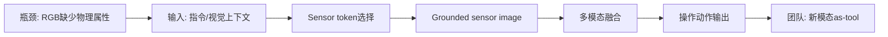
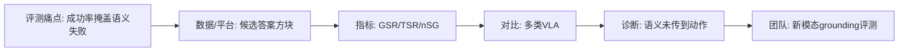
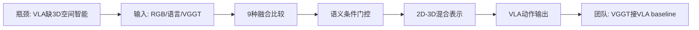
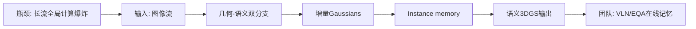

# 科研晨报：多模态 VLA、实时动作采样、语义 grounding 与流式语义 3DGS

## 今日主线

今天继续遵守最近 7 天去重：不重复前两期已经覆盖的 Embodied.cpp、ReactVLA、RegimeVGGT、Mamba-VGGT、FastPano3D、FLASH、DEFLECT、Any3D-VLA、LingBot-Map 和 FreeStreamGS。本期选择 5 个未覆盖条目，重点放在三个新判断：

1. **具身模型的速度问题正在从“推理时间”转向“反应时间”**：FASTER 不只看模型每次 forward 多快，而是把 Time to First Action、chunk 执行 horizon 和近端动作采样优先级统一建模。
2. **多模态 VLA 开始从“拼接传感器”转向“传感器作为工具”**：MuseVLA 让模型先判断是否调用温度、声音、雷达等传感器，再将异构读数转成 grounded sensor image，适合迁移到红外、偏振、触觉和全景。
3. **场景理解与生成感知正在向机器人可用中间表示收敛**：3D-Mix 讨论 VGGT 3D 表征如何接入 VLA；S2GS 则把在线 3DGS 从纯渲染推进到几何、外观和 instance-level semantics 的持续更新。

---

## 5条简报

### 1. MuseVLA: An Adaptive Multimodal Sensing Vision-Language-Action Model for Robotic Manipulation

**一句话结论**：MuseVLA 的关键不是多加几个传感器，而是把传感器调用建模为 VLA 的“工具选择”问题；这对红外、偏振、触觉等新模态 VLA 很有启发。

**为什么值得关注**：现有 VLA 大多依赖 RGB，而 RGB 很难直接感知温度、声音、遮挡后物体、材料属性和部分物理状态。MuseVLA 的流程是：给定任务指令和视觉上下文，模型先生成 sensor token 和 target description，决定调用哪种传感器、对什么目标采样；然后把异构传感器读数转换成 grounded sensor image，作为统一中间表示进入多模态融合和动作生成。论文在真实 dexterous hand 操作中覆盖 temperature-guided pick-and-place、audio-driven object search、radar-assisted hidden object retrieval，平均成功率报告为 80.6%，显著超过 RGB-only 和普通 multisensory baseline。来源：arXiv:2606.17598。

**是否开源**：当前检索只确认论文公开；代码、模型权重、数据集是否公开未确认。

**所需算力**：训练算力未知。方法需要 VLA backbone、传感器选择模块和 grounded sensor image 合成/融合模块；如果迁移到组内任务，建议从 LoRA/Adapter 级别微调开始。推理侧会额外产生一次 sensor selection 和 sensor measurement，但好处是避免所有模态全量常开，理论上比“所有传感器全拼接”更省算力和带宽。

**输入/输出**：输入是 RGB 视觉上下文、语言指令，以及按需调用的温度、声音、雷达等传感器读数；输出是机器人操作动作。中间表示是 sensor token、target description 和 grounded sensor image。

**核心 insight**：新模态不应该只是被动拼接到 VLA 输入，而应该像工具一样被按任务主动调用；模型要学会“什么时候 RGB 不够、该调用什么传感器、读哪个目标”。

**思路来源与前序瓶颈**：它大概率从 tool-use LLM、multimodal VLA、sensor fusion policy 和机器人主动感知发展而来。前序瓶颈是多传感器数据采集成本高、不同传感器表征不统一，而且很多任务并不总需要所有模态。

**对团队启发**：这篇可以直接迁移成“IR / polarization / tactile as tool”。例如透明/反光物体任务中，先由 RGB 判断不确定区域，再调用偏振或红外；插销任务中，接触前用视觉，接触后调用触觉；全景用于场景初始化而不是每个动作步都输入。

#### 总览图（Mermaid）

---

### 2. FASTER: Rethinking Real-Time Flow VLAs

**一句话结论**：FASTER 把低延迟 VLA 的核心指标从“平均推理耗时”推进到“真实反应时间”，尤其适合动态环境和接触瞬间纠偏。

**为什么值得关注**：很多异步 VLA 方法只优化轨迹平滑或吞吐，但忽略机器人对环境变化的反应延迟。FASTER 分析指出，reaction time 由 Time to First Action 和 execution horizon 共同决定；标准 flow-based VLA 的 constant schedule 会要求所有采样步骤完成后才启动动作，导致近端动作反应慢。FASTER 提出 Horizon-Aware Schedule，优先压缩近期动作的 denoising，把 π0.5 和 X-VLA 中即时反应动作的采样压到单步，同时保持长 horizon 轨迹质量，并结合 streaming client-server pipeline 在真实机器人和动态乒乓任务中验证。来源：arXiv:2603.19199。

**是否开源**：当前检索未确认代码、模型或数据公开。

**所需算力**：训练成本未知；推理侧重点是调度策略，不一定要求重新训练完整 backbone。它主要降低 flow action sampling 的有效反应延迟，对 consumer-grade GPU 部署尤其相关。

**输入/输出**：输入是视觉、语言和机器人状态；输出是 flow VLA 的 action chunk。中间变化是 Horizon-Aware Schedule：近端动作优先采样、远端动作保持平滑。

**核心 insight**：对机器人来说，action chunk 的前几步比后几步更关键；采样预算应该优先给“马上要执行的动作”，而不是平均分配给整段轨迹。

**思路来源与前序瓶颈**：它承接 π0/π0.5、X-VLA、flow-matching action head 和异步执行路线。前序瓶颈是 action chunk 提高了稳定性，却牺牲了对突发变化的反应速度；恒定采样 schedule 对控制任务不是最优。

**对团队启发**：插销和装配任务可以做一个明确实验：相同 VLA backbone 下比较 constant schedule、near-term priority schedule、chunk overlap 和 tactile-triggered replanning。指标不要只看成功率，还要看接触后反应时间、time-to-success 和失败恢复次数。

#### 总览图（Mermaid）

---

### 3. RoboSemanticBench: Diagnosing Semantic Grounding in Action Prediction for VLA Models

**一句话结论**：RoboSemanticBench 不测“会不会抓”，而测 VLA 是否真的把语义理解传递到了动作选择；这比普通成功率更接近 VLA 的核心问题。

**为什么值得关注**：VLA 的宣传逻辑是 VLM 的语义能力可以指导动作，但很多机器人微调数据只优化 imitation loss，可能让模型学到视觉或指令-动作 shortcut。RoboSemanticBench 将语义问题变成物理抓取：机器人看到多个候选答案方块，必须先解数学、常识或一般知识题，再抓取正确答案对应的方块。论文定义 GSR、TSR 和 nSG 等指标，用来分离“抓到任意候选块”的低层能力和“抓到语义正确目标”的 grounding 能力；结果显示不少 VLA 在能抓取候选块的情况下，语义正确选择仍接近或低于随机。论文 HTML 中给出了 GitHub 链接 `ZGC-EmbodyAI/RoboSemanticBench`。来源：arXiv:2606.02277。

**是否开源**：论文正文给出 GitHub 仓库链接；当前可确认 benchmark 代码入口存在。模型权重和完整数据资产开放程度需要进一步检查仓库。

**所需算力**：训练算力不适用，主要是评测 benchmark；如果只评估已有 VLA，需要执行多轮仿真或真实机器人 rollouts。相比训练大模型，算力门槛低，但需要稳定的候选物体抓取环境。

**输入/输出**：输入是语义问题、候选答案映射、视觉观察和机器人状态；输出是选择某个候选方块并执行抓取/放置。评测输出是 GSR、TSR、nSG 等诊断指标。

**核心 insight**：高 grasp success 不等于 VLA 真正理解指令；必须把语义决策和动作目标绑定过程单独测出来。

**思路来源与前序瓶颈**：它来自 VLA benchmark、counterfactual language evaluation、semantic grounding diagnostics。前序瓶颈是 LIBERO、CALVIN、RoboCasa 等任务经常把语义理解、视觉识别和运动控制混在一个 success rate 里，难以定位失败原因。

**对团队启发**：团队可以做一个更贴近具身操作的“物理属性 grounding benchmark”：让模型根据“更热的杯子”“反光更强的片材”“更容易滑动的透明膜”“已经接触过的孔位”等语义/物理条件选择目标，检验红外、偏振、触觉是否真的让动作 grounding 变好。

#### 总览图（Mermaid）

---

### 4. 3D-Mix for VLA: A Plug-and-Play Module for Integrating VGGT-based 3D Information into Vision-Language-Action Models

**一句话结论**：3D-Mix 是今天最直接连接 VGGT 与 VLA 的条目：它系统比较 9 种 VGGT 融合方案，并认为 semantic-conditioned gated fusion 最有效。

**为什么值得关注**：许多 VLA 仍以 2D MLLM 为核心，空间智能不足；但把 VGGT 的 camera、depth、point map 或 3D feature 接进 VLA 时，究竟该早融合、晚融合、拼接、门控还是改 action expert，并没有系统结论。3D-Mix 做了 pilot study，比较 9 种 VGGT integration schemes，并提出 plug-and-play 模块，可接入 GR00T-style 和 π-style VLA，不修改原有 MLLM 或 action expert。论文在 SIMPLER 和 LIBERO 上跨 6 个 MLLM series、9 个 2B–8B 模型变体评估，报告在 OOD SIMPLER 上平均 +7.0% 增益。来源：arXiv:2603.24393。

**是否开源**：当前检索未确认代码、模型或数据公开。

**所需算力**：训练/微调成本取决于 VLA backbone 和融合模块；由于主打 plug-and-play，理论上可先冻结 MLLM/action expert，只训练轻量 3D fusion/gating 模块。推理侧需要额外运行 VGGT 或缓存 VGGT 3D features，因此会增加几何前处理开销。

**输入/输出**：输入是 RGB 视觉、语言、机器人状态，以及 VGGT-based 3D information；输出是 VLA 动作。中间表示是由语义条件控制的 2D-3D gated feature。

**核心 insight**：3D 信息是否有用取决于任务语义；模型需要按任务上下文自适应决定“更相信 2D 语义还是 3D 几何”。

**思路来源与前序瓶颈**：它承接 VGGT、SpatialVLA、3D-aware manipulation、GR00T/π-style VLA。前序瓶颈是大家都知道 VLA 缺 3D，但集成方式分散，容易引入额外计算却不稳定提升。

**对团队启发**：这可以成为组内 VGGT-for-VLA 的最小可复现路线：先不训练新的大模型，只做 VGGT point/depth/feature 与 StarVLA 或 VLA-Adapter 的门控融合；任务上优先选透明、反光、弱纹理、遮挡和插销对齐，验证几何 token 是否 action-relevant。

#### 总览图（Mermaid）

---

### 5. S2GS: Streaming Semantic Gaussian Splatting for Online Scene Understanding and Reconstruction

**一句话结论**：S2GS 是严格 causal 的流式语义 3DGS：不看未来帧、不重复处理历史帧，同时更新几何、外观和实例语义。

**为什么值得关注**：很多 offline feed-forward reconstruction 在长图像流上需要对不断增长的历史观测做全局计算，导致 runtime 和 GPU memory 快速增长。S2GS 采用 geometry-semantic decoupled dual-backbone：几何分支做 causal modeling 以驱动 incremental Gaussian updates；语义分支利用 2D foundation vision model 和 query-driven decoder 预测 segmentation masks 与 identity embeddings，再通过 query-level contrastive alignment 和轻量 online association 维护 instance memory。论文报告可处理 1,000+ frames，且 runtime/GPU memory 增长明显慢于 offline global-processing baselines；后者在同设定下约 80 frames 附近就可能 OOM。来源：arXiv:2603.14232。

**是否开源**：当前检索未确认代码、模型或数据公开。

**所需算力**：训练成本未知；推理侧是 online incremental，不需要 per-scene global reprocessing。由于使用双 backbone 和 2D foundation model，显存仍需关注，但长序列可扩展性明显优于全局离线处理。

**输入/输出**：输入是长图像流或视频流；输出是持续更新的 3D Gaussian semantic field，包括几何、外观、实例语义和 identity association。中间表示包括 incremental Gaussians、segmentation mask、identity embedding、instance memory。

**核心 insight**：机器人在线记忆不能只维护可渲染几何，还必须维护可追踪的实例语义；否则 VLN/EQA 只能“看见场景”，但不能稳定回答“之前那个物体在哪里”。

**思路来源与前序瓶颈**：它从 3DGS、semantic Gaussian field、online SLAM、streaming reconstruction 发展而来。前序瓶颈是 offline 3DGS/semantic reconstruction 质量高但不 causal，长序列 memory 爆炸；纯几何 streaming 又缺少语义和实例一致性。

**对团队启发**：陈瑞阳方向可以把 S2GS 作为“在线语义记忆”路线，与 FreeStreamGS 类“在线可渲染 NVS”路线区分开。对 VLN/EQA 来说，instance memory、object re-localization 和 semantic consistency 可能比 PSNR 更重要。

#### 总览图（Mermaid）

---

## 三条主线映射

| 主线 | 今日覆盖 | 关键判断 |
|---|---|---|
| 具身模型 | MuseVLA、FASTER、RoboSemanticBench、3D-Mix | 速度、传感器、语义 grounding、3D 几何融合正在成为 VLA 落地的四个核心支点。|
| 场景理解模型 | 3D-Mix、S2GS、RoboSemanticBench | VGGT/3D 表征需要被组织成可被动作模型消费的 gated feature、object memory 或语义 grounding 指标。|
| 生成感知模型 | S2GS | 在线 3DGS 不应只服务 NVS，而要同时维护 geometry、appearance、instance semantics 和可查询 memory。|
| 横向全景模态 | 今日未选单独全景论文 | 继续跟踪 panorama-to-memory；可将 MuseVLA 的 sensor-as-tool 思路扩展为“何时调用 360 相机”。|

---

## 组会讨论题

1. **新模态到底应该常开还是按需调用？** MuseVLA 暗示 IR、偏振、触觉、全景可以做成 sensor-as-tool，而不是每一步都拼接进 VLA。
2. **低延迟评测应从 latency 改成 reaction time 吗？** FASTER 的 TTFA + horizon 分析比单纯 forward time 更贴近真实机器人。
3. **语义 grounding 是否应成为组内 VLA benchmark 的固定指标？** RoboSemanticBench 说明高抓取成功率可能掩盖语义目标选择失败。
4. **VGGT 接入 VLA 是用 point map、depth、feature，还是 gated 2D-3D token？** 3D-Mix 的结论支持语义条件门控，而不是固定融合。
5. **在线记忆到底该重建“好看的 3DGS”，还是维护“可查询的语义实例”？** S2GS 更偏后者，适合 VLN/EQA；FreeStreamGS 更偏在线 NVS，适合可渲染回看。

---

## 可延展选题

1. **Sensor-as-Tool VLA for 新模态**：把红外、偏振、触觉、全景统一成工具调用接口。任务设计为 RGB 不确定时调用新模态，评测信息增益、调用频率、成功率和额外延迟。
2. **Reaction-Time VLA Benchmark**：在插销、装配、传送带抓取中记录 TTFA、near-term action delay、chunk horizon、time-to-success 和 recovery count，对比 FASTER、FLASH、DEFLECT 类路线。
3. **Semantic Grounding for Physical Attributes**：仿照 RoboSemanticBench，但把语义问题换成物理属性：热/冷、反光/哑光、透明/不透明、柔软/硬、已接触/未接触，检验红外、偏振、触觉是否真正进入动作选择。
4. **3D-Mix + VGGT 组内复现**：冻结 VLA backbone，只训练轻量 gated fusion，把 VGGT point/depth/feature 接到 StarVLA 或 VLA-Adapter，任务选透明抓取、遮挡抓取、插销对齐。
5. **S2GS-style Semantic Memory for VLN/EQA**：不先追求高 PSNR，而是维护 instance memory、object re-localization、room-view-object hierarchy，评测 EQA answer consistency 和 VLN re-planning success。

---

## 音频版旁白稿

今天的科研晨报继续围绕三条主线展开：具身模型、场景理解模型，以及生成感知模型。今天不重复前两期已经介绍过的低延迟推理框架、Mamba-VGGT、FastPano3D、LingBot-Map 和 FreeStreamGS，而是关注五个新的技术信号：多模态传感器作为工具、实时 flow VLA 的反应时间、VLA 语义 grounding 评测、VGGT 三维信息接入 VLA，以及流式语义 3DGS。

第一篇是 MuseVLA。它的核心价值不是简单给 VLA 多加几个传感器，而是把传感器调用变成一个主动决策问题。传统多模态机器人往往把 RGB、深度、触觉、声音或红外全部拼接起来，但这会带来数据采集成本、同步成本和算力成本。MuseVLA 的思路更像 tool-use：模型先根据任务和视觉上下文判断应该调用哪种传感器，以及对哪个目标采样，然后把异构读数转成 grounded sensor image，再进入动作生成。这个方向对我们非常重要。红外、偏振、触觉、全景都不应该只是“多一个输入通道”，而应该回答一个更具体的问题：什么时候 RGB 不够？应该调用哪个模态？这个模态能提供什么 RGB 没有的信息？

第二篇是 FASTER。它重新定义了低延迟 VLA 的问题。我们平时容易看平均推理时间，但真实机器人更关心的是 reaction time，也就是环境变化后系统多久能产生有效动作。FASTER 指出，action chunk 策略里的反应时间由 Time to First Action 和执行 horizon 共同决定。如果 flow-based VLA 使用固定采样 schedule，那么系统必须等整段轨迹采样完成之后才能动，近端动作反而被拖慢。FASTER 的 Horizon-Aware Schedule 优先采样马上要执行的动作，把即时反应压到单步，同时保留长时域动作的平滑性。对插销、装配和动态抓取来说，这比单纯减少模型参数更接近真实瓶颈。

第三篇是 RoboSemanticBench。它提醒我们，VLA benchmark 不能只看“任务有没有完成”。一个模型可能很会抓块，但并没有真正理解要抓哪个块。RoboSemanticBench 把数学题、常识题和一般知识题变成物理抓取任务：机器人看到多个候选答案方块，必须先理解问题，再把正确答案 grounding 到可见目标，并执行抓取。它定义了 grasp success、task success 和 normalized semantic grounding 等指标，用来区分低层抓取能力和语义目标选择能力。这个工作对我们后续评测非常有价值。我们可以设计物理属性 grounding benchmark，比如让机器人选择更热的杯子、更反光的片材、更透明的薄膜，或者已经接触过的孔位，检验红外、偏振和触觉是否真正改变了动作决策。

第四篇是 3D-Mix for VLA。它是今天最直接连接 VGGT 和 VLA 的工作。大家都知道二维 VLA 缺少空间智能，也都想把 VGGT 的深度、点图或三维特征接进去，但到底怎么接并不清楚。3D-Mix 系统比较了九种 VGGT 融合方案，发现语义条件门控效果最好。也就是说，三维几何不是在所有任务中都应该被同等使用，模型需要根据任务语义判断什么时候更相信二维语义，什么时候更依赖三维几何。对我们来说，最小可行路线不是重新训练一个大 VLA，而是冻结现有 VLA backbone，训练一个轻量 gated fusion，把 VGGT 输出变成 action-relevant spatial token。

第五篇是 S2GS。它属于生成感知模型，但重点不是离线新视角合成，而是在线场景理解和重建。S2GS 是严格 causal 的 streaming semantic Gaussian Splatting，不使用未来帧，也不重复处理历史帧。它同时维护几何、外观和实例语义，并通过 instance memory 做在线关联。这个方向对 VLN 和 EQA 很关键，因为机器人不只需要一个好看的三维场景，还需要知道“之前看到的那个物体现在在哪里”“这个房间里哪些目标已经访问过”“某个实例是否和历史记忆一致”。因此，陈瑞阳方向后续可以把在线 3DGS 分成两条线：一条追求可渲染的在线 NVS，另一条追求可查询、可规划的语义实例记忆。

今天组会建议讨论三个问题。第一，新模态应该作为固定输入，还是作为工具按需调用？第二，低延迟 VLA 的指标是否应该从平均推理耗时转向 reaction-time 分布？第三，VGGT 和在线 3DGS 接入具身系统时，最终应该输出点云、3DGS、语义实例图，还是 action-relevant spatial token？如果要立刻安排实验，我建议从两个小 baseline 开始：一个是插销任务的 reaction-time benchmark，另一个是 VGGT gated fusion 接入 VLA 的透明或反光物体抓取实验。

---

## 今日已覆盖论文列表

1. MuseVLA: An Adaptive Multimodal Sensing Vision-Language-Action Model for Robotic Manipulation
2. FASTER: Rethinking Real-Time Flow VLAs
3. RoboSemanticBench: Diagnosing Semantic Grounding in Action Prediction for VLA Models
4. 3D-Mix for VLA: A Plug-and-Play Module for Integrating VGGT-based 3D Information into Vision-Language-Action Models
5. S2GS: Streaming Semantic Gaussian Splatting for Online Scene Understanding and Reconstruction
