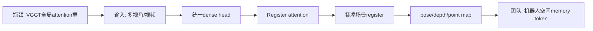
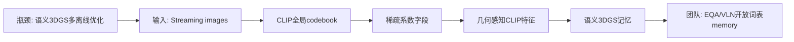

# 科研晨报：人类视频到 VLA、 高频动作闭环、VGGT 扩展与在线语义 3DGS

## 今日主线

今天继续避开最近三期已经覆盖的 15 个条目：Embodied.cpp、ReactVLA、RegimeVGGT、Mamba-VGGT、FastPano3D、Realtime-VLA FLASH、DEFLECT、Any3D-VLA、LingBot-Map、FreeStreamGS、MuseVLA、FASTER、RoboSemanticBench、3D-Mix for VLA、S2GS。

今天 5 条的主线是：

1. **具身模型进入“数据来源 + 控制频率”双重竞争**：CLAP 关注如何从人类视频抽取可执行 latent action，TIDAL 关注如何把 diffusion VLA 从低频 batch-and-execute 推向高频反馈。
2. **VGGT 系列的关键变化是“规模化训练”和“可迁移空间 token”**：VGGT-Ω 不只是重建更准，它把 register 作为紧凑场景表征，并明确展示可帮助 VLA 与语言对齐。
3. **宽视场/鱼眼相机正在成为机器人在线空间理解的现实入口**：RayTun3R 指出 3D foundation model 的 pinhole bias 主要藏在 positional encoding 中，用极少参数做在线相机适配，适合全景/鱼眼机器人感知路线。
4. **生成感知模型继续从离线渲染转向在线语义记忆**：EmbodiedSplat 将 streaming images 转成 semantic-embedded 3DGS，重点不是单纯 NVS，而是 open-vocabulary 3D scene understanding。

---

## 5条简报

### 1. CLAP: Contrastive Latent Action Pretraining for Learning Vision-Language-Action Models from Human Videos

**一句话结论**：CLAP 的价值在于把大量人类视频转成机器人可执行 latent action token，并在部署端接上 Rectified Flow action head，兼顾数据扩展和低延迟连续动作生成。

**为什么值得关注**：VLA 的一个根本瓶颈是机器人数据少，而人类视频多但不可直接执行。CLAP 先用 Act-VAE 从机器人轨迹中学习 executable action-token vocabulary，再用 contrastive learning 把人类视觉转移对齐到这个动作词表，最后训练 CLAP-NTP 自回归 VLA。部署时，它再用 CLAP-RF 作为 Rectified Flow 连续动作头，并用 Knowledge Matching 正则避免微调时语义能力遗忘。论文 arXiv 页面显示 v2 更新于 2026-06-14，代码已公开；GitHub README 还给出 Qwen3-VL-4B backbone、LIBERO 与 Astribot S1 真实机器人训练/评测脚本，并提供 Hugging Face 预训练权重入口。来源：[arXiv](https://arxiv.org/abs/2601.04061)，[GitHub](https://github.com/LinShan-Bin/OpenCLAP)。

**是否开源**：代码已公开，仓库为 `LinShan-Bin/OpenCLAP`；README 显示包含 Act-VAE/VD-VAE 训练、CLAP-NTP、CLAP-RF+KM post-training、LIBERO/Astribot 评测脚本，并提供预训练模型链接。完整数据需按其脚本与数据源另行准备。

**所需算力**：训练端不轻。README 中 Stage 3 使用 Qwen3-VL-4B，完整 Astribot 训练示例使用 8 卡 DeepSpeed；smoke test 可单卡检查数据和图结构，但 full recipe 需要 ZeRO-2/3。推理端的低延迟收益主要来自 CLAP-RF：在已获得 token policy 的基础上，用 rectified-flow continuous head 输出 action chunk。

**输入/输出**：输入包括机器人轨迹、人类视频视觉转移、语言指令、机器人观测；输出是离散 action token 或连续 action chunk。中间表示包括 Act-VAE codebook、VD-VAE pseudo-action token、CLAP-NTP autoregressive policy 和 CLAP-RF action head。

**核心 insight**：不要让人类视频直接监督机器人动作，而是先把机器人可执行动作离散成物理 grounded token，再把人类视频的视觉变化对齐到这个 token 空间。这样，人类视频提供的是“动作语义与技能先验”，而不是噪声很大的像素重建目标。

**思路来源与前序瓶颈**：它承接 latent action model、人类视频 imitation、OpenVLA/π0/StarVLA、flow action head 等路线。前序方法的瓶颈是人类视频和机器人动作空间不一致，视觉变化容易纠缠背景、视角和外观噪声；CLAP 用 executable token vocabulary 缓解这一点。

**对团队启发**：这篇适合给组内 VLA 数据路线定方向：如果真实机器人数据有限，可以先不追求大规模 teleoperation，而是构建“组内任务的动作 token 词表”，再考虑从第一人称视频、UMI 视频或学生采集视频中抽取 pseudo-action。插销/装配任务尤其需要把“接触前移动、对准、插入、纠偏”变成可复用动作 token。

#### 总览图（Mermaid）

---

### 2. TIDAL: Temporally Interleaved Diffusion and Action Loop for High-Frequency VLA Control

**一句话结论**：TIDAL 不只是加速推理，而是把 diffusion VLA 拆成低频语义意图循环和高频微控制循环，使 VLA 更接近真实机器人闭环控制。

**为什么值得关注**：大 VLA 通常采用低频 batch-and-execute：模型算一段 action chunk，机器人开环执行。这会在动态目标或接触纠偏中产生 execution blind spot。TIDAL 提出 dual-frequency 架构：低频 macro-intent loop 缓存语义 embedding，高频 micro-control loop 在执行过程中 interleave single-step flow integration。arXiv 摘要报告其在边缘硬件上达到约 9 Hz 控制更新，而 baseline 约 2.4 Hz；反馈频率约 4× 提升，并在动态拦截任务中取得约 2× performance gain。来源：[arXiv](https://arxiv.org/abs/2601.14945)，[HTML](https://arxiv.org/html/2601.14945v1)。

**是否开源**：当前检索未确认正式 GitHub 代码、模型权重或数据集 release；论文为 2026-01-21 提交，2026-06-24 更新到 v2。

**所需算力**：训练端需要 temporally misaligned training，让策略学会用 stale semantic intent 和实时 proprioception 做预测补偿；成本取决于底座 VLA。推理端的关键是架构性重排，不增加 marginal overhead，理论上适合在已有 diffusion/flow VLA 上做模块化改造。

**输入/输出**：输入是视觉、语言、机器人 proprioception 和上一阶段 semantic embedding；输出是高频动作更新。中间表示包括 macro semantic intent、micro-control flow step、differential motion predictor。

**核心 insight**：语义理解不需要每个控制步都完整重算，但低层动作必须高频更新。VLA 的“智能”可以低频，控制的“反应”必须高频。

**思路来源与前序瓶颈**：它从 diffusion policy、flow action generation、action chunking、asynchronous VLA 发展而来。前序瓶颈是 chunk 让长 horizon 更稳定，却让近端纠偏变慢；高层 VLM/VLA 推理和低层控制频率没有解耦。

**对团队启发**：插销和装配任务可以借鉴 TIDAL 的双频结构：语言/VGGT/全景 memory 给低频 intent，触觉/力反馈/末端视觉给高频 micro-control。不要把所有信息都塞进同一个大模型步里，尤其是接触阶段，应单独设计高频纠偏头。

#### 总览图（Mermaid）

---

### 3. VGGT-Ω

**一句话结论**：VGGT-Ω 是 VGGT 路线的规模化版本：用 register attention 和统一 dense prediction head 降低训练内存，同时扩展到静态/动态场景，并把 learned registers 推向 VLA 和语言对齐。

**为什么值得关注**：原始 VGGT 已经证明 feed-forward 3D foundation model 可以从多视角图像直接预测 pose、depth、point map 等几何；但 cross-frame attention 和多头结构在大规模训练时很重。VGGT-Ω 的改动很关键：用单一 dense prediction head 做多任务监督，去掉昂贵的高分辨率卷积层；用 registers 聚合场景信息，并通过 register attention 限制跨帧信息交换，部分替代 global attention。arXiv 摘要称训练时只用前代约 30% GPU memory，监督数据规模提升 15×，还能利用大量未标注视频；Sintel camera estimation accuracy 相比此前最好结果提升 77%。来源：[arXiv](https://arxiv.org/abs/2605.15195)，[项目页](https://vggt-omega.github.io/)。

**是否开源**：项目页已公开；当前检索未确认完整代码、模型权重和训练数据 release。论文标注 CVPR 2026 Oral。

**所需算力**：从头训练仍是大规模任务，但结构上更省显存：摘要明确称训练显存约为前代 30%。对组内 8×4090，更现实的路线是等待权重或复现小规模 adapter / register probing，而不是从头训练 VGGT-Ω。

**输入/输出**：输入是多视角图像、视频或动态图像序列；输出包括 camera、depth、point map / dense geometry，以及可用于其他任务的 geometry-aware registers。中间表示是 compact scene registers。

**核心 insight**：3D foundation model 的跨视角信息不一定都要走全局 dense attention；可以把场景信息压进少量 register，让 register 作为紧凑空间记忆和下游接口。

**思路来源与前序瓶颈**：它从 DUSt3R、MASt3R、VGGT、DINO/ViT register token、multi-task dense prediction 发展而来。前序瓶颈是多视角/长序列 attention 显存开销大，静态重建强但动态场景、语言/VLA 对齐和大规模视频利用不足。

**对团队启发**：对陈瑞阳的 stream/VGGT 方向，最值得借鉴的是 register：不要把历史所有帧都显式保留，可以学习少量 scene memory registers，再把它们喂给 VLN planner、EQA QA head 或 VLA geometry adapter。对 VQA/EQA 方向，可设计“VGGT register → spatial relation / affordance token”的实验。

#### 总览图（Mermaid）

---

### 4. RayTun3R: Online Camera Adaptation in 3D Foundation Models

**一句话结论**：RayTun3R 指出 VGGT/DUSt3R/MASt3R 等 3D foundation model 在鱼眼输入上失败的一个核心原因是 pinhole-biased positional encoding，并用 10,752 个可训练参数做在线相机适配。

**为什么值得关注**：机器人和 VLN 很适合用鱼眼、全景或宽视场相机减少 FoV gap，但现有 3D foundation model 多在 pinhole/perspective 图像上训练，直接喂鱼眼会导致 pose、depth、point map 崩坏。RayTun3R 保持 pretrained backbone 冻结，只适配 token position 与 camera geometry 相关的轻量组件：absolute / rotary positional encoding 的 residual correction，加上无参数的 tokenization 和 prediction-grid correction。论文 HTML 显示该 adapter 仅 10,752 trainable parameters，可从短 temporal segment 用几何损失学习，适配后对后续帧无额外推理开销。来源：[arXiv HTML](https://arxiv.org/html/2607.02711v1)。

**是否开源**：论文正文称代码将公开；当前检索未确认正式仓库已发布。论文提交日期为 2026-07-02，属于近期值得继续跟踪的条目。

**所需算力**：相比 LoRA 或重训非常轻量。训练只更新极少量 camera/position 相关参数，并可在短序列上自监督完成；推理端无额外 runtime overhead。对 8×4090 团队，甚至可以作为在线/测试时适配实验而非大训练项目。

**输入/输出**：输入是鱼眼/宽视场图像序列及相机几何估计；输出是适配后的 depth、pose、3D structure。中间表示是 corrected positional embeddings、RoPE residual、prediction-grid correction。

**核心 insight**：宽视场失效不是单纯 domain gap，而是像素网格到相机 ray 的几何含义变了；positional encoding 学到了 pinhole camera 的局部 Jacobian，因此相机适配应该首先改“位置到光线”的编码，而不是盲目 LoRA 改全部特征变换。

**思路来源与前序瓶颈**：它与 Fisheye3R、VGGT-360、RPG360、PRoPE、test-time adaptation、fisheye depth 等路线相关。前序瓶颈是把鱼眼切成多个 perspective patch 会增加计算并引入融合问题；普通 LoRA 参数更多但没有针对 camera geometry。

**对团队启发**：如果团队要做全景/VLN 在线记忆，不一定一开始就训练全景版 VGGT。可以先用 RayTun3R 思路给 VGGT/MASt3R 做 camera-aware positional adapter：360/鱼眼负责全局初始化，普通 wrist/head camera 负责局部精细更新。关键评测不是 NVS，而是 FoV gap、重复探索次数、object re-localization drift 和 VLN path replanning 成功率。

#### 总览图（Mermaid）

---

### 5. EmbodiedSplat: Online Feed-Forward Semantic 3DGS for Open-Vocabulary 3D Scene Understanding

**一句话结论**：EmbodiedSplat 把在线 feed-forward 3DGS 和 open-vocabulary semantic field 结合起来，目标是让机器人边探索边建立可查询的语义 3D 记忆。

**为什么值得关注**：很多 open-vocabulary 3DGS 仍是 offline 或 per-scene optimization，难以服务机器人在线探索。EmbodiedSplat 面向 streaming images，在线重建 semantic-embedded 3DGS，并支持超过 300 张 streaming images 的整场景构建。它的关键模块是 Online Sparse Coefficients Field 和 CLIP Global Codebook：用稀疏系数把 2D CLIP embedding 绑定到 3D Gaussian，同时降低内存并保持 CLIP 的开放词表泛化；再用 3D U-Net 聚合 3DGS partial point cloud，生成 geometry-aware CLIP feature，补足 2D CLIP 对三维几何不敏感的问题。来源：[arXiv](https://arxiv.org/abs/2603.04254)，[项目页](https://0nandon.github.io/EmbodiedSplat/)，[GitHub](https://github.com/0nandon/EmbodiedSplat)。

**是否开源**：代码已公开，仓库为 `0nandon/EmbodiedSplat`；GitHub 标注 CVPR 2026 official code，并提供训练文档。根据 GitHub issue，部分训练代码/特征相关内容曾分阶段释放，复现前仍需检查当前仓库完整度。

**所需算力**：训练成本未在摘要中明确；推理目标是 online / nearly real-time semantic reconstruction，结合 real-time 2D models 时更接近机器人可用。训练数据包括 ScanNet、ScanNet++、Replica 等室内数据；组内更适合先跑官方模型/脚本，再做少量场景适配。

**输入/输出**：输入是 streaming RGB images；输出是 semantic-embedded 3DGS，可用于 open-vocabulary 3D scene understanding。中间表示包括 CLIP Global Codebook、Online Sparse Coefficients Field、3D geometric-aware CLIP features。

**核心 insight**：机器人在线记忆不能只存几何，也不能只存 2D 语义；需要把开放词表语义绑定到可持续更新的 3D Gaussian 上，并用几何聚合纠正 2D CLIP 的空间不足。

**思路来源与前序瓶颈**：它从 LERF/OpenGaussian/semantic 3DGS、feed-forward 3DGS、online reconstruction、CLIP open-vocabulary segmentation 发展而来。前序瓶颈是语义 3DGS 多需逐场景优化，内存高、无法长序列在线更新；2D CLIP embedding 也缺三维几何一致性。

**对团队启发**：这篇可作为陈瑞阳方向的“在线语义记忆 baseline”。和 FreeStreamGS 的区别是：FreeStreamGS 更关注 unposed streaming NVS 稳定性，EmbodiedSplat 更关注 semantic-embedded 3DGS。后续可做 `VGGT/LingBot pose+point prior → EmbodiedSplat semantic Gaussians → EQA/VLN memory`，把渲染指标换成问答一致性、目标重定位和路径规划收益。

#### 总览图（Mermaid）

---

## 三条主线映射

| 主线 | 今日覆盖 | 关键判断 |
|---|---|---|
| 具身模型 | CLAP、TIDAL | VLA 的落地正在同时解决数据来源与控制频率：CLAP 用人类视频扩展技能，TIDAL 把语义推理和高频控制解耦。|
| 场景理解模型 | VGGT-Ω、RayTun3R | VGGT 类模型正在从“预测几何”变成“可压缩、可适配、可作为机器人空间 token 的 foundation model”。|
| 生成感知模型 | EmbodiedSplat | 在线 3DGS 的下一步不是只追求画质，而是把 semantic field 变成 EQA/VLN/VLA 可读的 3D memory。|
| 横向全景模态 | RayTun3R | 全景/鱼眼的增益是减少 FoV gap 和快速全局覆盖；关键风险是 pinhole bias、畸变几何和跨视角融合成本。|

---

## 组会讨论题

1. **人类视频到底能不能服务插销/装配？** CLAP 给出了一条路径：先学习可执行动作 token，再对齐人类视觉转移。组内可以讨论哪些动作阶段适合从视频中挖，哪些必须靠真实机器人数据。
2. **VLA 的高频闭环应该由谁负责？** TIDAL 暗示语义 intent 可以低频，micro-control 必须高频。插销任务中，高频模块应使用视觉、本体、触觉还是力反馈？
3. **VGGT register 能不能成为机器人空间记忆标准接口？** 与其输出完整点云/3DGS，不如输出少量 action-relevant registers：object anchor、free space、遮挡关系、可达性。
4. **全景/鱼眼路线应先做“模型适配”还是“输入投影”？** RayTun3R 反对简单切 perspective patch，因为重复计算和融合成本高；组内可比较 cubemap、RayTun3R adapter、VGGT-360 三条路线。
5. **在线语义 3DGS 的评测指标该怎么定？** EmbodiedSplat 如果只看 NVS/segmentation 不够，应增加 EQA answer consistency、VLN re-localization、目标搜索时间和长序列内存增长。

---

## 可延展选题

1. **CLAP-style 插销动作 token 库**：用少量真实插销/装配轨迹训练 Act-VAE，把动作分成接近、对准、插入、纠偏、退出等 token，再尝试用人类/第一人称视频做 pseudo-token pretraining。
2. **双频 VLA 插销控制**：低频模块读取 RGB/语言/VGGT memory 给 intent，高频模块读取 wrist camera + tactile/force 做接触纠偏；对比普通 action chunk、TIDAL-style micro loop、FASTER near-term schedule。
3. **VGGT register probing**：分析 VGGT-Ω 或原 VGGT 的中间 register/attention 是否编码 object anchor、空间关系、遮挡、可达性；用轻量 probe 接 EQA/VLN 问题，而不是直接训练大模型。
4. **RayTun3R for panoramic/fisheye memory**：用鱼眼/360 相机采集室内轨迹，比较未适配 VGGT、cubemap 切片、RayTun3R-style positional adapter 在 pose/depth/point map 和 VLN 规划上的差异。
5. **EmbodiedSplat + VGGT pose prior**：用 VGGT/LingBot-Map 提供 pose/point prior，EmbodiedSplat 负责 semantic Gaussian memory，评测开放词表目标搜索、EQA consistency 和 long-horizon drift。

---

## 音频版旁白稿

今天的科研晨报围绕三条主线展开：具身模型、场景理解模型和生成感知模型。今天继续避开最近几期已经讲过的条目，不重复 Embodied.cpp、ReactVLA、FLASH、DEFLECT、Any3D-VLA、LingBot-Map、FreeStreamGS、MuseVLA、FASTER、RoboSemanticBench、3D-Mix 和 S2GS。本期重点看五个新信号：人类视频如何变成 VLA 可执行动作，高频 VLA 控制如何摆脱低频开环执行，VGGT 系列如何规模化，鱼眼和全景相机如何接入 3D foundation model，以及在线语义 3DGS 如何变成机器人场景记忆。

第一篇是 CLAP。它的核心问题是机器人数据少，但人类视频很多。以往直接从人类视频学机器人动作很难，因为人手、机器人本体、视角和动作空间都不一样。CLAP 的思路更稳：先从机器人轨迹里学一个可执行的动作 token 词表，再把人类视频中的视觉转移对齐到这个词表，最后训练自回归 VLA。部署时，它还接了 Rectified Flow 连续动作头，用 Knowledge Matching 保持原有语义能力。对我们来说，这篇的启发是，组内不一定一开始就追求大规模遥操作数据，可以先围绕抓取、插销、装配建立任务动作 token，比如接近、对准、插入、纠偏、退出，再考虑用第一人称视频或 UMI 视频扩展技能先验。

第二篇是 TIDAL。它解决的是另一个真实机器人问题：大 VLA 推理慢，很多系统只能低频生成一段动作，然后让机器人开环执行。这样在动态目标或接触纠偏中会出现执行盲区。TIDAL 把 VLA 拆成两个频率：低频语义意图循环负责理解任务和缓存语义 embedding，高频微控制循环负责在执行过程中不断更新动作。它报告在边缘硬件上从约 2.4 赫兹提升到约 9 赫兹控制更新。这个思想很适合插销和装配：语义理解不需要每个控制步重算，但接触后的微小纠偏必须高频执行。

第三篇是 VGGT-Ω。它是 VGGT 路线的规模化版本。原始 VGGT 已经证明多视角 feed-forward 几何模型很强，但全局 attention 和多头 dense prediction 在大规模训练时很重。VGGT-Ω 用单一 dense prediction head 和 register attention 降低训练内存，摘要中说只需要前代约三成显存，并使用十五倍监督数据和大量未标注视频。更重要的是，它把 learned registers 作为紧凑场景表示，并显示这些 registers 可以帮助 VLA 和语言对齐。这对我们非常关键：未来接入机器人记忆时，也许不需要把完整点云或 3DGS 都交给 VLA，而是输出少量 action-relevant spatial registers。

第四篇是 RayTun3R。它非常适合全景和鱼眼相机这条横向线。机器人如果使用鱼眼或全景相机，可以减少视野盲区，但 VGGT、DUSt3R、MASt3R 这类 3D foundation model 大多在普通 pinhole 图像上训练，直接输入鱼眼图会退化。RayTun3R 的判断很明确：问题不只是普通 domain gap，而是 positional encoding 学到了 pinhole camera 的像素到光线关系。它冻结 3D backbone，只用一万多个可训练参数修正 absolute 和 rotary positional encoding，并且适配后没有额外推理开销。对我们来说，这提供了一条轻量路线：先不要从头训练全景版 VGGT，而是尝试 camera-aware positional adapter，让宽视场相机先服务 VLN 的全局记忆初始化。

第五篇是 EmbodiedSplat。它是在线 feed-forward semantic 3DGS，目标是让机器人边探索边建立开放词表的三维语义记忆。它不是只做新视角渲染，而是把 CLIP 语义嵌入绑定到 3D Gaussian 上，用稀疏系数字段和全局 codebook 降低内存，同时用 3D U-Net 聚合 partial point cloud，补足二维 CLIP 的几何不足。对陈瑞阳的方向，这篇可以作为一个很好的语义记忆 baseline：FreeStreamGS 更关注无位姿流式输入下的渲染稳定性，EmbodiedSplat 更关注语义 3DGS。下一步可以考虑用 VGGT 或 LingBot-Map 提供几何先验，再用 EmbodiedSplat 维护开放词表语义场。

今天组会可以集中讨论三个问题。第一，人类视频如何真正转化为我们插销和装配任务中的动作 token。第二，VLA 是否应该拆成低频语义模块和高频微控制模块，尤其是在触觉和力反馈加入以后。第三，全景或鱼眼相机接入 VGGT 时，应该优先做 cubemap 投影，还是做 RayTun3R 这种相机位置编码适配。我的建议是，短期可以启动两个小实验：一个是 CLAP-style 插销动作 token 库，另一个是 RayTun3R/VGGT 全景初始化记忆实验。两者都不需要从头训练大模型，但都能直接检验团队未来的技术路线。

---

## 今日已覆盖论文列表

1. CLAP: Contrastive Latent Action Pretraining for Learning Vision-Language-Action Models from Human Videos
2. TIDAL: Temporally Interleaved Diffusion and Action Loop for High-Frequency VLA Control
3. VGGT-Ω
4. RayTun3R: Online Camera Adaptation in 3D Foundation Models
5. EmbodiedSplat: Online Feed-Forward Semantic 3DGS for Open-Vocabulary 3D Scene Understanding
