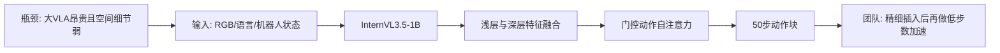
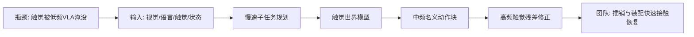
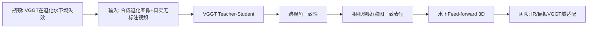
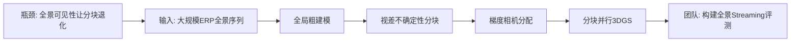
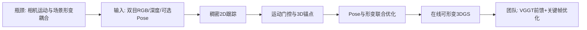

# 科研晨报：轻量精细操作、触觉快反馈与退化场景在线三维记忆

## 今日主线

今天选取的 5 项工作均未在最近 7 天简报中出现，重点不是继续堆叠更大的 VLA，而是观察三类更具体的技术变化：

1. **轻量 VLA 开始专门优化精细操作表征**：FabriVLA 表明，约 0.89B 参数的模型通过浅层空间特征融合与 action-token 自注意力，也能在插入、装配等任务上达到较强结果；但“参数少”还不等于“低延迟”，其 50 步 flow integration 仍值得进一步压缩。
2. **触觉正在从附加模态变成独立的预测—反馈控制回路**：TouchWorld 将慢速语义规划、中频动作块生成和高频触觉残差修正分离，直接对应插销、插头、擦拭和柔性物体操作。
3. **VGGT 的扩展重点开始转向退化成像域适配**：Wat3R 用合成退化、无标注真实视频和跨视角一致性，把 VGGT 从陆地普通成像迁移到水下退化环境；这一技术范式可直接迁移到红外、暗光、偏振与强反光场景。
4. **全景与在线 3DGS 出现两个互补信号**：PanoLOG 解决大规模全景 3DGS 的分块退化问题，但仍是逐场景优化；Track2Map 虽然真正在线更新，却达到约 6 秒/帧，也不是 feed-forward。二者共同说明，“online”“streaming”“feed-forward”“real-time”必须在评测中严格区分。

## 5条简报

### 1. FabriVLA：1B 级 VLA 可以做好精细操作，但动作生成仍有进一步加速空间

**一句话结论**：FabriVLA 使用 0.89B 参数的 InternVL3.5 骨干、浅层/深层视觉语言特征融合和带门控自注意力的 flow-matching action head，在 Meta-World MT50 上取得 90.0% tier-average success，并在紧密插入与装配子集达到 92.0%。

**为什么值得关注**：大量 VLA 依靠数十亿乃至更大参数规模提升泛化，但真实机器人部署更需要模型尺寸、空间精度和动作时序之间的平衡。FabriVLA 的消融显示，将第 6 层的空间细节与最终层语义特征融合，可把 tier-average success 从 82.9% 提升到 90.0%；action token 间的门控自注意力则显著改善 50 步动作块内部的时序依赖。这说明精细操作不一定必须依靠大模型，更关键的是保留浅层定位信息并显式建模动作块内部关系。

**是否开源**：论文正文描述了“released FabriVLA”配置，但截至本期检索，未确认正式代码仓库、模型权重或独立项目页；训练数据采用已公开的 Evo-1 Meta-World demonstration dataset。

**所需算力**：训练使用 5 张 NVIDIA RTX PRO 6000，batch size 40，训练 100,000 steps，BF16、DeepSpeed ZeRO-2 与 FP32 master weights，全模型联合微调。推理从噪声动作开始，使用 50 个 flow integration steps 生成 50×24 维动作块；因此模型虽然只有 0.89B 参数，但论文未给出真机延迟，不能直接视为 low-latency VLA。

**输入/输出**：输入为单路 448×448 RGB、语言任务指令和 24 维机器人状态；输出为 50 步、每步 24 维的动作块，Meta-World 部署时执行其中有效的 4 维动作。

**核心 insight**：精细操作同时需要深层语义和浅层空间细节；动作块也不是互相独立的 token，应在 action head 内部显式建模跨时间步依赖。

**思路来源与前序瓶颈**：该路线承接 Evo-1、TinyVLA、π0 和 flow-matching VLA。前序轻量模型通常压缩骨干或冻结 VLM，但容易损失物体边界、相对位置和接触定位；普通 cross-attention action head 又未充分建模动作块内部结构。

**对团队启发**：最直接的复现实验不是重训完整模型，而是在 StarVLA/VLA-Adapter 上加入“浅层空间特征旁路 + gated action self-attention”，重点测试插销、装配和精确放置。随后将 50 步 flow sampling 替换为 Mean Flow、few-step solver 或 speculative action head，才能真正回答速度问题。

**可靠来源**：[arXiv 论文](https://arxiv.org/abs/2607.08575)

#### 总览图（Mermaid）

---

### 2. TouchWorld：触觉不应与视觉语言共用同一个低频控制循环

**一句话结论**：TouchWorld 将慢速子任务规划、触觉世界模型、中频动作块生成和高频触觉残差修正拆成多时间尺度层级，在 6 个真实接触密集任务上达到 65.0% clean success 和 53.7% human-perturbation success，分别领先最强基线 15.7 和 18.5 个百分点。

**为什么值得关注**：视觉和语言能提供任务语义与粗几何，却无法直接观测接触力、滑移、插入对齐和抓取稳定性。现有多模态 VLA 常把触觉作为附加 token，与视觉语言按照同一频率统一推理，这会迫使慢语义、动作块和快反馈共享一个控制周期。TouchWorld 的核心价值在于明确分离三种时间尺度：高层规划低频更新，visuo-tactile policy 生成名义动作块，轻量触觉残差 Transformer 在执行过程中反复刷新局部修正。

**是否开源**：论文公开了项目页，但截至本期检索，未确认代码、模型权重和真实机器人数据完整发布。论文给出了系统、数据规模和训练流程的详细描述。

**所需算力**：完整训练分四阶段。子任务规划器基于 Qwen3-VL-4B，触觉世界模型基于 Wan2.2-TI2V-5B，并先用 EgoTouch 数据预训练，再在约 10 小时、108 万帧机器人数据上微调；每个真实任务采集 200 条遥操作轨迹。论文未披露 GPU 型号与总训练时长。推理端高层模块较重，但触觉 residual policy 是局部轻量模块，适合高频刷新。

**输入/输出**：输入包括多视角 RGB、任务语言、机器人本体状态、触觉压力观测和高层任务记忆；中间输出包括可执行子任务、未来视觉—触觉子目标和名义动作块；最终输出为经触觉残差修正后的动作窗口。

**核心 insight**：触觉既应作为“未来接触状态的预测目标”，也应作为“实时偏差修正信号”；预测与反应两条路径不能被压进单一 VLA 循环。

**思路来源与前序瓶颈**：该工作融合了 VLA 层级规划、触觉 foundation policy、世界模型与 residual control。此前 FTP-1 等工作强调跨传感器触觉表征，但仍偏单体策略；普通 VLA action chunk 在接触发生后无法等待下一次完整推理再纠偏。

**对团队启发**：李宗霖的触觉插销方向可以直接借鉴这一结构：视觉/VLA 负责接近和粗对准，触觉世界模型预测正确插入时的接触分布，小型 residual policy 只控制末端微位姿和力。评测应加入接触后恢复时间、卡滞次数、峰值力和扰动恢复率，而不只报告最终成功率。

**可靠来源**：[arXiv 论文](https://arxiv.org/abs/2607.07287)；[项目页](https://phanes-lab.github.io/TouchWorld-website/)

#### 总览图（Mermaid）

---

### 3. Wat3R：VGGT 的新方向不是继续扩大数据，而是用无标注真实视频适配退化成像域

**一句话结论**：Wat3R 以 VGGT 为基础，通过合成水下退化、teacher-student 伪监督和跨视角一致性，在不使用任何真实水下 3D 标注的条件下完成水下 feed-forward 3D 几何适配，并公开 Water3D、代码与数据。

**为什么值得关注**：这篇工作与团队的红外、暗光、偏振和透明/反光场景高度相关。作者发现，先做水下图像增强再输入 VGGT 几乎不能改善多视角几何，因为增强可能损失结构并产生跨视角不一致；相比之下，直接在几何模型内部使用跨视角信息补偿受衰减和散射影响的区域更有效。该结论对“先增强图像，再做 VLA/VGGT”这一常见 pipeline 构成直接挑战。

**是否开源**：代码与 Water3D 数据集已公开。Water3D 包含 42 个场景，并提供 depth 与 pose 标注；论文已被 ECCV 2026 接收。

**所需算力**：训练使用 4 张 RTX 4090，共 19,200 steps，采用 gradient checkpointing 与 BF16。输入长序列在评测时被切为最多 100 帧的子场景，因此它是多视角 feed-forward reconstruction，不是真正无限长 streaming memory。推理算力与 VGGT 同量级，论文未给出实时帧率。

**输入/输出**：输入为单张或多张水下 RGB 图像，可乱序输入；输出包括 camera pose、depth、point map 和相应置信度。训练阶段使用合成退化的有标注陆地数据与无标注真实水下视频。

**核心 insight**：退化成像域的几何适配应依靠“跨视角几何补偿 + 无标注真实视频”，而不是先做单帧外观增强；多头预测之间的 camera/depth/point consistency 也可作为无监督约束。

**思路来源与前序瓶颈**：Wat3R 从 VGGT、teacher-student domain adaptation 和 underwater image formation 发展而来。VGGT 的陆地训练数据与 pinhole/RGB 成像先验在水下失效，而真实水下三维标注昂贵；传统增强模型又不保证多视角一致。

**对团队启发**：可直接构造 `IR-VGGT` 或 `Polar-VGGT`：在 Objaverse/仿真中生成暗光、主动红外、偏振和反光退化作为有标注数据，再用无标注真机视频做 teacher-student adaptation。关键评测不是外观质量，而是 camera、depth、point map 以及下游抓取/VLN 的增益。

**可靠来源**：[arXiv 论文](https://arxiv.org/abs/2607.08772)；[代码与数据](https://github.com/LSXI7/Wat3R)

#### 总览图（Mermaid）

---

### 4. PanoLOG / Pano360：全景 3DGS 的大场景瓶颈不是视场不足，而是所有相机都“看见所有分块”

**一句话结论**：PanoLOG 针对全景图的 omnipresent visibility 重新设计 3DGS 分块策略，并发布 Pano360 大规模户外全景重建 benchmark；其价值主要在可扩展离线重建和数据集，而不是 streaming/feed-forward。

**为什么值得关注**：普通大场景 3DGS 按透视相机视锥分块，相机通常只监督局部区域；全景相机拥有 360° FoV，每个相机几乎都能看到所有分块，使局部分块重新退化为全局优化。PanoLOG 先做全局粗建模，再通过视差驱动的不确定性构造自适应空间块，并用梯度重要性决定相机—分块分配，从而恢复 block-parallel training。

**是否开源**：作者明确公开模型、训练代码和 Pano360 数据集。Pano360 包含 4 个户外场景、5,637 张 3840×1920 全景图，采集设备包括 Antigravity A1 全景无人机和 Insta360 X5。

**所需算力**：所有实验在单张 RTX 4090 24GB 上完成，每个方法训练 30,000 iterations，默认使用两个 partitions。它不需要多卡大集群，但仍是 per-scene optimization，不能直接用于实时 VLN 在线记忆。

**输入/输出**：输入为带标定 pose 和 sparse point cloud 的户外 ERP 全景图序列；输出为分块训练后合并的大尺度 3D Gaussian 场景，可用于新视角渲染和数字孪生。

**核心 insight**：全景相机减少了采集视角数量，但会破坏依赖局部视锥的空间分区假设；全景 3DGS 必须根据几何不确定性和训练梯度重新定义“哪张图应该监督哪个块”。

**思路来源与前序瓶颈**：该工作连接 OmniGS/SC-OmniGS 等 ERP rasterization 与 CityGaussian/H3DGS 等大场景分块路线。前者解决球面投影，后者解决规模扩展，但二者结合后出现“全景相机对所有块可见”的新问题。

**对团队启发**：Pano360 可以成为全景在线记忆的离线 teacher 数据。陈瑞阳方向可从其轨迹和场景切块中构造 streaming protocol：按采集顺序逐帧输入，只允许访问历史帧，评测全局覆盖、FoV gap、块间一致性、长期显存和 EQA/VLN 可用性。

**可靠来源**：[arXiv 论文](https://arxiv.org/abs/2607.08769)；[项目页与数据](https://insta360-research-team.github.io/GGPS-Website/)

#### 总览图（Mermaid）

---

### 5. Track2Map：真正 online 的 3DGS 仍可能远离 real-time，关键在动态场景的运动解耦

**一句话结论**：Track2Map 从双目手术视频中在线联合优化相机轨迹和可形变 3DGS，在缺失或噪声 pose 下保持稳定，但当前速度约为 6 秒/帧，因此它是 online optimization，而不是 feed-forward 或 real-time reconstruction。

**为什么值得关注**：流式三维重建中，场景运动与相机运动经常耦合。手术场景尤其典型：相机可能静止，但器械和组织持续运动；若无差别优化相机 pose，局部形变会被错误吸收到相机轨迹中。Track2Map 用 CoTracker3 的稠密 2D tracks 判断全局运动是否来自相机，只在必要时更新 pose，并把 2D tracks 提升到 3D anchors 初始化形变，再联合优化相机和 Gaussians。

**是否开源**：论文和项目页已公开，项目页提供代码入口；工作已被 MICCAI 2026 接收。

**所需算力**：系统在 NVIDIA Tesla V100 上运行，CoTracker3 使用 8 帧滑窗；当前实现约 6 秒/帧，作者明确建议 keyframe processing。它不需要离线完整序列，但每帧仍执行联合优化，显然不适合直接作为高频机器人 memory front-end。

**输入/输出**：输入为 stereo RGB、depth、相机内外参（可选且可带噪声）和工具 mask；输出为 refined camera poses、metric deformable 3DGS，以及作为副产物的 2D/3D tracks。

**核心 insight**：动态在线重建不能只估计“哪里动了”，还必须判断“是相机动、物体动，还是两者都动”；稠密 track statistics 可以作为 pose update gate 和 deformation initialization 的共享中间表示。

**思路来源与前序瓶颈**：该工作从 deformable 3DGS、non-rigid SLAM、CoTracker 和在线 endoscopic mapping 发展而来。前序系统通常依赖干净机器人运动学 pose，或把相机运动和组织形变全部交给逐帧逆渲染，容易漂移。

**对团队启发**：陈瑞阳的 stream feed-forward 路线可以采用混合结构：VGGT/LingBot-Map 负责每帧或窗口级前馈 pose/point initialization，Track2Map 式运动门控只在高不确定性关键帧触发少量 3DGS 优化。这样比纯 feed-forward 更稳，也比每帧 6 秒优化更接近机器人可用延迟。

**可靠来源**：[arXiv 论文](https://arxiv.org/abs/2607.08408)；[项目与代码](https://track2map.github.io/)

#### 总览图（Mermaid）

## 三条主线映射

| 主线 | 今日覆盖 | 关键判断 |
|---|---|---|
| 具身模型 | FabriVLA、TouchWorld | 轻量化要同时看参数、采样步数和控制频率；触觉的明确增益集中在滑移、力、接触稳定性和插入对齐等 RGB 不可观测状态。 |
| 场景理解模型 | Wat3R、PanoLOG | VGGT 可以通过无标注真实视频适配退化成像域；全景带来更大覆盖，但也会破坏透视相机下的分块与位置编码假设。 |
| 生成感知模型 | PanoLOG、Track2Map | PanoLOG 是离线逐场景优化，Track2Map 是在线逐帧优化；二者都不是 streaming feed-forward，恰好可作为陈瑞阳路线的对照组。 |
| 横向全景模态 | PanoLOG / Pano360 | 全景的真实信息增益是减少 FoV gap、扩大长程覆盖；新增代价是 ERP 畸变、全局可见性造成的分块退化和更复杂的全局—局部一致性。 |

## 组会讨论题

1. **0.89B 是否真的等于高效 VLA？** FabriVLA 的模型规模很小，但仍使用 50 次 flow integration。组内评测应同时记录参数、显存、单次前向、ODE/denoising 步数、action refresh frequency 和真机 time-to-success。
2. **触觉应该进入 VLA backbone，还是只进入 residual controller？** 对插销和装配而言，触觉可能不需要参与完整语义推理，而应以高频局部状态直接修正末端动作。
3. **Wat3R 的跨域适配范式能否直接迁移到红外和偏振？** 需要区分“外观退化”与“传感器真正新增信息”：红外/偏振不是简单风格变化，仿真时必须建模物理成像和跨模态不可见信息。
4. **在线、流式、前馈、实时四个概念如何在组内统一？** 建议明确：可逐帧更新叫 online；不能访问未来帧叫 streaming；无逐场景梯度优化叫 feed-forward；满足目标控制周期才叫 real-time。
5. **全景场景记忆应保存完整 3DGS，还是对象/拓扑级 token？** 对 VLN/EQA，完整可渲染场景可能不是必要条件；需要用下游决策指标判断表示复杂度。

## 可延展选题

1. **FabriVLA-lite for insertion**：在 1B 级 VLA 上融合浅层空间特征，比较普通 cross-attention、gated action self-attention、Mean Flow 和 one/few-step action head；任务采用插销、装配、精确放置。
2. **Predictive-Reactive Tactile VLA**：视觉语言模型只低频生成子目标，触觉 world model 预测接触模板，轻量 residual policy 以高频修正末端微位姿与夹爪力。
3. **IR/Polar-VGGT 无标注适配**：仿真生成有几何标注的红外/偏振/暗光退化，真实视频仅做 teacher-student 与跨视角一致性；评测 camera、depth、point map 和抓取成功率。
4. **Pano360-Stream Benchmark**：将 Pano360 重排为严格历史可见的导航序列，增加内存占用、累积漂移、跨块一致性、对象重定位、EQA 与 VLN path efficiency 指标。
5. **VGGT 前馈 + 关键帧 3DGS 优化**：前馈模型持续给出 pose/point map，利用 track-based motion gate 和 uncertainty 只选择少量关键帧优化 3DGS，目标将 Track2Map 式 6 秒/帧降为低频后台校正。

## 音频版旁白稿

今天的科研晨报围绕三个问题展开：小型 VLA 能不能真正做好精细操作，触觉如何进入高频机器人控制，以及 VGGT 和 3DGS 怎样走进退化场景、全景场景与在线动态场景。

第一篇是 FabriVLA。它使用不到十亿参数的视觉语言骨干，在五十个 Meta-World 操作任务上取得了很强的结果，尤其是在紧密插入和装配任务上达到百分之九十二。它最值得关注的并不是单纯把模型做小，而是两个结构判断。第一，最终层的语义特征不足以支撑精确接触，还需要把中间浅层保留的边界、位置和局部空间细节送给动作头。第二，一个动作块内部的多个时间步不是彼此独立的，动作 token 之间需要自注意力，才能学到连续插入、滑动和装配中的时序关系。不过，这篇文章也提醒我们，小参数不等于低延迟。它推理时仍然进行了五十步 flow integration，而且没有给出真机毫秒级速度。因此，对我们更有价值的路线是先复现浅层特征融合和动作自注意力，再结合 Mean Flow 或少步数动作头，真正降低动作刷新延迟。

第二篇是 TouchWorld。这篇与我们的触觉插销和接触操作最直接相关。它认为，视觉语言推理、动作块生成和触觉反馈不应该被塞进同一个低频模型里。视觉语言负责理解任务和划分子任务，触觉世界模型预测正确接触应该呈现什么状态，中频策略生成名义动作块，最后由一个轻量触觉残差模型在机器人控制循环中反复修正。实验包含插杯、插电源插头、擦拭和柔性物体操作等六类真实任务。在人为干扰下，它比最强基线高出十八点五个百分点。这里最关键的启发是，触觉相比 RGB 的增益非常明确：它直接观测滑移、力、接触稳定性和插入对齐。对于我们的插销任务，可以让 VLA 只负责靠近和粗对准，而把接触后的微位姿、力和卡滞恢复交给高频 residual controller。

第三篇是 Wat3R。它把 VGGT 迁移到水下退化成像环境，而且不使用真实水下三维标注。作者先在有三维标注的普通数据上合成水下衰减和散射，再用大量无标注真实水下视频做 teacher-student 训练，并通过跨视角一致性补偿单帧中被严重退化的区域。一个很重要的结论是，先做图像增强再送入 VGGT 几乎没有帮助，因为增强过程可能损失几何信息，也可能造成跨视角不一致。相比之下，直接在三维模型内部做跨视角补偿更有效。这一思路可以直接迁移到我们的红外、暗光和偏振方向：仿真负责提供几何真值和物理退化，真实视频只需要无标注适配，最终评测的重点应该是相机、深度、点图和下游机器人任务，而不是增强后的图像是否更好看。

第四篇是 PanoLOG。它研究大规模户外全景三维高斯重建。全景相机确实能够一次覆盖三百六十度，减少视场盲区和重复采集，但它也破坏了传统大场景分块的基本假设。透视相机通常只看见局部区域，而全景相机几乎能看见所有分块，导致每个局部块又被所有相机共同监督，分块优化重新退化成全局训练。PanoLOG 用视差不确定性决定空间分块，再用训练梯度决定哪些相机真正应该分配给哪个块。它还发布了 Pano360 户外全景 benchmark。需要注意，这仍然是逐场景三维高斯优化，不是在线或前馈模型。对我们而言，它更适合作为全景在线记忆的离线 teacher 和数据来源，而不是直接部署到机器人上。

第五篇是 Track2Map。它是真正逐帧在线更新的动态三维高斯系统，但当前速度大约是六秒一帧，因此在线并不等于实时。它面对的核心问题是相机运动和场景形变之间的混淆。在手术视频中，相机可能不动，但组织和器械一直在动。如果系统把所有图像变化都解释成相机运动，轨迹和三维场景都会漂移。Track2Map 用稠密二维点轨迹判断是否存在一致的全局相机运动，只在需要时更新相机位姿，同时用这些轨迹初始化三维形变。这个思路对陈瑞阳的方向非常重要。我们不必在纯前馈和纯优化之间二选一，可以让 VGGT 或 LingBot-Map 持续提供前馈几何，只在高不确定性关键帧触发少量三维高斯优化。

今天建议组会重点讨论三件事。第一，团队的高效 VLA 评测必须同时报告参数量、采样步数、动作刷新频率和真实任务完成时间，不能只看模型大小。第二，插销和装配任务中，触觉应该主要进入完整 VLA，还是进入一个独立的高频残差控制器。第三，陈瑞阳的在线重建路线是否应采用“前馈持续更新、关键帧优化校正”的混合框架。围绕这三个问题，可以形成两个近期实验：一个是浅层空间特征加少步数动作头的精细插入模型，另一个是 VGGT 前馈几何加 track-based motion gate 的在线三维记忆系统。

## 今日已覆盖论文列表

1. FabriVLA: A Lightweight Vision-Language-Action Model for Precise Multi-Task Manipulation
2. TouchWorld: A Predictive and Reactive Tactile Foundation Model for Dexterous Manipulation
3. Wat3R: Underwater 3D Geometry Learning without Annotations
4. Geometry and Gradient-based Partitioning for Panoramic Outdoor Reconstruction
5. Track2Map: Online Deformable SLAM with Motion-Aware Pose Optimization in Robotic Surgery
