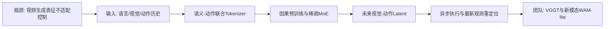
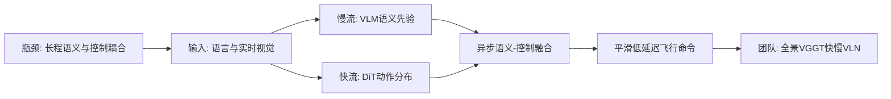

# 科研晨报：具身评测、原生 Video-Action 预训练与在线对象记忆

## 今日主线

北京时间 2026 年 7 月 12 日是周日，arXiv 周末没有新的常规发布批次；本期基于截至今早可见的最新一批论文，即 7 月 10 日 recent 列表中、主要于 7 月 9 日提交的工作。选题已避开最近几期出现过的 FabriVLA、TouchWorld、Wat3R、PanoLOG、Track2Map、CLAP、TIDAL、VGGT-Ω、RayTun3R、EmbodiedSplat、FLASH、DEFLECT、Any3D-VLA、LingBot-Map 和 FreeStreamGS 等条目。

今天值得关注的技术变化有四点：

1. **具身评测开始从单任务成功率扩展到任务、机器人形态、视觉变化和传感器条件的组合泛化**。DexVerse 的价值不只是“100 个任务”，而是把任务、形态和视觉域拆成可配置因素。
2. **World-Action Model 正从复用视频生成器转向原生具身预训练**。LingBot-VA 2.0 强调因果时序、语义—动作联合 tokenizer、稀疏 MoE 和异步重定位，说明 WAM 的核心可能不是预测更漂亮的视频，而是学习适合动作的未来状态。
3. **长程决策继续走向快慢双系统**。FSD-VLN 将慢速语义理解与快速动作生成异步解耦，这一结构同样适合地面 VLN、VLA 插销纠偏和多模态操作。
4. **在线场景记忆出现“对象级记忆”路线**。Whareformer 不重建完整稠密场景，而是持续维护“什么对象在哪里”，与 VGGT 局部几何、全景观察和 EQA/VLN 结合的成本更低。
5. **全景生成开始显式引入几何先验**。Canvas360 使用深度并行生成和环形边界约束改善 ERP 畸变与 0°/360° 接缝，但它仍是生成模型，不能直接等同于可信的三维记忆。

---

## 5条简报

### 1. DexVerse：评测重点从“会不会做”转向“换任务、换手、换视觉条件后是否仍会做”

**一句话结论**：DexVerse 提供 100 个灵巧操作任务、3 种机械臂、6 种灵巧手、可配置视觉变化和 3,180 条多模态示教，并显示 π0.5、OpenVLA、DP3 和 Diffusion Policy 在 19 个测试任务上的最佳平均成功率也只有 0.34。

**为什么值得关注**：现有 manipulation benchmark 往往只改变任务，机器人形态、相机视角、材质、照明和背景相对固定，因此模型可能只是记住视觉—动作对应关系。DexVerse 在 Isaac Lab 中将任务、embodiment 和 visual conditions 解耦，视觉变化覆盖材质、照明方向与强度、色温、HDR 背景、曝光和相机视角。它还同步提供 RGB、depth、point cloud、proprioception 和 state，为比较 RGB-only、RGB-D 和 3D policy 提供了统一入口。公开结果中，没有一种方法在所有类别上占优，精密插入、工具使用和非抓取控制仍然困难。

**是否开源**：官方代码仓库和初始任务套件已经公开，采用 BSD-3-Clause 许可证；部分资产可通过 Hugging Face 下载。完整遥操作工具、基线代码、跨形态示教和完整数据仍按 roadmap 分批发布，因此目前属于“框架已开源、数据尚未完全开放”。

**所需算力**：benchmark 本身不需要重新训练统一大模型，但依赖 Isaac Sim 5.1 与 Isaac Lab 2.3.2，需要 NVIDIA GPU。单环境验证可在单卡完成；大规模并行 rollout 和策略训练的成本取决于具体 baseline。对于团队的 8×4090，复现任务与训练轻量 policy 可行，但 π0.5/OpenVLA 全量微调仍需采用 LoRA、冻结骨干或分布式训练。

**输入/输出**：环境可输出 RGB、深度、点云、本体状态和任务状态；策略输出机械臂—灵巧手控制命令；benchmark 输出不同任务、形态和视觉域下的成功率。当前主指标仍以成功率为主，尚未系统纳入 time-to-success、恢复次数、峰值接触力和人类相对效率。

**核心 insight**：具身泛化应被拆成可控因素，而不是用一个混合成功率掩盖问题。任务泛化、视觉鲁棒性和跨形态迁移需要分别测量，也需要观察它们的组合失效。

**思路来源与前序瓶颈**：该路线承接 Meta-World、LIBERO、ManiSkill、RoboTwin 和灵巧手模拟 benchmark。前序平台通常任务数量有限、形态固定，或者缺少可控视觉变化；跨 embodiment 研究又常因资产、动作空间和观测接口不统一而难以复现。

**对团队启发**：可从 DexVerse 中选取插入、工具使用、双手协同和 contact-rich 子集，建立组内统一评测协议；在原有视觉随机化之外增加暗光、主动红外、偏振响应、透明/反光材质和触觉噪声。指标必须扩展为成功率、完成时间、接触后恢复时间、失败类型和相对人类 throughput，才能真正评估新模态的信息增益。

**可靠来源**：[arXiv](https://arxiv.org/abs/2607.08751)；[项目页](https://ycyao216.github.io/DexVerse.site/)；[GitHub](https://github.com/ycyao216/DexVerse)

#### 总览图（Mermaid）

---

### 2. Native Video-Action Pretraining：WAM 不应只是把数字内容生成器改成机器人控制器

**一句话结论**：LingBot-VA 2.0 从头构建面向具身的 Video-Action foundation model，用语义—动作联合 tokenizer、因果预训练、稀疏 MoE 和带最新观测重定位的异步推理，试图同时解决动作精度、容量和闭环速度问题。

**为什么值得关注**：很多 WAM 从视频 diffusion 或双向视频表征出发，再添加 action head；但内容生成模型优化的是视觉重建和感知质量，并不天然保证动作可辨识性、严格因果性和控制时延。LingBot-VA 2.0 明确提出四个原生设计：首先让 tokenizer 同时对齐语义和动作，而不只重建像素；其次从头采用 causal pretraining，避免把双向模型改成因果模型时产生灾难性遗忘；再次使用 sparse MoE 增加总容量而不让每次推理激活全部参数；最后在执行动作的同时预测未来 latent，并用最新观测和 learned forward dynamics 重新锚定每次 rollout。

**是否开源**：截至 7 月 12 日早晨，arXiv 页面未给出官方代码、模型权重、数据或项目页，公开检索也未确认正式 release。因此当前只能将其视为论文级架构信号，不能直接作为可复现 baseline。

**所需算力**：论文公开摘要未披露 GPU 型号、训练时长、总参数量和激活参数量。由于模型采用从头因果预训练和 sparse MoE，完整预训练大概率属于多机多卡级别，明显超出 8×4090 从头复现的合理范围。团队更现实的路线是复现 tokenizer、异步 re-grounding 或 action head，并在现有 WAM/VLA backbone 上做 LoRA 或模块级微调。Sparse MoE 理论上降低每次前向的激活计算，但尚无公开毫秒延迟、控制频率或显存数据。

**输入/输出**：从公开信息可确认，输入包含语言、当前视觉观测、机器人动作/状态历史；模型联合预测未来视觉 latent 和机器人动作序列。异步执行时，模型一边产生未来 latent 和动作，一边用最新观测重新校正 rollout。具体是否使用多视角、深度、本体状态维度和动作 chunk 长度，公开摘要未明确。

**核心 insight**：WAM 的瓶颈不只是采样步数，而是表征目标错位。若 tokenizer 只服务像素重建，模型可能生成视觉上合理、但对动作不敏感的未来；原生 visual-action token 应优先保留接触、运动和任务语义。

**思路来源与前序瓶颈**：该工作延续 LingBot-VA、Cosmos Policy、视频 diffusion policy 和 action-conditioned world model。前序路线往往复用娱乐视频模型的 VAE/DiT，存在双向预训练与因果控制不一致、动作信息在压缩中丢失、整模型推理慢，以及异步执行后观测过期等问题。

**对团队启发**：不建议追随其规模，而应做 `WAM-lite`：用 VGGT/在线 3D memory 产生紧凑 world tokens，将红外、偏振、触觉只编码成动作相关变量，例如透明边界、表面法线、接触状态和滑移；训练时预测未来状态，推理时允许关闭高成本视频解码器。对插销和装配，可比较“未来 RGB latent”和“未来接触/位姿 latent”哪一种更能提升动作成功率与恢复速度。

**可靠来源**：[arXiv](https://arxiv.org/abs/2607.08639)

#### 总览图（Mermaid）

---

### 3. FSD-VLN：长程导航中的语义推理与控制刷新不应运行在同一频率

**一句话结论**：FSD-VLN 通过慢速 VLM 语义流与快速 DiT 动作流异步协同，在低空长程 VLN 模拟中将未见场景成功率最高提升到基线的约 2 倍，并将单动作延迟和总任务时间降低超过 50%。

**为什么值得关注**：长程 VLN 既需要全局语言理解、地标识别和任务阶段判断，也需要高频、平滑的局部控制。单一大模型逐步完成全部计算，会造成动作抖动和严重决策延迟。FSD-VLN 将稳定的语义先验低频更新，快速分支则利用跨时间动作分布连续产生飞行命令；time-aware adaptive optimizer 用于缓解长序列训练中的梯度振荡。这一结构和 TouchWorld 的多时间尺度控制、TIDAL 的意图—微控制分解具有共同趋势：语义和控制应按各自需要的频率运行。

**是否开源**：截至本期检索，arXiv 页面没有代码、数据、模型或项目页链接，尚未确认公开实现。

**所需算力**：论文摘要未公开训练硬件与模型规模。若慢速 VLM 冻结、只训练快速 DiT 与融合模块，8×4090 具备复现类似结构的条件；若端到端训练大型 VLM，成本会显著提高。推理侧的主要节省来自复用慢速语义先验，而不是让 VLM 每个控制步重复运行。论文只公开相对降幅，未给出可直接比较的毫秒延迟和显存。

**输入/输出**：输入为语言导航指令和实时 UAV 视觉流；输出为连续或序列化飞行控制命令。公开摘要未明确是否额外使用深度、位姿、IMU 或地图，因此不能把它直接视为纯视觉无位姿导航系统。

**核心 insight**：全局语义状态变化慢，局部控制状态变化快。用异步双分支让慢模型提供稳定先验，让快模型负责跨时间动作连续性，比单体模型每步重新推理更适合长程实时系统。

**思路来源与前序瓶颈**：该工作与 fast-slow reasoning、层级 VLN、action diffusion 和异步 VLA 同源。传统 VLN policy 常把语言、视觉、历史和动作预测放入单一 Transformer，随着路径变长，计算量、轨迹抖动和历史压缩问题同时恶化。

**对团队启发**：可将结构迁移到地面 VLN：慢分支每隔若干步读取全景图、语言和 VGGT/3DGS 全局记忆，输出子目标、frontier 或对象级 spatial token；快分支只读取局部 RGB-D/里程计和最近动作，输出低延迟转向与前进控制。全景的真实增益应通过路径效率、重复探索率、FoV gap 和紧急避障反应时间测量，而不是只看最终成功率。

**可靠来源**：[arXiv](https://arxiv.org/abs/2607.08359)

#### 总览图（Mermaid）

---

### 4. Whareformer：在线场景记忆未必需要保存整个场景，先记住“什么在哪里”

**一句话结论**：Whareformer 是面向长第一视角视频的在线 3D 对象跟踪器，通过可更新 track memory、feed-forward 关联模块和 New Track token，在对象离开视野、被遮挡或外观变化后仍维护其身份与位置。

**为什么值得关注**：机器人场景记忆通常有两条路线：一条持续维护稠密点云、mesh 或 3DGS，信息完整但内存与漂移成本高；另一条只存对象实体、相对位置和状态。Whareformer 属于后者，它针对 OSNOM——“看不见但不能忘记”——将当前对象观测与历史 track 关联，并联合使用 evolving appearance 与更新后的 3D location。模型只用 56 段训练视频，却在 EPIC-KITCHENS-100、IT3DEgo 和 HD-EPIC 的 260 段长测试视频上取得 SOTA，说明相对距离和动态 track representation 有较好的跨数据集泛化。

**是否开源**：代码、预提取特征、训练数据 LMDB 和预训练权重已公开，仓库采用 MIT License。项目还提供 DINOv2 特征以及 EPIC、IT3DEgo、HD-EPIC 的数据准备说明，复现条件相对完整。

**所需算力**：论文未在摘要中披露 GPU 型号。模型训练使用预提取 DINOv2 特征，且训练集仅 56 段视频，因此核心 tracker 的训练成本应明显低于端到端视频 foundation model；谨慎估计可在单张 24GB 级 GPU 上训练或微调。若从原始视频重新提取 DINOv2 特征、恢复相机和稠密/稀疏三维位置，前处理成本会更高。推理是逐观测 feed-forward 关联，memory 随对象数量而非帧数增长。

**输入/输出**：输入是第一视角视频中的对象观测、外观特征和对象 3D 位置；中间表示是持续更新的对象 track memory；输出是当前观测应关联的历史对象，或通过 New Track token 新建对象。它是真正在线的对象关联，但不是从原始 RGB 独立完成相机姿态与 3D 重建，仍依赖外部几何/检测信息。

**核心 insight**：长序列记忆应围绕实体状态更新，而非无限累积帧 token。对象外观会变化，绝对坐标也会漂移；相对距离和可演化的 track representation 比固定模板更稳健。

**思路来源与前序瓶颈**：该工作从 long-term egocentric tracking、object memory、3D instance association 和 OSNOM 任务发展而来。传统 MOT 假设对象持续可见，或只在短遮挡后重现；稠密地图又难以直接维护“这个被移动的杯子还是不是之前那个杯子”。

**对团队启发**：可构建 `VGGT + Whareformer` 在线记忆：VGGT 或 LingBot-Map 只处理局部窗口，输出 pose、point map 和对象 3D anchor；Whareformer 维护跨窗口的对象身份、位置、遮挡与移动历史；EQA/VLN/VLA planner 读取对象级 memory，而不必持续读取完整 3DGS。偏振可增强透明/反光对象的实例身份，触觉可在接触后更新对象可操作性和抓取状态。

**可靠来源**：[arXiv](https://arxiv.org/abs/2607.08537)；[项目页](https://jacobchalk.github.io/Whareformer/)；[GitHub](https://github.com/JacobChalk/Whareformer)

#### 总览图（Mermaid）

---

### 5. Canvas360：全景生成需要在训练阶段学习几何与环形边界，而不是事后修补接缝

**一句话结论**：Canvas360 使用 100K RGB—depth 全景进行几何感知预训练，再用 900K 样本统一微调风格迁移、修复、扩图和编辑，通过 parallel depth generation、velocity circular padding 与 similarity regularization 提升 ERP 几何一致性和 0°/360° 边界连续性。

**为什么值得关注**：普通透视 diffusion 模型迁移到全景后，会出现两类问题：一是 equirectangular projection 在极区和边缘的非均匀畸变，二是图像左右边界在球面上相邻、但网络中被当成远距离位置。Canvas360 不只做普通 circular padding，而是在 velocity prediction 中加入 ghost columns 和边界监督；同时并行生成 RGB 与 depth，使模型在预训练阶段学习场景结构。项目公开结果显示其 panorama-specific FAED 达到 2.33，左右边界 LRCE-RGB 为 0.0063，并能在统一框架中处理四类 in-context 任务。

**是否开源**：训练和推理代码已经公开，采用 MIT License，包含预训练与下游 LoRA 脚本。模型权重和在线 demo 标注为 coming soon；完整 1M Canvas360Dataset 是否可下载尚未确认，因此代码可用，但论文结果暂时不能完全一键复现。

**所需算力**：模型基于 FLUX.1-dev，公开脚本采用 1024 分辨率、LoRA rank 64 和 BF16，并提供单 device 参数。单卡脚本不意味着论文级训练只需单卡：完整 1M 样本训练预计耗时较长，24GB 4090 可能需要 gradient checkpointing、8-bit optimizer、CPU offload 或降低分辨率；团队 8×4090 适合 LoRA 复现和小规模消融，而不适合无优化地重跑全部数据。推理成本接近 FLUX.1-dev 加 LoRA，明显高于轻量在线重建模型。

**输入/输出**：预训练输入为文本、RGB panorama 和对应 depth panorama，输出并行 RGB/depth 全景；下游输入为源全景、mask/context 和文本指令，输出编辑、inpainting、outpainting 或风格化全景。该工作不是 streaming reconstruction，也不输出相机 pose、点云或 3DGS。

**核心 insight**：全景几何先验可以通过辅助深度生成进入 diffusion 表征；边界一致性也应在速度/流场预测阶段被监督，而不只是对生成图做后处理。

**思路来源与前序瓶颈**：该路线承接 PanFusion、PanoDiffusion、DiT360、HunyuanWorld 和 in-context image editing。前序方法常缺少大规模配对全景任务数据，或只处理 text-to-panorama，无法统一编辑、修复与扩图；普通 circular padding 也不能保证跨层特征和生成速度在接缝处一致。

**对团队启发**：Canvas360 可作为“全景记忆补全器”，但不能把生成内容直接当作真实几何。更可靠的路线是：全景模型补全 FoV 缺口并输出 depth/uncertainty，VGGT 或在线重建模型只在高置信区域更新 memory，低置信生成区域只作为 planner 的候选假设。可设计 panorama hallucination benchmark，评测补全后对 VLN 路径选择、EQA 答案和对象重定位究竟是帮助还是误导。

**可靠来源**：[arXiv](https://arxiv.org/abs/2607.08765)；[项目页](https://zry000.github.io/Canvas360/)；[GitHub](https://github.com/Insta360-Research-Team/Canvas360)

#### 总览图（Mermaid）

---

## 三条主线映射

| 主线 | 今日覆盖 | 关键判断 |
|---|---|---|
| 具身模型 | DexVerse、LingBot-VA 2.0 | 速度与鲁棒性需要同时从评测因素、动作表征、因果预训练和异步执行解决；仅报告成功率或模型参数量已经不够。 |
| 场景理解模型 | FSD-VLN、Whareformer | 最新批次没有新的 VGGT 专项扩展，最相关变化是将空间理解转为低频语义先验和对象级在线记忆；这可与 VGGT 局部几何互补。 |
| 生成感知模型 | LingBot-VA 2.0、Canvas360 | 生成模型开始更强调动作相关 latent、几何辅助监督和可控边界，而不是只追求未来图像观感。 |
| 横向全景模态 | FSD-VLN 延展、Canvas360 | 全景可降低 FoV gap，并提供全局上下文；但生成式补全会引入幻觉，必须通过几何一致性与不确定性门控后才能进入导航记忆。 |

---

## 组会讨论题

1. **组内真机 benchmark 是否应该采用 DexVerse 式因素分解？** 同一任务分别改变照明、材质、视角、传感器和机器人形态，避免把所有变化混成一个平均成功率。
2. **WAM 应该预测未来图像，还是预测未来动作相关状态？** 对插销和装配，未来接触分布、位姿误差和遮挡变化可能比高保真 RGB 更有价值。
3. **快慢双系统如何确定刷新频率？** 慢速 VLM/VGGT planner 每多少步更新一次，快速 action policy 多高频运行，遇到接触或异常时如何强制触发慢分支重规划？
4. **在线记忆应优先做稠密 3DGS，还是对象级 track memory？** 稠密表示适合回看和 NVS，对象记忆更适合规划与问答；两者是否需要双层结构？
5. **生成全景能否进入 VLN memory？** 应建立什么置信度、可验证性和错误隔离机制，防止补全出的不存在通道或物体误导路径规划？

---

## 可延展选题

1. **DexVerse-Multisensor**：选取 10—15 个插入、工具、双手和 contact-rich 任务，在 Isaac Lab 中加入暗光、NIR、偏振、透明/反光材质和触觉观测，形成新模态相对 RGB 的信息增益 benchmark。
2. **Native WAM-lite**：不训练大规模 MoE，只研究动作相关 tokenizer；比较 RGB reconstruction token、VGGT geometry token、contact token 和 joint action token 对真实操作的贡献。
3. **Fast-Slow Panoramic VLN**：慢分支读取 360° 全景和全局语言指令，快分支读取窄视场局部图与里程计；评测路径效率、重复探索、控制延迟和异常恢复。
4. **VGGT-Whareformer Memory**：VGGT 负责短窗口 pose/point map，Whareformer 负责跨窗口对象身份与位置，形成可被 EQA/VLN/VLA 直接查询的 object-centric memory。
5. **Panorama Completion with Verification**：Canvas360 生成缺失视野，随后用真实新观测做在线验证和 memory 修正；研究生成先验在何种置信度下能够减少探索，何种情况下会累积错误。

---

## 音频版旁白稿

今天的科研晨报继续围绕具身模型、场景理解模型和生成感知模型三条线展开。由于今天是周日，arXiv 没有新的常规发布批次，所以本期选取的是截至今天早晨可见的最新一批工作，主要来自七月十日的 recent 列表，并避开了最近几天已经介绍过的论文。

第一篇是 DexVerse。它最值得关注的地方，不只是包含一百个灵巧操作任务，而是把任务、机器人形态和视觉条件拆成了可以独立控制的评测因素。平台支持三种机械臂、六种灵巧手，并可以改变材质、照明、背景、曝光和相机视角。数据同时包含彩色图像、深度、点云、本体状态和任务状态。作者比较了扩散策略、三维扩散策略、OpenVLA 和 π0.5，结果显示最好的平均成功率也只有零点三四，而且没有一种方法能在所有任务类别上占优。这说明现有模型在精密插入、工具使用、非抓取控制和跨形态泛化上仍然很弱。对我们来说，可以直接借鉴它的评测思想，把暗光、红外、偏振、透明反光材质和触觉噪声作为独立变量，并加入完成时间、恢复次数和接触力等指标。

第二篇是 Native Video-Action Pretraining，也就是 LingBot-VA 2.0。它提出一个很重要的判断：机器人世界—动作模型不应该只是把数字内容生成模型改造一下。普通视频生成器追求像素重建和视觉质量，但机器人需要动作敏感、严格因果并且能够高频闭环的表征。因此，这个工作从头采用因果预训练，设计语义和动作联合的 tokenizer，再用稀疏专家网络扩展容量。推理时，模型一边执行动作，一边预测未来状态，并用最新观测重新校正 rollout。它目前没有公开代码和权重，而且从头训练的算力很可能远超我们的条件。但它给出的研究方向很清楚：我们可以做一个轻量版本，让 VGGT、红外、偏振和触觉只提供对动作有用的世界状态，而不是追求生成完整的未来视频。

第三篇是 FSD-VLN。它针对长程空中导航中的一个结构性问题：高层语义推理变化慢，低层飞行控制变化快，如果让同一个大模型在每个控制步重新完成全部计算，就会产生延迟和轨迹抖动。FSD-VLN 使用两个异步分支，慢分支提取稳定的视觉语言语义先验，快分支使用动作扩散模型产生连续飞行命令。论文报告，未见场景的导航成功率最高达到现有方法的两倍，同时单动作延迟和总任务时间降低超过一半。这个结构完全可以迁移到地面导航和机械臂操作：全景图、语言和三维记忆低频更新，局部视觉和动作控制高频运行，出现异常时再触发高层重新规划。

第四篇是 Whareformer。它提供了另一种在线场景记忆思路：机器人不一定要始终保存完整的稠密三维场景，也可以优先维护对象级记忆，也就是记住什么对象在哪里。Whareformer 面向长第一视角视频，即使对象离开视野、被遮挡或者外观发生变化，也会通过可更新的轨迹记忆保持对象身份和三维位置。它的关联过程是在线前馈的，记忆规模主要随对象数量增长，而不是随视频帧数无限增长。这个方向和陈瑞阳的在线重建并不冲突。可以让 VGGT 负责短窗口的相机和几何，对象级模块负责跨窗口身份、位置和状态，最终让导航、问答和动作模型读取更紧凑的场景记忆。

第五篇是 Canvas360。它关注全景生成中的几何畸变和左右接缝问题。模型先用十万组彩色全景和深度全景进行几何感知预训练，再用九十万组数据统一训练修复、扩图、编辑和风格迁移。关键设计包括并行生成彩色和深度，以及在生成速度场中显式约束零度和三百六十度边界。代码已经公开，但模型权重和在线演示还没有发布。对我们来说，它可以作为全景视野补全的先验，但必须特别警惕生成幻觉。生成出的房间、通道或物体不能直接写入机器人记忆，最好先输出不确定性，再由后续真实观测和 VGGT 几何进行验证。

今天建议组会重点讨论三个问题。第一，我们的评测是否应该从单一成功率转向任务、视觉条件、传感器和形态的因素化测试。第二，在线场景记忆是否应该采用双层结构：底层保留局部三维几何，上层维护对象身份、位置和可操作状态。第三，世界模型和全景生成模型产生的内容，在什么条件下可以参与决策，又应该用什么机制防止幻觉进入长期记忆。短期最值得启动的两个实验，一个是 VGGT 加对象级在线记忆，另一个是带暗光、红外、偏振和触觉变量的插入与装配鲁棒性 benchmark。

---

## 今日已覆盖论文列表

1. DexVerse: A Modular Benchmark for Multi-Task, Multi-Embodiment Dexterous Manipulation
2. Native Video-Action Pretraining for Generalizable Robot Control
3. FSD-VLN: Fast-Slow Dual-System Modeling for Aerial Long-Horizon Vision-Language Navigation
4. Whareformer: Learning to Track What is Where in Long Egocentric Videos
5. Enhancing In-context Panoramic Generation via Geometric-aware Pretraining
