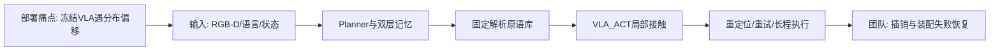
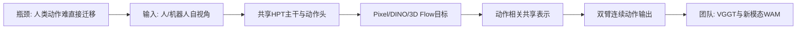
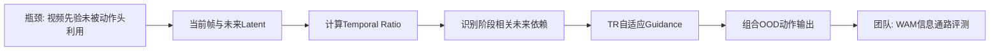
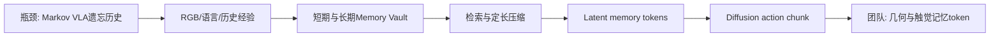
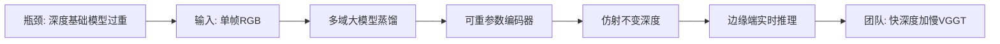

# 科研晨报：VLA可靠性、世界表征与边缘几何感知

## 今日主线

截至北京时间 2026 年 7 月 13 日早晨，arXiv 的 cs.RO 与 cs.CV recent 页面仍以 7 月 10 日批次为最新可见常规批次。本期继续从该批次中筛选最近 7 天未覆盖的工作，避开 Harness VLA 之外此前已介绍的 DexVerse、LingBot-VA 2.0、FSD-VLN、Whareformer、Canvas360、FabriVLA、TouchWorld、Wat3R、PanoLOG、Track2Map 等条目。

今天有四个值得关注的技术变化：

1. **VLA可靠性开始从“继续微调模型”转向“把冻结VLA放进可重试的系统闭环”**。Harness VLA 将VLA限定为局部接触原语，其余重定位、搬运和恢复由规划器完成。
2. **WAM的核心竞争点从视频是否逼真转向世界表征是否与动作相关**。EgoWAM显示，DINO语义特征和相机稳定的3D运动流均比像素重建更适合人类视频到机器人的迁移。
3. **生成未来并不等于策略会使用未来**。Temporal Ratio直接度量动作头对未来latent的依赖，为WAM/VAM提供了可解释诊断和阶段自适应引导方法。
4. **机器人记忆出现两种互补路线**：LaMem-VLA把历史压缩为VLA原生latent token；ZipDepth则说明局部几何可以在边缘端高频获得，再与较慢的VGGT全局更新组合。

本期没有发现符合去重要求、且比近期已覆盖工作更新的直接streaming feed-forward 3DGS或全景重建论文，因此不为凑数重复旧条目；相关判断放入“可延展选题”。

## 5条简报

### 1. Harness VLA：把冻结VLA变成可重试的接触原语

**一句话结论**：Harness VLA不微调VLA，而是把冻结VLA封装为局部接触原语 `VLA_ACT`，由带双层记忆的规划器调用固定解析原语完成重定位、重布置、搬运和失败重试，从而扩大原有策略的可用范围。

**为什么值得关注**：端到端VLA通常在训练分布内具有较强局部动作能力，但面对目标换绑、布局变化和接触失败时容易整段崩溃。Harness VLA将问题拆开：VLA只负责抓取、受限放置、抽屉操作和插入等难以解析建模的接触阶段；解析原语负责非接触运动和恢复。项目页报告，RLinf在LIBERO-Pro上由50.0%提升至82.4%，RLDX-1在RoboCasa365上由30.0%提升至55.4%，π0.5在RoboTwin C2R上由47.9%提升至58.4%。

**是否开源**：论文和项目页已公开；截至今日，项目页仍标注“Code coming soon”，代码、模型和执行日志尚未正式发布。

**所需算力**：没有新增VLA训练或微调成本。运行时需要冻结VLA推理、规划器推理和任务启动阶段的成功轨迹/失败规则积累。论文未报告统一的端到端毫秒延迟与GPU配置，因此目前只能判断它减少了训练成本，不能据此断言降低了单步控制延迟。

**输入/输出**：输入为任务描述、实时RGB-D、机器人状态、任务专用记忆和全局记忆；规划器输出结构化原语调用，而不是直接输出低层动作。`VLA_ACT`输出局部动作块，解析原语输出重定位、搬运、夹爪控制和恢复动作。

**核心 insight**：可靠性未必来自不断扩大技能库或继续微调大模型，而可以来自“限制VLA的工作区间”。系统先把环境重新布置到VLA熟悉的局部状态，失败后再重定位、重试，使冻结策略成为可组合、可验证的部件。

**思路来源与前序瓶颈**：它结合了语言智能体、行为树/技能原语与VLA局部策略。前序端到端VLA的主要瓶颈是训练轨迹之外缺乏显式恢复；纯解析规划又难处理不规则接触和高维视觉控制。

**对团队启发**：插销和装配可采用“几何规划器负责接近与重对准，VLA负责最后接触段，触觉残差负责高频纠偏”的三级结构。透明/反光物体抓取中，可将红外、偏振或深度用于重定位与失败诊断，而不必先把所有新模态都塞进完整VLA主干。

**来源**：[arXiv](https://arxiv.org/abs/2607.08448) · [项目页](https://harnessvla.github.io/)

#### 总览图（Mermaid）

### 2. EgoWAM：世界目标应超越像素重建

**一句话结论**：EgoWAM通过控制变量比较Pixel、DINO和相机稳定3D motion flow三种世界预测目标，表明人类自视角数据能否迁移到机器人，关键在于世界表征是否抽象外观、跨形态一致并分离自运动。

**为什么值得关注**：行为克隆将人手形态、头部运动和操作风格与可迁移的物体/场景语义混在一起。EgoWAM固定主干、动作头和数据混合，只改变世界预测目标：像素预测迁移较弱；DINO对未见物体与场景的泛化最高可提升约4倍；3D flow在域内空间操作上提升20%—30%。这说明WAM不应默认把“预测未来RGB”当作唯一目标。

**是否开源**：项目页和EgoVerse数据入口已公开；代码仍标注“coming soon”。模型权重未确认公开。

**所需算力**：除1.3B像素预测变体外，多数变体在单张NVIDIA L40S上约训练两天/任务/方法；像素预训练变体需要数据并行。推理时世界模型头被关闭，只保留动作头，论文报告可按30Hz运行，因此世界预测主要作为训练期表征塑形，而不是部署期额外负担。

**输入/输出**：输入包含人类或机器人的自视角RGB、机器人腕部RGB、本体状态和动作历史；共享主干同时训练动作头与世界头。动作头输出双臂连续动作，世界头在训练时预测未来像素latent、DINO特征或相机稳定的3D运动流。

**核心 insight**：可迁移的监督不是“人做了什么动作”，而是“动作对世界造成了什么效果”。相机稳定的3D flow把头部自运动与物体真实变化分开，DINO则降低外观与背景依赖；二者分别提供几何和语义增益。

**思路来源与前序瓶颈**：该工作承接人类视频预训练、异构机器人共同训练和WAM路线。此前行为克隆依赖严格动作对齐，像素世界模型又过度优化视觉重建，容易把与控制无关的纹理和形态差异写入共享表示。

**对团队启发**：可设计面向低算力的 `WAM-lite`：不预测完整未来图像，而预测VGGT点图变化、对象级3D flow、偏振法线变化、红外目标显著性和触觉接触状态。对于透明抓取与插销，世界目标应直接描述“相对位姿误差、接触是否建立、物体是否滑动”，更接近动作所需信息。

**来源**：[arXiv](https://arxiv.org/abs/2607.08436) · [项目页](https://gatech-rl2.github.io/egowam.github.io/)

#### 总览图（Mermaid）

### 3. Temporal Ratio：生成了未来，不代表动作头真正使用未来

**一句话结论**：该工作提出Temporal Ratio，以“动作头对未来帧的注意力/对当前帧的注意力”衡量未来依赖，并用推理时自适应引导缓解视频模型先验无法传递到动作策略的泛化缺口。

**为什么值得关注**：视频基础模型可能已经能生成未见过的物体—目标组合，但动作头仍可能忽略正确的未来预测。作者发现TR在规划阶段升高，在精细操作阶段降低；该指标比单纯比较微调方式、噪声水平或预测时域更能解释组合泛化。TR-Adaptive Guidance只在策略需要未来信息时加强视频条件，在LIBERO和真实双臂任务中改善OOD表现，同时尽量保留域内精细控制。

**是否开源**：论文与项目页已公开，项目页显示Code和Models入口；截至今日未能从公开页面稳定确认可用仓库和完整权重，暂按“发布入口存在、可复现资产仍需核验”处理。

**所需算力**：主实验以Cosmos-Predict 2.5-2B为视频骨干；真实任务的匹配预算等价于32张NVIDIA H200训练100万步，完整复现成本很高。TR诊断本身只需读取注意力，组内可在较小WAM/VAM上低成本复现。自适应引导在推理时需要额外视频骨干前向，因此可能提高延迟，必须同时报告成功率和运行时间。

**输入/输出**：输入为当前观测、语言和部分去噪的未来视频latent；动作头输出连续动作。TR是中间诊断量，TR-Adaptive Guidance则动态调节未来latent对动作头的条件强度。

**核心 insight**：WAM失败不一定是“世界模型不会预测”，也可能是“动作头没有读取正确的世界预测”。评价WAM时应检查信息通路，而不能只并列展示未来视频质量和机器人成功率。

**思路来源与前序瓶颈**：该工作从视频扩散模型、flow-matching动作头和可解释attention分析发展而来。前序研究常默认视频先验会自然进入动作表征，但机器人微调可能阻断这条通路，且长时预测还会带来幻觉与跳帧。

**对团队启发**：可将TR扩展为“空间记忆依赖比”：比较动作头对VGGT/3DGS历史token、当前RGB和触觉token的注意力。在接近阶段应更多读取全局几何和未来目标，在插入接触阶段应回到当前触觉与局部视觉；这可形成一套阶段相关的多模态VLA诊断指标。

**来源**：[arXiv](https://arxiv.org/abs/2607.08127) · [项目页](https://umishra.me/temporal-ratio/)

#### 总览图（Mermaid）

### 4. LaMem-VLA：把历史变成VLA原生latent token

**一句话结论**：LaMem-VLA以短期视觉记忆和长期语义记忆双库检索历史，再压缩成固定长度latent token，与当前观测和指令共同进入VLA推理序列，从而避免上下文随时间无限增长。

**为什么值得关注**：多数VLA仍近似Markov策略，或仅把历史图像拼成更长窗口。LaMem-VLA通过curator、seeker、condenser和weaver完成历史整理、检索、压缩和注入，使记忆直接进入VLA原生嵌入空间。其在LIBERO五套任务上达到97.6%平均成功率，比MemoryVLA高1.1个百分点，比CogACT高4.4个百分点；但结果主要来自仿真，尚无真机验证。

**是否开源**：GitHub仓库已经建立，但README仍写明“Codes will be released soon”，且尚无release；目前不能视为完整开源。

**所需算力**：模型采用7B Prismatic VLM和约300M参数的diffusion action expert，在8张NVIDIA H800上通过FSDP训练，global batch为256。推理使用10步DDIM生成长度16的动作块，因此它解决的是记忆容量与长程依赖问题，不是低延迟方案；真机刷新率仍需实测。

**输入/输出**：输入为单路第三人称RGB、语言指令和历史经验；输出为连续7-DoF末端动作块。中间表示是从短期/长期记忆中检索并压缩得到的定长latent memory tokens。

**核心 insight**：历史信息只有进入与视觉、语言、动作一致的连续latent空间，才能真正参与推理；外置数据库只负责“找到什么”，condenser负责把证据变成VLA能够直接消费的表示。

**思路来源与前序瓶颈**：它结合了RAG式检索、短长期记忆和diffusion VLA。此前扩大观测窗口会造成计算随序列增长，外部memory又常在策略末端做附加条件，难以与多模态推理深度融合。

**对团队启发**：陈瑞阳方向可将VGGT窗口输出拆成短期几何记忆与长期对象/语义记忆，再压缩为固定token供VLN或VLA读取。触觉接触结果、失败类型和插销相对位姿也可进入长期记忆，但应保持显式坐标锚定，避免纯latent记忆在长序列中出现不可解释漂移。

**来源**：[arXiv](https://arxiv.org/abs/2607.07608) · [GitHub](https://github.com/quhongyu/LaMem-VLA)

#### 总览图（Mermaid）

### 5. ZipDepth：边缘端高频几何可作为慢速VGGT的补充

**一句话结论**：ZipDepth以6.1M参数和3.0 GMAC实现跨域零样本单目深度，在Jetson Orin NX 15W模式下FP32达到34.4 FPS，并已发布代码和预训练权重。

**为什么值得关注**：VGGT、DUSt3R和Depth Anything类模型几何能力强，但不适合在每个控制周期都运行。ZipDepth通过可重参数化编码器、轻量全局上下文和大规模蒸馏，在五个零样本数据集上取得轻量模型中较好的精度—效率折中。它不替代VGGT，却提示一种工程路线：边缘深度高频运行，VGGT低频负责全局位姿、多视角一致性和记忆校正。

**是否开源**：官方GitHub已公开代码、MIT许可证和预训练checkpoint，并提供GPU/NPU友好的两个上采样版本。训练图像与伪深度是否可完整再分发受原数据许可约束，但训练列表与主要配置已公开。

**所需算力**：训练使用Depth Anything v2-Large为教师，对17个域约1410万张图像蒸馏，仅需2张RTX 3090约3天。推理在Jetson Orin NX 15W下FP32为34.4 FPS、约397 mJ/帧；TensorRT/FP16与移动NPU可进一步加速。该成本明显适合端侧机器人。

**输入/输出**：输入为单帧RGB，输出为仿射不变的逆深度图。它不输出相机位姿、point map、3DGS或语义记忆，也不保证多帧尺度一致，因此不能直接视为streaming 3D reconstruction。

**核心 insight**：轻量模型的跨域能力不能只靠小架构，关键是用大模型在多域大数据上进行知识蒸馏；同时将训练期多分支卷积重参数化为推理期单分支，降低端侧开销。

**思路来源与前序瓶颈**：该工作延续Depth Anything式大规模伪标签与FastDepth类轻量网络。此前轻量深度常针对单一域自监督训练，离开训练场景后容易失效；大基础模型则难以满足功耗和实时控制要求。

**对团队启发**：可建立“快深度—慢VGGT”双速几何感知：ZipDepth每帧提供局部障碍、边界和接近误差，VGGT每隔若干帧更新相机、point map和全局memory。对透明/反光物体，必须单独比较RGB-only、RGB+ZipDepth、RGB+VGGT、红外和偏振；现有定性结果不足以证明单目深度对透明操作已有稳定增益。

**来源**：[arXiv](https://arxiv.org/abs/2607.08771) · [项目页](https://zipdepth.github.io/) · [GitHub](https://github.com/fabiotosi92/ZipDepth)

#### 总览图（Mermaid）

## 三条主线映射

| 主线 | 今日覆盖 | 关键判断 |
|---|---|---|
| 具身模型 | Harness VLA、LaMem-VLA | 可靠性与长程能力可分别通过系统级重试和原生latent记忆提升；但二者都没有直接解决高频接触控制延迟。 |
| 场景理解模型 | ZipDepth、EgoWAM的3D flow | 场景几何正在分化为低成本局部深度与动作相关运动表征；ZipDepth不等同于VGGT，应作为高频局部分支而非全局三维基础模型替代品。 |
| 生成感知模型 | EgoWAM、Temporal Ratio | WAM的重点从像素生成质量转向动作相关world target，以及动作头是否真正读取未来表征。 |
| 横向全景模态 | 今日无新条目 | 最近批次中没有比近7天已覆盖项目更新且满足相关性的全景工作；下一步重点应是全景初始化与局部在线更新的双速记忆。 |

## 组会讨论题

1. **插销/装配的可靠系统应优先改VLA本体，还是先建立Harness式重定位与重试层？** 建议明确哪些阶段必须由学习策略完成，哪些阶段可由解析几何和控制器承担。
2. **我们的WAM究竟应该预测什么？** 完整未来RGB、DINO语义、VGGT点图变化、对象3D flow、触觉接触状态和相对位姿误差，哪一种最接近真实动作增益？
3. **如何证明动作头真的使用了空间记忆或未来预测？** 是否建立TR式指标，分别测量对当前RGB、VGGT历史token、触觉和未来world token的依赖？
4. **在线记忆应是latent还是显式三维？** LaMem式token便于端到端学习，3DGS/点云/对象anchor便于调试和坐标校正，二者如何分层组合？
5. **快深度—慢VGGT是否足够支持真机？** 需要在延迟、尺度漂移、透明/反光失效、对象重定位和下游成功率上做联合评测，而不是只比较深度误差。

## 可延展选题

1. **Harness-VLA for Contact-Rich Manipulation**：解析规划负责接近、重定位和退避；VLA负责最后接触段；触觉策略负责高频残差。建立插销、装配和透明抓取的统一失败恢复协议。
2. **Action-Relevant World Target Benchmark**：固定同一VLA主干，比较RGB未来帧、DINO、VGGT point-flow、对象SE(3)变化、偏振normal变化和触觉接触图，评价成功率、延迟与跨物体泛化。
3. **Temporal Ratio for Multimodal VLA**：将TR扩展到当前视觉、未来latent、空间memory和触觉token，研究规划、接近、接触、恢复四个阶段的模态依赖变化。
4. **Explicit–Latent Hybrid Memory**：VGGT/3DGS维护可校正的显式几何和对象anchor；LaMem式condenser将任务相关部分压成定长token，供VLN/EQA/VLA读取。
5. **Fast Local Geometry + Slow Global Memory**：ZipDepth以30Hz级别提供局部深度，VGGT以低频窗口更新全局坐标和point map；在长视频中测试显存、累积漂移、对象重定位和VLN路径效率。
6. **全景路线后续跟踪**：使用单张全景初始化全局memory，透视/腕部相机持续局部更新；必须区分ERP畸变、生成补全区域和真实观测区域，并为补全部分保留不确定性标记。

## 音频版旁白稿

今天的科研晨报围绕三个关键词展开：可靠性、世界表征，以及在线记忆。由于截至今天早晨，arXiv最新可见的常规批次仍是七月十日，本期继续从这一批中筛选最近七天没有重复介绍的工作。今天没有为了凑数重复streaming 3DGS或全景论文，而是重点讨论五项能够改变我们技术路线判断的工作。

第一项是 Harness VLA。它没有继续微调一个更大的VLA，而是把冻结VLA放进一个带记忆和重试能力的智能体系统。系统把VLA限制在最擅长的局部接触阶段，例如抓取、插入、开抽屉和受限放置；目标重定位、搬运、退避和失败恢复则交给解析原语。这个设计的核心不是让VLA无所不能，而是让环境和任务状态重新回到VLA熟悉的工作区间。对我们的插销和装配任务，这种结构非常合适：几何模块负责接近与重对准，VLA负责最后的接触动作，触觉残差策略负责高频纠偏。需要注意的是，目前结果主要来自仿真，而且代码还没有正式发布，因此真实延迟和真机可靠性仍需验证。

第二项是 EgoWAM。它回答了一个非常关键的问题：世界模型到底应该预测什么。作者固定主干、动作头和数据，只更换未来预测目标，比较像素、DINO语义特征和相机稳定的三维运动流。结果显示，像素预测对人类视频到机器人的迁移帮助有限，DINO更有利于未见物体和场景泛化，三维运动流更有利于精确空间操作。这里最重要的判断是，人类示教中真正可迁移的并不是人手动作本身，而是动作对世界造成的变化。对我们来说，WAM不一定要生成完整未来视频，可以预测对象位姿变化、VGGT点图变化、偏振法线、红外显著性和触觉接触状态。更重要的是，EgoWAM在推理时关闭世界预测头，只保留动作策略，因此世界模型可以作为训练期的表征塑形手段，而不一定增加部署延迟。

第三项是关于 Temporal Ratio 的工作。它指出，即使视频模型能够想象正确的未来，动作头也可能完全忽略这些未来信息。作者用动作头对未来帧的注意力除以对当前帧的注意力，得到Temporal Ratio。这个指标在规划阶段较高，在精细操作阶段下降，可以解释模型什么时候依赖未来、什么时候应该回到当前观测。基于这个规律，作者提出推理时自适应引导，只在需要未来信息时加强视频条件。对我们更有价值的是它提供了一种评测思想：以后把VGGT、三维记忆或触觉接入VLA，不能只看最终成功率，还要证明动作头真的使用了这些token。我们可以建立空间记忆依赖比，分析接近、接触和恢复阶段的模态权重变化。

第四项是 LaMem-VLA。它将历史经验组织成短期视觉记忆和长期语义记忆，再检索并压缩为固定长度的latent token，与当前图像和语言一起进入VLA。它解决的是长序列历史无限增长的问题，也让记忆真正参与VLA内部推理。不过，这个模型采用七十亿参数视觉语言主干、三亿参数动作专家和十步扩散采样，训练使用八张H800，因此它并不是低延迟方案，而且目前只有仿真结果。对陈瑞阳的方向，更值得借鉴的是结构，而不是照搬模型规模：VGGT窗口负责短期几何，对象身份、位置和失败历史进入长期记忆，最后只把与当前任务相关的部分压缩为固定token。

第五项是 ZipDepth。它只有六百一十万参数，在Jetson Orin NX十五瓦模式下可以达到每秒三十四帧左右，并已发布代码和模型。它不能输出相机位姿，也没有多视角一致性，因此不是VGGT的替代品。但它给出了一条很实用的双速路线：轻量深度每帧运行，负责局部障碍、边界和接近误差；VGGT每隔若干帧运行，负责全局坐标、多视角point map和长期记忆。对透明、反光和弱纹理物体，必须进一步比较普通RGB深度、红外、偏振和VGGT的真实信息增益，不能只依据普通数据集的深度指标做判断。

今天组会建议重点讨论三个问题。第一，插销和装配应该先改大模型，还是先建立可重定位、可重试的系统层。第二，WAM应该预测漂亮的未来图像，还是只预测对动作有用的世界状态。第三，在线记忆应该采用可解释的三维结构，还是采用紧凑的latent token。一个可执行的近期方案是同时启动两个小实验：一是Harness式插销失败恢复baseline；二是快深度加慢VGGT的双速几何感知baseline，并用下游操作成功率、反应延迟和长序列漂移统一评测。

## 今日已覆盖论文列表

1. Harness VLA: Steering Frozen VLAs into Reliable Manipulation Primitives via Memory-Guided Agents
2. EgoWAM: World Action Models Beyond Pixels with In-the-Wild Egocentric Human Data
3. Understanding and Mitigating the Video-Action Generalization Gap via Temporal Ratio
4. LaMem-VLA: Dual Latent Memory in Vision-Language-Action Models for Robotic Manipulation
5. ZipDepth: Bringing Lightweight Zero-Shot Monocular Depth Anywhere, on Any Device
