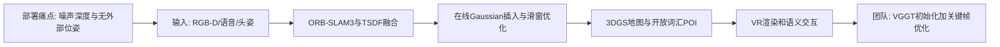
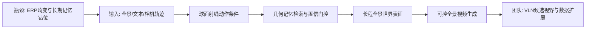

# 科研晨报：连续动作曲线、VGGT共视推理与全景世界记忆

## 今日主线

北京时间 2026 年 7 月 14 日早晨，arXiv 机器人与计算机视觉 recent 页面最新可见批次为 **7 月 13 日发布批次**。本期从该批次中筛选 5 项与团队主线直接相关的工作，并避开最近 7 天已经介绍过的 FLASH、DEFLECT、ReactVLA、FabriVLA、TouchWorld、Any3D-VLA、LingBot-Map、FreeStreamGS、Mamba-VGGT、EmbodiedSplat、Harness VLA、EgoWAM、LaMem-VLA 等条目。

今天有四个值得关注的技术变化：

1. **具身加速开始从“减少模型采样次数”扩展到“重新设计动作表示”**。B-spline Policy 不再输出固定离散 action chunk，而输出可连续采样、可重定时的动作曲线。
2. **新模态的价值必须在闭环控制中被量化**。TACTIC 的触觉消融显示，触觉与视觉接近掩码分别承担接触后反馈与接触前预判，两者不是简单冗余。
3. **VGGT 的中间层表示正在变成可调用的空间能力**。Co-VGGT 不做完整重建，而是从冻结 VGGT 中直接读取共视关系，为流式窗口选择和记忆写入提供低成本门控。
4. **“在线地图”出现两条不同路线**：AnythingReality 是在线优化式 3DGS-SLAM；PanoWorld 是全景生成式长期记忆。前者写入真实观测但仍需优化，后者可生成远距离视野但存在幻觉与累积误差，两者都不能直接等同于 streaming feed-forward reconstruction。

---

## 5条简报

### 1. B-spline Policy：动作加速不一定先改模型，可以先改动作表示

**一句话结论**：B-spline Policy 将离散、固定频率的 action chunk 改为由控制点和节点定义的连续 B 样条曲线，使同一策略输出可以被低层控制器以更高频率采样并动态重定时，在保持成功率的同时显著缩短任务完成时间。

**为什么值得关注**：现有 VLA、Diffusion Policy 和 ACT 通常预测固定长度、均匀时间间隔的动作块，但自由空间移动、粗抓取、精确对准和插入阶段需要的时间分辨率完全不同。固定 chunk 一方面把算力浪费在平稳段，另一方面在高速执行时容易产生 chunk 边界跳变。BSP 通过连续曲线和推理时 segment alignment，把策略推理频率与低层控制频率解耦。真实机器人实验覆盖单臂抓放、长程桌面清理和双臂杯子堆叠；例如回归策略结合 BSP、以 4 倍速执行时，方块抓放达到 19/20、平均 2.08 秒，而原始 1 倍速回归策略为 18/20、9.84 秒。值得注意的是，极端加速在双臂接触任务中仍可能因执行器和控制器极限失败，因此这不是“无代价提速”。

**是否开源**：代码已公开，官方仓库提供 Diffusion Policy、ACT 风格回归策略的实现与示例，采用 MIT License；未看到统一发布的全部真实机器人数据和预训练模型。

**所需算力**：论文没有披露训练 GPU、训练时长或显存。训练成本主要继承基础策略，额外开销是将示教轨迹离线拟合为 B 样条参数；推理端的曲线解码和高频采样开销很低，真正瓶颈仍是视觉策略前向和机器人控制器。基于其 Diffusion Policy/ACT 规模，组内使用单张或少量 4090 进行任务级训练应可行，但该判断需要以仓库配置实测确认。

**输入/输出**：输入为第三人称或腕部图像与本体状态；策略输出未来局部 B 样条段的节点和控制点，而非固定离散动作序列。低层控制器再以任意频率采样连续关节或末端位姿命令。

**核心 insight**：机器人操作的时间结构高度非均匀，动作表示应该允许“同一几何轨迹、不同执行速度”。连续曲线天然平滑、局部可控、可解析求导，并允许在不重新训练策略的情况下重定时。

**思路来源与前序瓶颈**：该路线把传统运动规划中的样条轨迹、DMP 与现代 imitation learning 的 action chunking 结合起来。DemoSpeedup、SAIL 等工作主要重采样示教或优化整个执行栈；BEAST 更偏向动作 token 编码。BSP 则把样条直接作为控制导向的策略输出，针对固定时间分辨率和 chunk 边界不连续两个瓶颈。

**对团队启发**：插销与装配不应全程同速。可设计“自由空间 3—4 倍速、接近阶段 1—2 倍速、接触阶段原速或触觉自适应减速”的分阶段曲线执行；评测除成功率和 time-to-success 外，还应加入轨迹跟踪误差、峰值 jerk、接触峰值力和加速后恢复次数。该方法也可与 Mean Flow、FLASH 等 action-head 加速叠加：前者减少策略采样，BSP 提高动作执行效率。

**来源**：[arXiv](https://arxiv.org/abs/2607.09648) · [项目页](https://b-spline-policy.github.io/) · [代码](https://github.com/B-spline-policy/bspline-policy)

#### 总览图（Mermaid）

---

### 2. TACTIC：触觉的明确增益是接触定位、力调节和遮挡下恢复

**一句话结论**：TACTIC 将 RGB-D、全臂分布式触觉和二维接近掩码融合进混合预测模型与采样式 MPC，在遮挡、多接触和持续滑动条件下，同时预测未来接触构型与作用力，实现约 12 Hz 的接触中心闭环规划。

**为什么值得关注**：多数 VLA 或视觉策略把机械臂当作“无碰撞移动的末端执行器”，而全臂操作需要主动利用前臂、肘部和末端与环境接触。TACTIC 在 Kinova Gen3 上布置 22 个触觉传感单元，以 RGB-D 估计接近关系，再用触觉确认真实接触和力。其消融结果很有说服力：在仿真迷宫中，完整视觉—触觉系统成功率为 87.2%；同时移除触觉和接近掩码后降至 63.5%，力违规次数由 39.0 增至 84.4。仅保留接近掩码时成功率为 72.1%，说明视觉负责“接触前预测”，触觉负责“接触后闭环修正”。真实机器人上，在侧翻、肢体重新定位和动态迷宫等任务中，TACTIC 相比 Diffusion Policy 获得明显更高成功率，同时减少危险作用力。

**是否开源**：项目页公开了低成本全臂触觉硬件设计、装配说明以及外骨骼和触觉采集相关代码。完整预测模型、MPC 控制栈、训练数据和权重是否全部开放，目前未能确认，因此应按“硬件与部分驱动开放，完整算法复现资产待核验”处理。

**所需算力**：论文未披露训练 GPU 和完整训练时长。部署端在真实机器人上运行约 12 Hz 的 MPPI 规划器，并配合 1 kHz 柔顺控制；视觉接近掩码约需 5—8 ms，表征编码约 6 ms，轻量检测模块经 TensorRT 约 2—3 ms。系统使用 100 个 MPPI 候选、规划时域 8，并对高价值候选做更精细评估。由此判断，现代单卡 GPU 可以支撑推理，但全量训练成本仍需代码发布后确认。

**输入/输出**：输入包括 RGB-D、22 路全臂触觉、本体状态和二维接近掩码；混合模型输出未来潜在状态、接触构型和作用力预测；MPC 最终输出关节空间动作序列，底层柔顺控制器执行。

**核心 insight**：纯学习世界模型在罕见多接触状态下容易违反物理一致性，纯解析模型又无法描述复杂接触。TACTIC 让学习模型预测难建模的接触动态，同时用运动学和 contact Jacobian 约束动作采样方向，使策略既能“预见接触”，又能“利用接触”。

**思路来源与前序瓶颈**：它结合了模型预测控制、分布式触觉皮肤、JEPA/潜在动力学和解析接触运动学。前序视觉策略受遮挡影响，末端触觉又不能覆盖前臂和肘部；纯 model-free 策略在训练分布之外的多点接触上稳定性不足。

**对团队启发**：对于插销、装配和透明物体抓取，触觉不一定要直接进入大型 VLA 主干。更可行的结构是：RGB、红外、偏振或 VGGT 负责接近与粗对准；VLA 生成中频动作段；触觉 MPC 或 residual policy 在接触后高频调节微位姿和力。建议优先构建“触觉是否被使用”的量化指标：接触建立时间、卡滞识别时间、峰值力、滑移检测率、扰动后恢复时间，而不是只比较最终成功率。

**来源**：[arXiv](https://arxiv.org/abs/2607.09218) · [项目页与开放硬件](https://emprise.cs.cornell.edu/tactic/)

#### 总览图（Mermaid）

---

### 3. Co-VGGT：把“是否共视”从重建副产品变成VGGT可直接读取的能力

**一句话结论**：Co-VGGT 冻结 1.2B 级 VGGT，只训练不足 7.5M 参数的逐层 mixture-of-experts 头，即可从无位姿 RGB 图像直接预测共视概率和 visibility graph，为 SfM、SLAM 和流式 3D 记忆选择有效帧对。

**为什么值得关注**：流式 VGGT 的主要浪费之一，是把大量几乎不重叠的帧放进同一个窗口，既增加注意力成本，也可能导致错误对齐。该工作发现 VGGT 内部已自发形成层级空间能力：早期层建立三维感知表征，后期层更像共视推理器，L17 还表现为稳定的“非共视负锚点”。基于这些发现，Co-VGGT 对每一层的特征自适应加权，在 Co-VisiON 上相对已有方法提升超过 25% 的成对共视性能和约 10% 的多视图性能，成对预测的校准误差 ECE 为 0.030，可直接作为可见性图边权，而无需后处理校准。

**是否开源**：arXiv 摘要声明代码与数据可用，但截至本次核查，未能稳定定位到可直接复现的完整公开仓库；因此暂按“论文承诺开放，实际代码、权重和数据下载状态需继续核验”处理。

**所需算力**：VGGT 主干完全冻结，仅训练不足 7.5M 参数的 MoE 头，参数更新成本远低于全量微调。论文训练设置为 batch size 32、最多 50 epochs；未披露 GPU 型号。实际显存主要由冻结 VGGT 的多视图特征提取决定。成对模式预计单张高显存 GPU 可训练，多视图 batch 可能需要多卡或梯度累积；这一估计需以代码为准。

**输入/输出**：输入为两张或多张无位姿 RGB 图像；中间表示为 VGGT 不同层的 token/特征和逐层 MoE 权重；输出为成对共视概率、多视图 visibility graph，而不是 camera pose、depth 或 point map。

**核心 insight**：几何基础模型的价值不只在最终 3D 输出，其内部层已经分化出可调用的空间判断能力。对于许多下游任务，先判断“哪些视图值得联合处理”比直接对所有帧做完整重建更有效。

**思路来源与前序瓶颈**：传统 SfM/SLAM 依赖全局图像检索、局部特征匹配或先重建再判断重叠；DUSt3R/VGGT 类模型虽然能端到端恢复几何，但在极小重叠和长序列中计算昂贵。Co-VGGT 将共视作为独立、可校准的几何探针，避免每个候选帧对都运行完整重建。

**对团队启发**：陈瑞阳的 streaming VGGT 可加入 `co-visibility gate`：新帧先与关键帧或全景 memory 估计共视概率，只对高概率边运行局部 VGGT/3DGS 更新；低概率帧则新建子地图或对象 memory。该门控还可用于 VLN，避免因回头、跨房间或全景—透视视角差异把错误帧写入同一空间记忆。建议评测节省的 GPU 时间、错误回环率、地图断裂率与下游 EQA/VLN 表现。

**来源**：[arXiv](https://arxiv.org/abs/2607.09503)

#### 总览图（Mermaid）

---

### 4. AnythingReality：在线3DGS已经能集成SLAM、VR与开放词汇交互，但仍不是feed-forward

**一句话结论**：AnythingReality 将 ORB-SLAM3 位姿、在线 Gaussian-plus-SDF 地图、VR 双目渲染和语音驱动视觉语言交互集成到一个真实 RGB-D 系统中，能够持续更新场景并记录开放词汇兴趣点，但其地图更新包含滑窗优化，属于 online optimization，而非纯 streaming feed-forward reconstruction。

**为什么值得关注**：许多在线 3DGS 工作假设干净深度或外部相机位姿，难以直接在消费级 RGB-D 与动态采集条件下运行。AnythingReality 使用 ORB-SLAM3 提供 pose，将每帧融合进全局 TSDF，并依据光度和深度置信度增加 Gaussians；系统异步对近期视图与关键帧做短优化，再实时向 VR 头显提供双目渲染。语义模块可把语音问题转换为场景描述和开放词汇 POI。论文报告，在自建数据上相对对比方法提升 14.5% PSNR、8.6% SSIM，并降低 14.3% LPIPS；在 TUM-RGBD 上也有类似提升，VLM 物体识别率为 88%。

**是否开源**：论文已公开，但当前没有确认到正式代码仓库、模型权重或自建数据下载地址，应视为尚未完整开源。

**所需算力**：论文没有披露统一 GPU 型号和训练成本；系统主体不是大规模预训练，而是在线映射、局部优化、VR 渲染与可选 VLM/语音模型推理。论文提供 quality/speed 两种配置，在多组数据上报告约 47—89 FPS 与 141—224 FPS 的系统速度，但这些数字受分辨率、优化频率和硬件影响，不能直接等同于完整语义交互的端到端帧率。

**输入/输出**：输入是 RealSense 等设备采集的 RGB-D 流，位姿由 ORB-SLAM3 在线估计；交互端还输入语音和用户头部姿态。输出为持续更新的 3DGS+TSDF 地图、VR 双目视图、场景描述和开放词汇兴趣点。

**核心 insight**：真实在线场景系统需要同时处理位姿、几何置信度、可渲染表示、异步优化和语义交互；单独提升 3DGS 的新视角质量并不足以形成可用的机器人场景记忆。

**思路来源与前序瓶颈**：该工作延续 Gaussian-SDF SLAM、ORB-SLAM3、在线 3DGS 和 language-aware mapping。前序方法常依赖外部 pose，或只输出视觉地图而不能直接查询；纯深度 ICP 又容易受消费级噪声和缺纹理区域影响。

**对团队启发**：它可作为陈瑞阳方向的“系统上界参考”，但不是理想的 feed-forward baseline。更值得研究的是用 VGGT 或 LingBot-Map 替换/补充 ORB-SLAM3：VGGT 负责无位姿窗口的快速 pose/point map 初始化，3DGS 只在高不确定关键帧上短优化；语义不应只查询当前渲染图，而应写入对象级长期 memory。下游指标建议加入 map freshness、单位时间新增显存、对象重定位漂移、EQA 答案稳定性和 VLN 重规划成功率。

**来源**：[arXiv](https://arxiv.org/abs/2607.09260)

#### 总览图（Mermaid）

---

### 5. PanoWorld：全景世界模型开始用球面射线统一动作与长期记忆

**一句话结论**：PanoWorld 利用全景表示的旋转等变性，将相机旋转吸收到固定朝向中，再通过 Dense Panoramic Ray-Conditioning 和 Geometry-aware Memory Augmentation 建模六自由度运动与长程历史，可从初始全景、文本和相机轨迹生成可控的长全景视频。

**为什么值得关注**：普通视频世界模型基于透视 FoV，镜头旋转后大量历史区域离开视野，memory 通常依赖二维特征对齐；在 ERP 全景中，零度与三百六十度相连，畸变随纬度变化，传统位置编码和历史检索会出现跨边界错位。PanoWorld 用球面射线和 ray-aware positional encoding 表示相机运动，再把历史特征投影到共享射线几何中，并以置信度门控进行长期记忆检索。作者构建 World360，包含约 12 万条序列，其中 7 万条来自真实全景无人机、5 万条来自 AirSim360，提供多高度轨迹、位姿与深度。

**是否开源**：官方 GitHub 已公开推理代码和模型检查点，单卡推理要求至少约 20 GB 显存；训练代码和 World360 数据集目前仍标注为后续发布。

**所需算力**：基础模型为 Wan2.2-TI2V-5B，使用 rank 64 LoRA。论文训练使用 8 张 NVIDIA H20，约 7 万训练样本、2 个 epoch，并分阶段训练动作条件和长记忆模块。完整 161 帧生成在单张 H20 上约需 4 分 48 秒；经 causal-forcing 蒸馏的版本约 8 秒完成，约 20 生成帧每秒。对 8×4090 团队，直接从头复现完整训练压力较大，但可尝试 LoRA、较短序列或只复现球面 memory 模块。

**输入/输出**：输入为初始 ERP 全景、文本描述以及相机轨迹或键盘动作；输出为 81/161 帧的可控全景视频。中间表示包括球面射线条件、历史全景特征、几何检索坐标和置信度门控 memory。

**核心 insight**：全景世界中的旋转不应被视为普通图像位移，而应在球面几何中显式处理。将当前动作与历史记忆都表示为射线关系，可以缓解 ERP 接缝、旋转错位和长距离运动中的记忆漂移。

**思路来源与前序瓶颈**：该工作延续 CameraCtrl、视频扩散世界模型、全景生成和球面位置编码。此前 perspective world model 的 memory 假设不能直接迁移到 360°；显式 3D 重建虽然可提供几何，但成本高且难支撑长视频生成。PanoWorld 选择以隐式射线几何作为中间方案。

**对团队启发**：PanoWorld 更适合做“未来视野生成、仿真数据扩展和导航 rollout”，不能直接当作真实在线地图。它仍依赖首帧，并会在长序列中累积生成误差。对于 VLN，可把其 GMA 球面 memory 迁移到真实全景视频，但所有生成区域进入长期记忆前都必须由新观测、VGGT 几何或深度不确定性验证。可延展成“全景世界模型提出候选前沿，真实 streaming reconstruction 负责确认”的双模型系统。

**来源**：[arXiv](https://arxiv.org/abs/2607.09661) · [项目页](https://lihaoy-ux.github.io/panoworld-page/) · [代码与模型](https://github.com/Insta360-Research-Team/PanoWorld)

#### 总览图（Mermaid）

---

## 三条主线映射

| 主线 | 今日覆盖 | 关键判断 |
|---|---|---|
| 具身模型 | B-spline Policy、TACTIC | 提速不仅是压缩 VLA，还包括连续动作表示和分阶段重定时；触觉相对 RGB 的明确增益集中在遮挡下接触确认、作用力调节与失败恢复。 |
| 场景理解模型 | Co-VGGT、AnythingReality | VGGT 的中间层可以直接服务共视、帧选择和记忆门控；真实场景系统仍需位姿、几何置信度、地图维护和语义查询的完整闭环。 |
| 生成感知模型 | AnythingReality、PanoWorld | 在线优化式真实地图与生成式世界记忆是两条不同路线。前者可信但有优化成本，后者覆盖广但需要观测验证。 |
| 横向全景模态 | PanoWorld、Co-VGGT延展 | 全景相对透视图的真实增益是持续 360° 覆盖和减少 FoV gap；关键技术问题是球面几何、接缝、跨时刻射线对齐和生成内容可信度。 |

---

## 组会讨论题

1. **动作加速应该由谁决定？** 是策略直接输出时间尺度，还是由任务阶段、视觉不确定性和触觉状态控制 B 样条重定时？
2. **触觉是否需要进入 VLA backbone？** 对插销和装配而言，独立高频触觉控制器可能比把触觉 token 全部输入大模型更稳定、更省算力；需要怎样的消融才能证明？
3. **Co-VGGT 能否作为 streaming reconstruction 的第一道门？** 先做共视判定，再决定局部重建、回环或新建子地图，能节省多少计算并降低多少错误写入？
4. **真实在线地图与生成世界模型如何分工？** 是否采用“真实地图保存已观测区域，PanoWorld 只提出未观测区域候选，VGGT/新观测负责验证”的体系？
5. **在线、streaming、feed-forward、real-time 应如何统一标注？** 建议组内论文和 benchmark 明确区分：是否可访问未来帧、是否逐场景优化、每帧延迟、累计显存、回看历史规模和长序列漂移。

---

## 可延展选题

1. **Phase-Adaptive B-spline VLA**：用视觉距离、VGGT 几何不确定性和触觉接触概率共同预测执行时间尺度。自由空间高速、接触区低速，实现速度—安全联合优化。
2. **RGB/偏振/红外/触觉信息增益 benchmark**：在透明抓取、反光物体、弱纹理插销中，分别评测各模态对粗定位、接触确认、法线估计、滑移检测和失败恢复的增益，而不是只比较最终成功率。
3. **Co-VGGT-Gated Streaming Memory**：Co-VGGT 负责窗口和关键帧筛选，VGGT 负责局部几何，3DGS/对象 token 负责长期记忆；在 EQA、VLN 重复探索率和 GPU 延迟上统一评测。
4. **Feed-forward + Keyframe Optimization 混合在线重建**：逐帧由 VGGT/LingBot-Map 前馈更新，只有 pose/geometry uncertainty 超阈值时触发 AnythingReality 式短优化，研究质量—延迟—显存的 Pareto 曲线。
5. **Verified Panoramic World Memory**：PanoWorld 生成候选未来视野，但只将通过真实观测、深度一致性或共视验证的区域写入长期地图；重点研究生成幻觉的隔离与回滚机制。

---

## 音频版旁白稿

今天的科研晨报围绕三个关键词展开：动作表示、空间门控，以及全景长期记忆。今天的五项工作分别回答了三个很实际的问题：机器人为什么执行得慢，触觉到底比视觉多提供了什么，以及在线三维记忆怎样在真实观测和生成预测之间取得平衡。

第一篇是 B-spline Policy。过去我们讨论 VLA 加速，通常关注减少扩散采样步数、异步执行，或者压缩模型。但这篇工作的切入点更底层：机器人动作为什么一定要表示成固定长度、固定时间间隔的 action chunk？真实任务有非常明显的阶段差异。机械臂在自由空间接近目标时可以很快，但抓取、对准和插入时需要更细的控制。B-spline Policy 让策略直接预测连续动作曲线的节点和控制点，低层控制器可以高频采样同一条曲线，并在不重新训练的情况下改变执行速度。它还设计了段对齐，避免高速执行时相邻预测段发生跳变。对我们最直接的启发是，插销和装配应该做分阶段变速，而不是把整段动作统一加速。后续评测也不能只看成功率，还要同时看完成时间、轨迹跟踪误差、峰值冲击和接触后的恢复次数。

第二篇是 TACTIC。它关注全臂接触操作，把 RGB-D、分布式触觉和接近掩码放进混合世界模型和模型预测控制。它的价值在于给出了比较清晰的新模态增益证据。视觉接近掩码负责预测哪里快要接触，触觉负责确认已经发生的接触、实际作用力以及滑动状态。消融中，同时去掉触觉和接近信息后，成功率明显下降，力违规大幅增加。这说明触觉并不是另一种低质量图像，而是提供 RGB 无法可靠获得的接触和力信息。对插销任务，比较合理的系统可能不是把全部触觉数据塞进大型 VLA，而是让视觉和几何模型负责接近，让 VLA 输出中频动作段，再由触觉控制器在接触后高频纠偏。

第三篇是 Co-VGGT。它没有继续用 VGGT 输出深度和点图，而是问 VGGT 内部到底已经学会了什么。作者发现，早期层更像三维场景编码器，后期层已经形成共视推理能力，也就是判断两张图是否看到了同一片表面。基于这个发现，他们冻结 VGGT，只训练一个很小的逐层专家头，就能输出校准良好的共视概率。这个能力对陈瑞阳的 streaming 方向很关键。长视频中并不是所有帧都应该进入同一个窗口，也不是每一帧都值得写入地图。我们可以先用共视门控判断新帧与哪些关键帧相关，再决定运行局部 VGGT、建立回环，还是新建子地图。这样既能减少计算，也能降低错误几何写入长期记忆的风险。

第四篇是 AnythingReality。它把 ORB-SLAM3、在线三维高斯、TSDF、VR 渲染和开放词汇语义交互集成在一起。这里需要特别注意概念：它是真正在线和因果的，但并不是纯前馈。系统每来一帧都会更新地图，同时还会对近期视图做短时优化。因此它代表的是 online optimization，而不是 streaming feed-forward reconstruction。它对我们的价值更多在于展示一个完整系统还缺哪些模块：稳定的位姿、地图置信度、异步优化、可渲染表示、对象兴趣点和语义查询。陈瑞阳的方向可以借鉴这种系统接口，但底层可以换成 VGGT 快速初始化，只在高不确定关键帧触发少量优化。

第五篇是 PanoWorld。它是今天的全景横向重点。普通视频模型面对三百六十度全景时，二维位置编码和历史记忆容易在接缝、旋转和高纬度区域错位。PanoWorld 用球面射线统一描述动作和历史视图，并通过几何记忆检索保持长距离全景生成的一致性。它还构建了包含真实无人机和仿真数据的 World360。这个系统可用于生成未来视野、导航 rollout 和数据扩展，但不能直接当作真实地图，因为生成内容会随时间累积误差。更可靠的用法是，让全景世界模型提出候选区域或前沿，再由真实相机、深度或 VGGT 验证后写入长期记忆。

今天组会建议集中讨论三个问题。第一，插销与装配的动作速度应该由任务阶段决定，还是由视觉不确定性和触觉状态联合决定。第二，Co-VGGT 能不能作为所有流式几何更新之前的第一道门，用来选择窗口和控制记忆写入。第三，真实在线地图和全景生成模型是否应该组成双系统：真实地图负责可信状态，生成模型负责预测和探索候选。短期最值得启动的实验，一个是分阶段 B 样条插销控制，另一个是 Co-VGGT 门控的在线场景记忆 baseline。

---

## 今日已覆盖论文列表

1. B-spline Policy: Accelerating Manipulation Policies via B-spline Action Representations
2. Tactile and Vision Conditioned Contact-Centric Control for Whole-Arm Manipulation
3. What VGGT Knows About Overlap: Probing Geometric Foundation Models for Co-Visibility
4. AnythingReality: Robust Online Gaussian Splatting SLAM for Open-Vocabulary VR Scene Exploration
5. PanoWorld: Real-World Panoramic Generation
