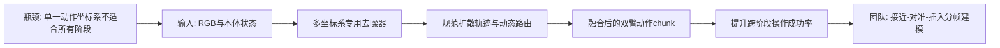
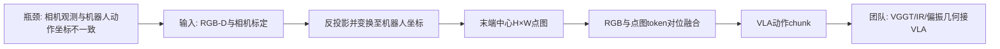
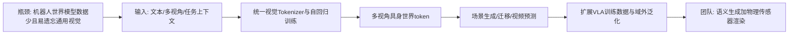
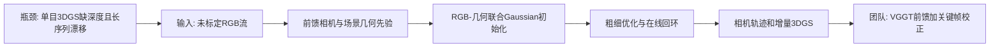
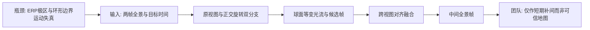

# 科研晨报：多坐标系动作建模、机器人中心点图与在线三维记忆

## 今日主线

截至北京时间 2026 年 7 月 15 日早晨，arXiv 机器人与计算机视觉 recent 页面最新常规批次为 **7 月 14 日发布批次**。本期从该批次筛选 5 项工作，并避开最近 7 天已覆盖的 FLASH、DEFLECT、Any3D-VLA、LingBot-Map、FreeStreamGS、MuseVLA、FASTER、3D-Mix for VLA、S2GS、CLAP、TIDAL、VGGT-Ω、RayTun3R、EmbodiedSplat、FabriVLA、TouchWorld、Wat3R、DexVerse、Whareformer、Harness VLA、EgoWAM、LaMem-VLA、B-spline Policy、TACTIC、Co-VGGT、AnythingReality 和 PanoWorld 等条目。

今天有四个值得团队重点关注的技术变化：

1. **动作表示正从单一坐标系转向阶段相关的多坐标系建模**。MoF 说明双臂移动操作中，不同阶段适合不同参考系；但它提升的是可学习性和成功率，并没有直接降低扩散采样延迟。
2. **三维信息进入 VLA 的关键不只是“有没有深度”，而是是否先变换到机器人动作坐标系**。Robot-Centric Pointmap 把相机观测和机器人动作统一到末端中心坐标，显著提升跨相机视角泛化。
3. **生成感知模型出现两种尺度路线**：Xiaomi-Robotics-U0 以 38B 世界基础模型充当大规模数据引擎；GeoGS-SLAM 则将前馈几何先验与在线 3DGS 优化结合，构建真实场景记忆。
4. **全景时序模型开始使用球面等变约束，而不再把 ERP 当普通平面视频处理**。SVI360 对极区畸变和球面运动进行显式建模，但其输出仍是生成帧，不能未经验证直接写入机器人长期记忆。

---

## 5条简报

### 1. Mixture of Frames Policy：不同操作阶段需要不同动作坐标系

**一句话结论**：MoF 在同一条扩散轨迹中并行使用基座、左右末端和相对轨迹坐标系的专用去噪器，再把预测统一变换回规范坐标系融合；它显著改善双臂移动操作成功率，但并不是低延迟 VLA 方法。

**为什么值得关注**：当前 Diffusion Policy、ACT 和多数 VLA 通常预先固定一种动作坐标系。抓取接近更适合末端坐标系，保持杯子竖直和双臂协同更适合基座坐标系，插入阶段又依赖两臂或末端—目标之间的相对关系。MoF 的仿真平均成功率为 66.8%，高于标准 Diffusion Policy 的 50.3% 和按任务事后选择最优坐标系的 63.8%；在真实倒杯和端盘任务中分别达到 85% 和 70%。路由器还会随任务阶段切换坐标系，说明收益并非简单的多专家集成。

**是否开源**：代码、仿真配置和 9 个任务的示教数据已公开；仓库包含 BiGym、DexMimicGen 和真实 HoMMI 子模块，采用 MIT License。未见统一发布的全部预训练 checkpoint。

**所需算力**：论文未披露 GPU 型号和训练时长。公开配置支持单 GPU 启动，使用 ResNet-18 视觉编码器、100 条示教、500 epochs、batch size 128，以及 16 步 DDIM 推理。真实系统策略服务器仅以 5 Hz 运行，每 3.2—3.6 秒请求一段新轨迹。因此，MoF 增加多个专用去噪器后，理论计算量不低于单一扩散策略；它解决的是动作分布复杂度和跨阶段坐标系选择，不是推理加速。

**输入/输出**：输入为头部/腕部 RGB 图像与机器人本体状态；输出为双臂末端位姿、夹爪、头部注视点组成的动作 chunk。中间状态是一条规范坐标系下的扩散轨迹，以及多个坐标系专家变换后的噪声预测。

**核心 insight**：动作分布的复杂性部分来自坐标系选择，而不是任务本身。将同一动作在多个任务相关坐标系中同步去噪，可以让每个专家处理在其坐标系下更简单的局部运动，再在统一空间中融合。

**思路来源与前序瓶颈**：它把任务参数化运动原语、多坐标系技能表示、Mixture-of-Experts 与 Diffusion Policy 结合起来。前序方法通常把坐标变换作为低维输入，却仍在一个固定动作空间中去噪；MoF 进一步让坐标系直接定义专用动作空间。

**对团队启发**：插销和装配可设置“基座/相机坐标负责全局接近、末端坐标负责局部对准、孔—销相对坐标负责插入、触觉接触坐标负责卡滞恢复”的专家结构。建议同时记录成功率、完成时间、不同阶段的专家权重、接触峰值力与失败类型。若追求速度，应再叠加 Mean Flow、FLASH 或动作曲线重定时；MoF 本身不能替代低延迟 action head。

**来源**：[论文](https://arxiv.org/abs/2607.11884) · [项目页](https://mofpo.github.io/) · [代码与数据](https://github.com/pointW/mofpo)

#### 总览图（Mermaid）

---

### 2. See like a Robot：VLA 应先把三维观测变换到机器人动作坐标系

**一句话结论**：Robot-Centric Pointmap 把每个 RGB-D 像素变成机器人坐标系中的 XYZ，并以当前末端为原点保留 H×W 图像网格，使 3D 几何能够直接接入预训练 2D VLA 的视觉通路。

**为什么值得关注**：普通 VLA 在相机坐标系中看场景，却在机器人基座或末端坐标系中输出动作。相机位置固定时，模型可以记住这一映射；数据来自多个实验室和不同相机位置时，这种 frame mismatch 会成为显著泛化瓶颈。该方法将 π0.5 风格模型在 RoboCasa 24 项任务上的平均成功率从 55.3% 提升到 62.9%，SmolVLA 从 37.2% 提升到 41.4%。真实 Franka 实验中，相机处于未见位置时，RGB-only 为 55.0%，加入 pointmap 后为 66.7%。

**是否开源**：论文和项目页已公开；截至本期生成时，项目页的“Code”尚无可点击仓库链接，代码、模型和数据均未确认正式发布。

**所需算力**：论文未披露 GPU 型号和训练时长。受控实验在 24 个 RoboCasa 任务上使用每任务 50 条示教、30k steps，并为 RGB 和 pointmap 分别配置 SigLIP 视觉塔。相较 RGB-only，它增加一个视觉编码分支，推理与显存成本会明显增加，但没有引入点云网络或逐场景优化。基于 π0.5/SmolVLA 规模，8×4090 更适合做 LoRA、冻结主干或小模型复现，而不宜默认全参数训练。

**输入/输出**：输入为 RGB-D、相机内外参、语言指令、本体状态；每像素深度先反投影到相机坐标，再变换到机器人基座坐标，并减去当前末端位置，得到末端中心 pointmap。RGB token 与 pointmap token 按像素对应相加，VLA 输出动作 chunk。

**核心 insight**：给模型深度、内参和外参，不等于模型会高效学会相机到机器人坐标的变换。将三维点预先表达在机器人真正执行动作的坐标系中，能够减少模型需要隐式学习的几何映射；保留图像网格又能复用预训练 VLA 的视觉结构。

**思路来源与前序瓶颈**：它承接 DUSt3R、MASt3R、VGGT 的 pointmap 表示，以及 PointVLA、GeoVLA、DP3 等 3D 操作策略，但没有直接使用 VGGT。区别在于它强调“robot-centric + image-form”，而非额外建立独立点云 token 流。

**对团队启发**：这是连接 VGGT 与 VLA 的非常清晰的接口设计。可将 VGGT point map、IR 深度、偏振法线恢复结果或触觉接触点统一变换到末端中心坐标，再保持 H×W 或稀疏局部网格送入 VLA。需要注意，原方法依赖可靠 RGB-D 和标定；透明、反光、黑色及弱纹理物体上深度可能失效。团队真正应验证的是：偏振、主动红外或触觉是否修复了 pointmap 中对动作关键的区域，并最终改善抓取、插销和装配，而不是只提高深度指标。

**来源**：[论文](https://arxiv.org/abs/2607.11498) · [项目页](https://davian-robotics.github.io/pointmap/)

#### 总览图（Mermaid）

---

### 3. Xiaomi-Robotics-U0：世界基础模型首先是数据引擎，而非实时控制器

**一句话结论**：Xiaomi-Robotics-U0 将通用图像生成、图像编辑、多视角具身场景生成、具身迁移和具身视频预测统一到一个大型自回归模型中，并通过结构保持的数据增强显著提升下游 π0.5 的视觉域外泛化。

**为什么值得关注**：很多机器人世界模型从有限机器人视频出发，容易损失通用视觉先验。U0 从通用图像/视频基础模型继续训练，将场景、机器人形态、交互状态和多视角约束纳入同一离散视觉 token 空间。作者利用生成数据增强，将 π0.5 在真实域外干扰条件下的成功率从 36.9% 提升到 63.2%，说明世界模型的短期价值可能首先体现在“生成保持动作标签的视觉变化”，而非直接在线输出机器人动作。

**是否开源**：推理代码、Xiaomi-Robotics-U0 与 FlashAR 权重、视觉 tokenizer 已公开，支持 Scene Gen、Transfer、T2I 和 X2I；视频生成代码可见，但 `Xiaomi-Robotics-U0-Video` checkpoint 仍标注为 coming soon。论文称模型为 38B；当前 Hugging Face collection 对基础与 FlashAR checkpoint 的参数标注存在 34B/38B 差异，部署时应以具体权重说明为准。

**所需算力**：完整继续预训练算力未公开，但 38B 级自回归模型显然超出 8×4090 从头训练的现实范围。官方在单张 H20 上报告 1024×1024 图像：普通自回归为 450.77 秒/张，FlashAR+vLLM 为 5.44 秒/张，约 82.9× 加速。即便加速后，它仍不是毫秒级动作闭环模型，更适合作为离线数据生成器或低频规划/想象模块。组内可运行量化或多卡推理，优先复现数据增强与结构保持，而非重训基础模型。

**输入/输出**：输入可为文本、参考图像、深度、多视角具身观测、机器人形态及任务上下文；输出包括单图、多视角机器人场景、结构保持的场景迁移图像以及未来具身视频。中间表示是统一离散视觉—文本 token 和自回归序列。

**核心 insight**：不要为机器人世界模型丢掉互联网级图像生成知识，而应通过统一多任务继续训练，把通用生成能力转化为具身场景一致性、可控迁移和未来交互预测能力。

**思路来源与前序瓶颈**：它连接了 Emu/Janus 类多模态自回归生成模型、机器人视频世界模型、视觉域随机化和 WAM 数据扩展。前序机器人世界模型通常数据规模小、形态单一；普通图像编辑模型又难保持机器人姿态、多视角几何和动作标签。

**对团队启发**：团队可利用其公开场景迁移能力构造光照、背景、材质和干扰物变化，服务 VLA 鲁棒性训练。但红外、偏振和透明反光物体涉及真实成像物理，普通 RGB 风格迁移不保证传感器响应正确。更可靠的路线是“U0 生成语义与布局变化 + 物理渲染器生成 IR/偏振/深度 + 真机少量校准”。对于 WAM-lite，可蒸馏其多视角结构保持能力，而不复制 38B 自回归生成栈。

**来源**：[论文](https://arxiv.org/abs/2607.11643) · [官方项目页](https://robotics.xiaomi.com/xiaomi-robotics-u0.html) · [代码](https://github.com/XiaomiRobotics/Xiaomi-Robotics-U0) · [模型集合](https://huggingface.co/collections/XiaomiRobotics/xiaomi-robotics-u0)

#### 总览图（Mermaid）

---

### 4. GeoGS-SLAM：前馈几何负责初始化，在线优化负责可信地图

**一句话结论**：GeoGS-SLAM 从未标定单目 RGB 流中先预测相机和场景几何先验，再将 RGB 与几何共同初始化为 3D Gaussians，并通过光度—几何联合优化、回环检测和位姿图优化维护在线地图。

**为什么值得关注**：现有 3DGS-SLAM 往往依赖外部深度，纯前馈几何系统虽然速度快，却可能在优化阶段丢弃原始 RGB，导致渲染和局部细节下降。GeoGS-SLAM 采用混合路线：feed-forward visual geometry model 提供相机与场景先验，3DGS 保留颜色与可渲染表达，在线优化修正相机与地图，并通过 loop closure 维持全局一致性。该路线比“纯前馈或纯优化二选一”更接近真实机器人长期运行需求。

**是否开源**：论文和项目页已公开；截至本期生成时，未在公开检索结果中确认正式代码仓库、模型权重或数据发布，按“论文/项目页公开，复现资产待发布或待核验”处理。

**所需算力**：论文摘要没有披露 GPU、具体 FPS、显存或训练预算，只报告 online real-time。系统推理成本包含前馈几何模型、逐帧 Gaussian 扩展、相机—地图粗到细联合优化、回环与位姿图优化，因此它不是一次前向传播完成更新的 streaming feed-forward 模型。真实部署前必须实测单帧时延、优化线程占用、地图规模增长和回环峰值显存。

**输入/输出**：输入为未标定的单目 RGB 视频流；前馈几何模型输出 camera/scene priors，系统输出相机轨迹和可持续更新的 3D Gaussian 地图，并支持新视角渲染。

**核心 insight**：前馈 3D foundation model 更适合提供稳定初始化和几何约束，3DGS 优化更适合吸收原始 RGB 细节并校正长期误差；将二者结合能够在实时性、几何准确性和渲染质量之间取得折中。

**思路来源与前序瓶颈**：它承接 DUSt3R/MASt3R/VGGT 类无标定几何先验、传统 SLAM 回环与 pose graph，以及 3DGS-SLAM 的增量地图。前序前馈方法缺乏长期全局校正，3DGS-SLAM 又容易依赖深度或脆弱初始化。

**对团队启发**：这是陈瑞阳方向非常值得复现的系统范式：`VGGT局部窗口前馈 → 不确定性估计 → 选择性3DGS更新 → 回环/对象记忆`。建议不要只评测 PSNR、SSIM 和 ATE，还要加入每帧前馈延迟、优化触发频率、显存随序列增长、长期对象重定位误差、EQA回答一致性和 VLN 重规划成功率。可进一步研究：当 VGGT 置信度高时纯前馈写入；只有透明、反光、动态或回环冲突区域触发局部优化。

**来源**：[论文](https://arxiv.org/abs/2607.11184) · [项目页](https://rlgao.github.io/geogs_slam/)

#### 总览图（Mermaid）

---

### 5. SVI360：全景视频不能直接套用平面光流与插帧模型

**一句话结论**：SVI360 同时处理原始 ERP 全景帧和旋转后的正交视图，以跨视图光流等变约束和球面加权损失修正极区畸变，生成任意时间的中间全景帧。

**为什么值得关注**：全景相机提供一次性 360° 覆盖，能减少 FoV gap，但 ERP 极区被严重拉伸，普通视频插帧和光流模型在顶部、底部及跨边界运动上容易产生错配。SVI360 的双分支让原视图中的极区在正交视图中移到较易处理区域，再将两支的光流、特征和候选帧对齐融合。模型在 FlowScape、Flow360、ODV360 和 360VFI 上取得较强结果，并使用 WS-PSNR、WS-SSIM 和球面端点误差评价球面质量。

**是否开源**：代码和预训练模型已经公开，项目页提供论文和 GitHub 入口。

**所需算力**：完整训练使用 2 张 H100 80GB、300 epochs、batch size 16。标准模型约 50.1M 参数，在论文测试配置下约 365 ms/帧；Lite 版本约 22.9M 参数，但其对应延迟未在主表中完整披露。它可以降低低帧率全景视频的时间缺口，但当前标准版本不适合高频机器人闭环。

**输入/输出**：输入为两个时刻的 ERP 全景帧及目标插值时间；网络在原始球面视图和旋转正交视图中估计光流、遮挡和候选中间帧，最终输出一张插值全景图及隐式球面运动场。

**核心 insight**：全景畸变是随纬度变化的球面几何问题。通过旋转视图让两个分支互相补偿极区，并在球面上约束光流等变性，比单纯使用 ERP padding 或平面卷积更有效。

**思路来源与前序瓶颈**：它继承 RAFT/AMT 式相关体、粗到细光流更新和视频插帧，同时吸收球面旋转、ERP 畸变建模与 spherical-aware metric。前序透视模型在极区和跨 0°/360° 边界处运动不一致。

**对团队启发**：全景插帧可作为低帧率 360 相机与高频导航控制之间的感知补间，也可用于补齐全景视频训练数据。但生成中间帧不是新观测，不能直接写入长期 3DGS/VGGT memory。建议同步输出光流置信度和插值不确定性，只将真实关键帧用于几何地图，插值帧用于短期控制、时序对齐或特征传播，并评测其是否真正降低 VLN 的转向延迟和目标丢失率。

**来源**：[论文](https://arxiv.org/abs/2607.11710) · [项目页与代码](https://icb-vision-ai.github.io/video360_interpolation/)

#### 总览图（Mermaid）

---

## 三条主线映射

| 主线 | 今日覆盖 | 关键判断 |
|---|---|---|
| 具身模型 | Mixture of Frames Policy、Robot-Centric Pointmaps | 提升具身操作不只靠缩短采样；坐标系选择和观测—动作几何对齐会直接影响成功率与跨视角泛化。MoF 不加速，Pointmap 会增加视觉分支成本，二者需要与低延迟 action head 组合。 |
| 场景理解模型 | Robot-Centric Pointmaps、GeoGS-SLAM | Pointmap 是 VGGT/深度与 VLA 之间自然的中间接口；在线地图更可能采用前馈几何初始化与选择性优化校正的混合结构。 |
| 生成感知模型 | Xiaomi-Robotics-U0、GeoGS-SLAM、SVI360 | 大世界模型适合离线数据扩展，在线 3DGS 适合可信场景记忆，全景插帧适合短期时序补间；三者的可信度和使用频率应严格区分。 |
| 横向全景模态 | SVI360 | 全景相比普通透视图的真实增益是全局覆盖与减少 FoV gap，但必须显式处理 ERP 极区、环形边界和球面运动一致性。 |

---

## 组会讨论题

1. **插销和装配中的动作坐标系是否应随阶段切换？** 接近、对准、接触、插入和恢复分别以相机、基座、末端、孔—销相对坐标还是触觉接触坐标表示最简单？
2. **VGGT 接入 VLA 的最佳表示是 point cloud、pointmap 还是对象级 token？** Robot-Centric Pointmap 说明图像网格与机器人坐标对齐都很重要，是否可以设计 `VGGT robot-centric pointmap`？
3. **新模态的信息增益怎样才算明确？** 红外、偏振和触觉是否应该通过 pointmap 关键区域误差、跨相机泛化、卡滞恢复和 time-to-success 来证明价值，而不只是中间视觉指标？
4. **陈瑞阳的 streaming 系统是否应明确采用混合架构？** 前馈 VGGT 提供每帧初始化，关键帧 3DGS 优化处理累积误差，显式对象 memory 服务 VLN/EQA。
5. **生成内容能否进入机器人记忆？** U0 生成场景和 SVI360 插值帧都需要不确定性标记与真实观测验证，应建立“生成候选层”和“可信地图层”的隔离机制。

---

## 可延展选题

1. **VGGT Robot-Centric Pointmap for VLA**：将 VGGT point map 变换到机器人基座/末端坐标并保持图像网格，接入 StarVLA 或 VLA-Adapter；比较 RGB、RGB-D、VGGT pointmap、IR pointmap、偏振 normal-pointmap。
2. **Frame-Routed Insertion Policy**：为插销任务建立相机、末端、孔—销相对坐标和触觉接触坐标四类专家，分析不同阶段的路由权重，并与单坐标系 policy 对比。
3. **Feed-forward + Selective Optimization Online Memory**：VGGT 逐帧或窗口输出 pose/point map；依据共视、置信度和回环冲突，只对少量关键帧执行 3DGS 优化，面向 VLN/EQA 评测长期漂移。
4. **Generated Data Trust Protocol**：U0 负责背景、光照和对象布局变化，物理渲染器负责 IR/偏振/透明反光传感器响应；记录生成数据对 VLA 真机泛化的增益与负迁移。
5. **Panoramic Temporal Gap Benchmark**：人为降低 360 相机帧率，对比无插帧、普通 VFI、SVI360 以及 IMU/光流辅助插帧，评测 VLN 转向反应时间、目标持续跟踪、VGGT 几何一致性和错误地图写入率。

---

## 音频版旁白稿

今天的科研晨报围绕三个问题展开：机器人动作究竟应该在哪个坐标系里预测，三维几何怎样以最小改动进入视觉语言动作模型，以及生成模型和在线重建模型分别应该在机器人系统中承担什么角色。

第一篇是 Mixture of Frames Policy。它指出，双臂和移动操作天然存在多个坐标系。抓取一个杯子时，末端坐标系最容易描述局部接近；机器人端着杯子移动时，基座坐标系更容易描述保持竖直；双臂进行插入或协同操作时，又需要两臂之间的相对坐标。传统扩散策略通常固定一个动作坐标系，让同一个去噪器承担所有阶段。MoF 的做法是在多个坐标系里并行去噪，再把结果统一回规范坐标系融合。它在双臂任务上明显提升成功率，而且路由器会随任务阶段切换专家。不过要特别注意，这不是加速方法。它仍然使用多步扩散，并且多个专家可能增加计算量。对我们的启发是，把它用于插销和装配的阶段化动作建模，再配合 Mean Flow 或其他低步数动作头解决速度问题。

第二篇是 See like a Robot。它关注一个非常基础但常被忽略的错位：VLA 在相机坐标系里观察，却在机器人坐标系里输出动作。当训练数据来自不同相机位置时，模型必须反复学习相机到机器人之间的几何变换。作者把每个 RGB-D 像素反投影为三维点，再变换到机器人坐标系，并以当前末端为中心，形成和 RGB 同样大小的 pointmap。这样既提供机器人中心的三维几何，又保留预训练视觉模型熟悉的图像网格。真实实验显示，相机移动到训练中没有出现的位置后，pointmap 的优势更明显。这对我们非常重要：VGGT 不一定要把点云单独送入一个大型三维编码器，也可以先输出 pointmap，再变换到末端坐标并和 RGB token 对位融合。红外、偏振和触觉的价值，也可以统一表现为对动作关键区域的几何修复。

第三篇是 Xiaomi-Robotics-U0。它是一个三百多亿参数的世界基础模型，统一做图像生成、编辑、多视角具身场景生成、场景迁移和未来视频预测。它最值得关注的不是直接控制机器人，而是作为数据引擎。作者用保持机器人姿态和动作标签的视觉迁移数据增强策略训练，把下游策略在真实域外条件下的成功率从三十六点九提升到六十三点二。官方已经公开部分权重和推理代码，并通过并行自回归解码将单张图像生成从数百秒压缩到大约五秒。但五秒仍然远离机器人闭环控制，所以它更适合离线数据扩展或低频想象。对于我们的红外和偏振方向，不能把普通 RGB 风格迁移当作物理正确的传感器数据，应该让大模型负责语义和布局变化，再由物理渲染器生成真正的偏振、红外和透明反光响应。

第四篇是 GeoGS-SLAM。它代表陈瑞阳方向中非常现实的一条混合路线。系统先使用前馈视觉几何模型从未标定单目视频中预测相机和场景先验，再用这些先验和原始 RGB 初始化三维高斯，随后在线联合优化相机与地图，并通过回环检测和位姿图优化处理长期漂移。它是真正在线的系统，但不是纯 feed-forward，因为每一阶段仍然包含地图优化。这个判断很关键：未来我们的在线场景记忆不必强行在纯前馈和纯优化之间二选一。更合理的结构可能是 VGGT 持续输出局部几何，只有在低置信度、透明反光、动态区域或回环冲突时，才触发少量关键帧优化。

第五篇是 SVI360。它解决全景视频插帧中的球面畸变问题。普通透视视频模型在 ERP 图像极区和零度、三百六十度边界附近容易失败。SVI360 同时处理原始全景帧和旋转后的正交视图，让一个视图中的极区在另一个视图中变得更容易建模，再通过球面光流等变约束进行融合。它适合补齐低帧率全景相机的时间缺口，但标准模型仍然需要数百毫秒生成一帧，也不应把生成帧直接当作真实观测写入三维地图。更合理的使用方式是让插值帧辅助短期跟踪和动作时序对齐，长期记忆仍然只接受真实关键帧或经过几何验证的内容。

今天组会建议重点讨论三个问题。第一，插销和装配的不同阶段是否应该使用不同动作坐标系，并用路由器自动切换。第二，VGGT 接入 VLA 时，是否优先尝试机器人中心 pointmap，而不是独立点云分支。第三，陈瑞阳的系统是否明确采用前馈持续更新加关键帧优化校正，并把生成候选和可信地图严格分层。短期最值得启动的实验，是 VGGT robot-centric pointmap 接入 VLA，以及全景真实关键帧和生成插值帧对在线记忆影响的对照实验。

---

## 今日已覆盖论文列表

1. Mixture of Frames Policy: Multi-Frame Action Denoising for Bimanual Mobile Manipulation
2. See like a Robot: Robot-Centric Pointmaps for Vision-Language-Action Models
3. Xiaomi-Robotics-U0: Unified Embodied Synthesis with World Foundation Model
4. GeoGS-SLAM: Online Monocular Reconstruction Using Gaussian Splatting with Geometric Priors
5. SVI360: Spherical Video Interpolation
