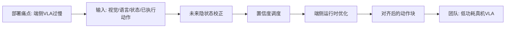
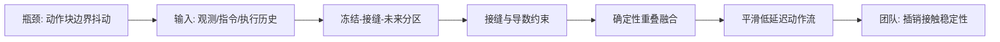
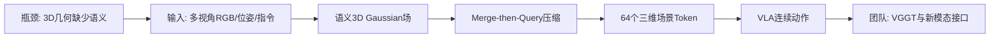
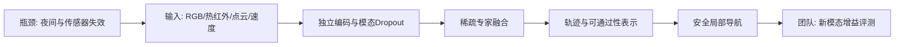
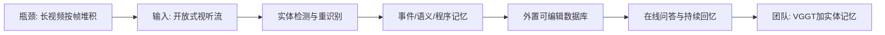

# 科研晨报：端侧低延迟 VLA、动作块连续性与开放式场景记忆

> 本期基于 arXiv 2026 年 7 月 15 日最新常规列表筛选，重点选择 7 月 14 日提交或更新的工作，并与 7 月 9 日至 7 月 15 日简报中的论文去重。近期已覆盖的 Jetson 端侧深度、B-spline 动作表示、GeoGS-SLAM、Co-VGGT、PanoWorld、AnythingReality、Vista 之外的 3D VLA 等条目不重复展开。

## 今日主线

今天最值得注意的不是某一个更大的模型，而是五个正在收敛的工程判断：

1. **低延迟 VLA 正从高端 GPU 演示转向真正的端侧部署**。Jetson-PI 把异步推理、轻量未来状态校正、调度和运行时优化统一起来，开始讨论功耗、带宽和控制频率。
2. **action chunk 的问题不只在长度，也在块与块之间是否连续**。ChunkFlow 将边界抖动、速度突变和历史误差累积显式纳入训练与评测。
3. **VLA 的三维输入正在从原始 depth/point cloud 转向语义化、可压缩的场景级表示**。VistaVLA 用语义 3D Gaussian 作为策略可读取的 3D cognitive tokens。
4. **新模态的价值需要在传感器缺失和极端环境下证明**。MAMMOTH 给出 RGB、热红外、点云和速度的因素化消融，显示热红外和几何信息承担不同角色。
5. **在线记忆应围绕持续实体，而不是持续堆帧**。ReflectWorld-MM 将开放式视频流组织成实体级、事件级和语义级记忆，为 VGGT/VLN 的长期场景记忆提供了新的上层架构。

---

## 5条简报

### 1. Jetson-PI: Towards Onboard Real-Time Robot Control via Foresight-Aligned Asynchronous Inference

**一句话结论**：Jetson-PI 将 VLA 的端侧瓶颈拆成“推理期间环境已经变化”和“反应时间仍受大模型限制”两个问题，并以轻量未来表征校正、置信度调度和 llama.cpp 运行时优化，在 Jetson Orin 上显著提高控制频率。

**为什么值得关注**：此前低延迟 VLA 多在 RTX 4090 或服务器上验证，难以反映移动机器人真实的功耗、带宽和续航约束。论文显示，π0/π0.5 在 Jetson Orin 50W 模式下单次推理约为 1.4 秒，而在 RTX 4090 上约为 70—76 毫秒。Jetson-PI 在 Orin 上相对原生 PyTorch 和 vla.cpp 分别实现 8.66 倍和 5.41 倍控制频率提升，并在 LIBERO 上比 VLASH 平均成功率高 14.8%。

**是否开源**：异步算法和端侧推理引擎均已公开，分别为 `PKU-SEC-Lab/Jetson-PI` 与 `PKU-SEC-Lab/Jetson-PI-Edge`。代码、运行时和硬件配置较完整；完整训练数据仍依赖所采用的 π 系列策略数据。

**所需算力**：

- 训练：只新增约 40M 参数的 future correction module，约占完整 VLA 的 1%；论文未公开总训练 GPU 数量。基于模块规模判断，利用现有 π0/π0.5 或 StarVLA 权重做两阶段微调，8×4090 具备可行性。
- 微调：第一阶段让 action expert 学会读取未来隐藏状态，第二阶段训练 future correction module 预测未来压缩表征；无需从头训练 VLM。
- 推理：覆盖 Jetson Orin 30W/50W、Jetson Thor、RTX A6000 和 RTX 4090。核心收益来自减少 VLM 调用、复用 CUDA 图、GPU 常驻中间缓存和 flow unrolling，而不只是模型量化。

**输入/输出**：输入为当前视觉、语言、机器人状态以及已经承诺执行的 action sequence；中间输出是未来时刻的压缩 VLM 表征和置信度；最终输出是与实际执行时刻对齐的 action chunk。

**核心 insight**：异步推理不能只预测未来机器人关节状态，因为物体和环境也会被已执行动作改变。更有效的做法是预测“动作执行后环境在 VLM 隐空间中的状态”，并根据预测置信度决定何时重新调用完整 VLM。

**思路来源与前序瓶颈**：该路线承接 VLASH、RTC、Realtime-VLA、Fast-WAM 和 latent world model。前序方案或只处理 chunk 拼接，或只校正未来本体状态，或仍依赖高端 GPU；Jetson-PI 将轻量世界预测与端侧运行时结合，直接针对低带宽设备。

**对团队启发**：组内可建立 `StarVLA/π0.x + 40M latent correction + Edge runtime` 的端侧 baseline。红外、偏振和触觉不必每个控制步都经过完整 VLM，可由置信度调度器决定何时刷新高成本模态；插销接触阶段则提高 action expert 和触觉分支调用频率。

**来源**：[arXiv](https://arxiv.org/abs/2607.12659) · [Jetson-PI](https://github.com/PKU-SEC-Lab/Jetson-PI) · [Jetson-PI-Edge](https://github.com/PKU-SEC-Lab/Jetson-PI-Edge)

#### 总览图（Mermaid）

---

### 2. ChunkFlow: Towards Continuity-Consistent Chunked Policy Learning

**一句话结论**：ChunkFlow 指出 action chunk 的低延迟收益会被边界抖动抵消，因此把每个动作块划分为 frozen、editable 和 future 三个区域，并在训练阶段显式约束块间接缝、速度和加速度连续性。

**为什么值得关注**：现有 RTC、EMA 或 overlap blending 多在推理时处理边界，但如果相邻 chunk 的原始预测本身冲突，简单加权只会把错误平滑化，无法消除误差累积。ChunkFlow 在 CALVIN 上达到 4.30 的平均序列长度，在 LIBERO 上达到 93.4% 成功率，推理摊销延迟为 4.43 毫秒，两项真机任务均达到 9/10；同时报告一阶/二阶变化、边界跳变、高频能量和总变差等稳定性指标。

**是否开源**：论文和项目页已公开；截至本期检索，未确认正式代码仓库、模型权重或完整数据 release。

**所需算力**：

- 训练：未披露 GPU 型号和数量。方法主要在已有 chunked policy 上增加 seam loss、一阶/二阶连续性损失、history corruption、scheduled sampling 和 AWAC fine-tuning，成本应显著低于从头预训练 VLA。
- 微调：可作为现有 π0.5、VLA-Adapter 或 diffusion/flow action head 的结构化后训练阶段。
- 推理：不需要额外策略前向，只做确定性 overlap blending；论文报告 4.43 毫秒摊销 reasoning latency，并在人工加入 100 毫秒控制延迟时基本保持性能。

**输入/输出**：输入是当前视觉、语言、近期执行历史和上一动作块；中间表示是分区后的重叠 action chunk；输出为经过边界融合、时间连续的控制序列。

**核心 insight**：action chunk 应按“哪些动作已经不可修改、哪些动作处于重叠接缝、哪些动作尚未执行”进行结构化建模，而不是把整个 chunk 用同一损失监督。训练目标必须与真实执行索引对齐。

**思路来源与前序瓶颈**：该工作从 ACT、diffusion policy、flow policy、RTC 和 VLA action chunking 发展而来。此前方法主要优化单块动作质量或推理时平滑，缺少块边界的训练监督，也没有系统评估 jerk、频谱和边界误差。

**对团队启发**：插销和装配任务应把 chunk seam 作为独立失败来源。除成功率和 time-to-success 外，应记录末端速度/加速度突变、接触力峰值、块边界卡滞次数、触觉纠偏触发率和恢复时间。ChunkFlow 可以与 Mean Flow、FLASH 或 Jetson-PI 组合：前者解决动作连续性，后者解决生成与端侧延迟。

**来源**：[arXiv](https://arxiv.org/abs/2607.12992) · [项目页](https://cytoderm-ai.github.io/chunkflow)

#### 总览图（Mermaid）

---

### 3. VistaVLA: Geometry- and Semantic-Aware 3D Gaussian-Grounded VLA for Robotic Manipulation

**一句话结论**：VistaVLA 不再把 depth 或 point cloud 作为孤立几何输入，而是构建带 SigLIP2/DINOv2 语义特征的 3D Gaussian 场，再压缩为 64 个策略可读取的三维场景 token。

**为什么值得关注**：普通 3D VLA 通常只提供低层几何，难以与 VLM 的语义特征对齐；直接输入大量点云或 Gaussian 又会造成 token 爆炸。VistaVLA 的 Merge-then-Query 将数十万 Gaussian 压缩 99%，在七项真机任务中相对 VLA-Adapter 平均提升 22.8 个百分点，在空间分布外任务上提升 30.0%；标准 LIBERO 平均成功率为 96.05%，LIBERO-Pro-Swap 为 12.2%，显著高于其 2D 和普通 3D 输入基线。

**是否开源**：论文已公开；截至本期检索，尚未确认代码、模型权重或训练数据发布。

**所需算力**：

- 训练：所有 VLA 方法在 4 张 RTX 5090 上采用匹配训练预算；策略主干为 VLA-Adapter-0.5B。Stage I 需要训练语义 Gaussian 表示，Stage II 训练 MtQ 和策略注入模块。
- 微调：适合在已有 0.5B VLA 上做任务级适配，算力明显低于 7B 级 VLA 全参数训练。
- 推理：每个控制步从最新 RGB 和标定相机位姿在线构建 Gaussian，不需要测试时 depth 或第三视图；执行前若干动作后再重规划。论文未报告端到端毫秒延迟，因此“在线构建”不等于已证明实时。

**输入/输出**：训练阶段输入多视角 RGB-D 和相机位姿，并以 SigLIP2、DINOv2-Large 特征监督语义场；推理阶段输入多相机 RGB、语言、机器人状态和标定 pose；中间输出为语义 3D Gaussian 与 64 个 summary tokens；最终输出连续机器人动作。

**核心 insight**：真正对 VLA 有价值的三维接口不是原始 depth，而是与语言和视觉语义对齐、跨视角一致、同时保留空间坐标的紧凑场景 token。

**思路来源与前序瓶颈**：该路线由 SpatialVLA、3D point-cloud policy、DepthSplat、semantic Gaussian 和 query bottleneck 共同发展而来。前序方法要么只有几何、缺少开放词汇语义，要么直接堆叠多视角 2D token，计算量和视角冗余较高。

**与 VGGT 的关系**：VistaVLA 本身不是 VGGT，也不支持无位姿输入和持续长序列记忆。它依赖标定 pose，并在每步重新构建局部场景。VGGT 可以替换其外部 pose/depth 来源，提供 pose-free point map；更进一步，可将 Gaussian summary tokens 写入长期对象记忆，而不是每个控制步全部重建。

**对团队启发**：可构建 `VGGT/红外深度/偏振法线 → 语义 Gaussian → 64 个 action-relevant token → VLA`。对透明、反光和弱纹理物体，重点比较原始 RGB、depth、VGGT point map、偏振 normal 和触觉 contact token，判断哪种信息真正改善空间 OOD 和接触操作。

**来源**：[arXiv](https://arxiv.org/abs/2607.12356)

#### 总览图（Mermaid）

---

### 4. MAMMOTH: A Multi-Modal End-to-End Policy for Off-Road Mobility Robust to Missing Modality

**一句话结论**：MAMMOTH 将 RGB、长波红外、3D 点云和本体速度纳入稀疏专家融合，并用 modality dropout 训练策略在夜间、低照度和单传感器失效时继续工作。

**为什么值得关注**：很多多模态工作只在“所有传感器均正常”时展示融合收益，无法回答真实部署中的传感器遮挡、掉线或退化。MAMMOTH 在真实越野机器人上连续测试白天、夜间和缺失模态条件，并显示不同传感器承担不同功能：热红外主要降低不安全地形选择，点云显著降低碰撞；仅依赖 RGB 时，白天和夜间性能均明显下降。

**是否开源**：论文已公开，作者承诺公开代码和数据；截至本期检索，正式仓库、权重和数据尚未上线。

**所需算力**：

- 训练：单张 NVIDIA H100，训练 20 个 epoch，batch size 100。
- 微调：RGB 与热红外分别使用 EfficientNet-B0 编码器，点云和速度采用独立编码，随后进入稀疏 MoE；模型规模和训练成本低于大型 VLA，可在组内 4090 上进行缩小版复现。
- 推理：扩散策略一次生成 8 条、每条 8 个 waypoint 的候选轨迹，并同时预测内在 traversability heuristic。论文未给出端到端 FPS，不能直接认定为实时高频控制。

**输入/输出**：输入为当前 RGB、LWIR、LiDAR 3D point cloud、ego velocity 和目标图像；中间表示为各模态 token、独立 router 和共享专家；输出为候选局部轨迹、地形可通过性评分及目标时间距离。

**核心 insight**：新模态的价值不应只看完整传感器配置下的平均精度，而应看它在特定退化条件下是否承担不可替代功能，以及移除该模态后哪一种失败显著增加。

**思路来源与前序瓶颈**：该工作继承 ViNT、NoMaD、FlowNav、多模态 traversability estimation、diffusion trajectory policy 和 mixture-of-experts。前序方法常依赖 RGB 或固定传感器组合，对夜间和 modality failure 缺乏系统鲁棒性。

**对团队启发**：虽然任务是越野导航，但方法可直接迁移到桌面操作：训练时随机丢弃 RGB、红外、偏振、触觉或 depth，迫使策略学会可替代和互补关系。透明物体任务应测试“RGB 失效时偏振是否降低漏抓”“触觉失效时视觉是否还能完成粗插入”“红外失效时普通 RGB 是否能维持安全停止”。

**来源**：[arXiv](https://arxiv.org/abs/2607.12965)

#### 总览图（Mermaid）

---

### 5. ReflectWorld-MM: An Entity-Oriented Multimodal Memory System for Open-Ended Video Streams

**更新原因**：该论文最初于 7 月 6 日提交，7 月 14 日更新为 v2，并在最新列表中重新出现。本期此前未覆盖该标题，因此只分析其开放式在线记忆与系统实现，不重复近期 Whareformer、LaMem-VLA 等对象记忆条目。

**一句话结论**：ReflectWorld-MM 不再按帧或 token 堆积视频历史，而是把无限视频流持续转化为实体级观察、事件级轨迹、长期语义事实和程序规则，并将其外置到可查询、可修改的数据库中。

**为什么值得关注**：大部分 streaming VLM 将历史压缩在 KV cache 或固定 memory bank 中，视频越长，状态读取和身份一致性越困难。ReflectWorld-MM 将“谁或什么实体再次出现”作为记忆主轴，保持每段工作状态和查询上下文有界，同时允许总数据库随时间增长。它在六项长视频和终身记忆 benchmark 上取得最佳结果，并能接入网络摄像头、手机、WebRTC 和本地视频流。

**是否开源**：论文明确说明完整系统代码已开源，并公开 prompts、阈值和 ONNX 工具配置。系统依赖 GPT-5-mini、文本 embedding 服务及多个本地感知模型，因此并非完全离线开源模型栈。

**所需算力**：

- 训练：主要是系统集成和 prompt/memory 设计，不需要从头训练大型视觉语言模型。
- 微调：默认本地工具包括 YOLO26m、RetinaFace、ArcFace、CLIP-ReID、RTMPose 和轻量语音识别；可替换为组内模型。
- 推理：主语义理解与 consolidation 使用 GPT-5-mini，具体云端成本和 GPU 延迟未量化。系统提供 `offline_quality` 与 `live_latency` 两种模式，关键身份字段可低延迟提交；它是真正持续在线的记忆服务，但不是实时几何重建模型。

**输入/输出**：输入为可能无限的视听流与时间戳；中间表示为实体解析观察、三层 episodic memory、可增删改的 entity semantic memory 和 procedural rules；输出为可查询记忆、问答证据、实体历史与主动提醒。

**核心 insight**：长期场景记忆的基本单位应从“帧”升级为“持续实体和事件”。过去不仅用于回答问题，也应在当前感知阶段参与实体识别和场景解释，减少跨时间身份断裂。

**思路来源与前序瓶颈**：该路线来自 MovieChat、Flash-VStream、ReKV、M3-Agent、WorldMM 与语言 Agent 的 episodic/semantic/procedural memory。前序 streaming cache 与视频长度绑定，显式记忆又常是 append-only 或不维护实体身份。

**与 VGGT/VLN 的关系**：ReflectWorld-MM 没有 metric 3D、camera pose、depth、point map 或可达性，因此不能直接作为 VLN 地图。更合理的组合是：VGGT 维护短窗口 pose/point map，3DGS 或对象地图维护空间坐标，ReflectWorld 式实体记忆维护身份、状态、交互和失败历史。

**对团队启发**：陈瑞阳方向可以采用双层记忆：底层是 `VGGT window + 3DGS/point memory`，上层是 `entity/event/semantic memory`。VLN 规划器不读取全部历史帧，而查询“目标对象最后位置、当前可见性、已探索区域、失败动作、最近状态变化”等结构化事实。

**来源**：[arXiv](https://arxiv.org/abs/2607.09759)

#### 总览图（Mermaid）

---

## 三条主线映射

| 主线 | 今日覆盖 | 关键判断 |
|---|---|---|
| 具身模型 | Jetson-PI、ChunkFlow、MAMMOTH | 真机效率需同时处理端侧带宽、异步状态错位、动作块接缝和模态失效；不能只报模型参数量或单次推理速度。 |
| 场景理解模型 | VistaVLA、ReflectWorld-MM | 场景表示正在从原始 depth/point cloud 转向紧凑三维语义 token，并从短窗口几何扩展到实体级长期记忆。 |
| 生成感知模型 | Jetson-PI 的未来隐状态、ReflectWorld-MM 的在线记忆 | 生成感知不必预测完整未来 RGB；轻量 future latent 和结构化 entity memory 更可能服务实时控制与长程决策。 |
| 横向全景模态 | 本期无新的高优先级全景论文 | 可将全景作为 ReflectWorld-MM 的宽视场入口和 VGGT 的全局初始化，但仍需处理 ERP 畸变、跨视角身份一致性和生成内容可信度。 |

---

## 组会讨论题

1. **端侧 VLA 的优化目标是什么？** 是单次模型延迟、控制频率、反应时间、功耗，还是单位电量完成任务数？Jetson-PI 表明这些指标并不等价。
2. **action chunk 的 seam 是否应该成为正式 benchmark 指标？** 插销、装配和接触操作中，块边界的速度/加速度突变是否比平均轨迹误差更能预测失败？
3. **VGGT 输出如何转为策略可用表示？** 直接输入 point map，还是先形成语义 Gaussian，再压缩成 64 个对象/空间 token？
4. **多模态增益如何避免“传感器越多越好”的伪结论？** 是否必须加入单模态失效、双模态缺失、噪声注入和极端环境测试？
5. **长期场景记忆应该保存什么？** 完整 3DGS、对象轨迹、实体语义、失败事件和程序规则应如何分层，哪些信息必须可编辑和可追溯？

---

## 可延展选题

1. **Jetson-VLA 端侧基准**：在 Jetson Orin、Mac Studio、RTX 4090 上统一测试 π0.x、StarVLA 和 VLA-Adapter，报告单次延迟、控制频率、功耗、显存、网络依赖和 time-to-success。
2. **Continuity-aware 插销 benchmark**：在 action chunk 边界人工注入延迟、噪声和历史偏差，比较 RTC、ChunkFlow、Mean Flow 与触觉 residual controller；增加 jerk、峰值力和卡滞恢复指标。
3. **VGGT-to-Gaussian Token**：使用 VGGT 提供无位姿 point map 和 pose，再采用 VistaVLA 的 MtQ 形成固定长度 3D semantic tokens，测试是否减少相机标定依赖。
4. **新模态缺失训练**：将 MAMMOTH 的 modality dropout 迁移到 RGB、红外、偏振、深度和触觉，重点验证透明、反光、弱纹理和暗光场景中的信息增益。
5. **双层 VLN 在线记忆**：底层以 VGGT/3DGS 维护局部几何，上层以 ReflectWorld 式实体记忆维护对象身份、状态、任务事件和失败历史；统一评测 EQA 一致性、目标重定位和重复探索率。
6. **后续跟踪：FlowWAM**：关注 optical-flow-as-action 是否发布代码，以及 flow representation 能否与 VGGT scene flow、触觉接触运动和偏振表面变化结合，形成不依赖机器人动作标注的 WAM 预训练数据。

---

## 音频版旁白稿

今天的科研晨报继续围绕具身模型、场景理解模型和生成感知模型展开。今天最明确的变化，是研究重点正在从“模型能不能做任务”，转向“能不能在端侧持续、平滑、可靠地做任务”。五条工作分别对应端侧推理、动作块连续性、三维语义表示、新模态鲁棒性和长期在线记忆。

第一篇是 Jetson-PI。它关注的是视觉语言动作模型真正放到 Jetson Orin 以后会发生什么。论文指出，π0 和 π0.5 在 Orin 上一次推理大约需要一秒多，控制频率不足一赫兹。简单使用异步推理虽然能让机器人一边执行、一边计算，但模型看到的观测和动作真正执行时的环境已经不一致。Jetson-PI 增加了一个只有四千万参数的未来校正模块，根据已经承诺执行的动作，预测未来时刻的环境隐表示；再用置信度决定什么时候重新调用完整视觉语言模型，什么时候只运行较轻的动作专家。配合端侧运行时优化，它在 Orin 上显著提升控制频率。对我们来说，最重要的启发是，红外、偏振和完整视觉模型不一定每个控制步都运行，可以根据不确定性动态刷新。

第二篇是 ChunkFlow。现在很多 VLA 为了提高控制频率，会一次输出一段 action chunk。但相邻动作块在重叠区域可能给出互相矛盾的动作，导致末端在边界处抖动。过去常用插值或滑动平均做推理时平滑，但这只是把冲突平均掉，并没有让模型真正学会可拼接的动作。ChunkFlow 将每个动作块分成已经冻结、可以编辑和未来预测三个区域，并在训练时加入接缝、一阶速度和二阶加速度连续性约束。它还报告边界跳变和高频能量，而不是只报成功率。这一点非常适合插销和装配，因为接触阶段一个很小的速度突变，就可能造成卡滞或冲击力过大。

第三篇是 VistaVLA。它试图解决三维信息怎样真正进入 VLA。过去把深度图或点云直接拼到模型中，通常只能提供低层几何，而且很难与视觉语言模型的语义特征对齐。VistaVLA 先把多视角视觉语义提升到三维 Gaussian 场中，再把数十万个 Gaussian 压缩成六十四个三维场景 token，供动作模型读取。它在真机空间变化任务上获得明显提升。需要注意的是，它本身不是 VGGT，也依赖标定相机位姿。我们可以进一步用 VGGT 提供无位姿的 point map 和 camera pose，再将这些几何结果压缩成动作相关 token。红外深度、偏振法线和触觉接触点，也可以进入同一个三维语义接口。

第四篇是 MAMMOTH。虽然它研究的是越野导航，但它对新模态评测很有参考价值。模型同时使用 RGB、长波红外、三维点云和本体速度，并在训练中随机删除某些模态，使系统在传感器失效时仍能工作。实验显示，热红外主要减少夜间对危险地形的误判，点云主要降低碰撞。这说明不同模态的价值必须通过具体失败类型来证明，而不能只看全部传感器都存在时的平均分。对我们的透明抓取和插销任务，可以用同样的方式随机丢弃 RGB、偏振、红外和触觉，观察缺少哪一种模态会增加哪一类失败。

第五篇是 ReflectWorld-MM。它关注无限视频流中的长期记忆。传统方法常按帧或 token 保存历史，时间越长，缓存越大，而且同一个对象离开视野再回来时，身份容易断裂。ReflectWorld-MM 把记忆组织成持续实体、事件轨迹、长期语义事实和程序规则，并存入外部数据库。当前片段的理解还会读取已有实体历史，让过去参与当前感知。它不是三维重建模型，也不能直接提供可行走区域或相机位姿，但非常适合作为 VGGT 和三维地图之上的长期语义层。底层维护几何，上层记录目标对象最后位置、状态变化、已执行动作和失败事件，这可能比把全部历史图像塞进一个大模型更适合长程导航和环境问答。

今天组会建议讨论三个核心问题。第一，端侧 VLA 应该优化单次延迟，还是优化反应时间、功耗和单位电量任务完成数。第二，插销和装配是否应正式加入动作块边界、接触冲击和恢复时间指标。第三，在线场景记忆是否应确定为双层架构：VGGT 或三维 Gaussian 负责局部几何，实体记忆负责长期身份、语义和失败历史。短期最值得启动的两个实验，是 VGGT 到语义 Gaussian token 的接口，以及带模态随机失效的多传感器插销 benchmark。

---

## 今日已覆盖论文列表

1. Jetson-PI: Towards Onboard Real-Time Robot Control via Foresight-Aligned Asynchronous Inference
2. ChunkFlow: Towards Continuity-Consistent Chunked Policy Learning
3. VistaVLA: Geometry- and Semantic-Aware 3D Gaussian-Grounded VLA for Robotic Manipulation
4. MAMMOTH: A Multi-Modal End-to-End Policy for Off-Road Mobility Robust to Missing Modality
5. ReflectWorld-MM: An Entity-Oriented Multimodal Memory System for Open-Ended Video Streams
