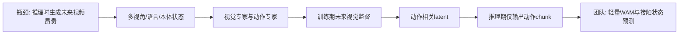
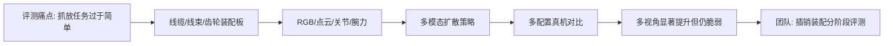
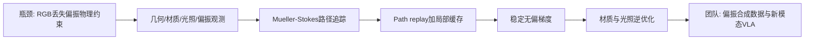
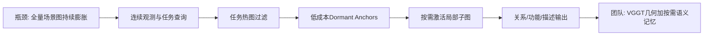
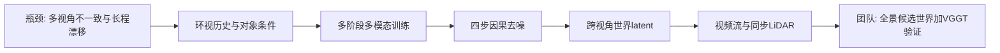

# 科研晨报：训练时看未来、执行时只出动作；在线记忆从“全量建图”转向“按需激活”

## 今日主线

本期基于截至 2026 年 7 月 17 日早晨可见的最新论文批次筛选，并避开最近 7 天已覆盖的 Jetson-PI、ChunkFlow、VistaVLA、Co-VGGT、GeoGS-SLAM、PanoWorld、Whareformer、ReflectWorld-MM 等条目。今天有五个值得团队关注的技术信号：

1. **WAM 的部署路线正在收敛**：未来视觉主要作为训练期的密集监督，真机推理只激活动作专家，避免生成未来视频带来的延迟和误差累积。
2. **工业具身评测开始逼近真实装配问题**：线缆整理、连接器插入和齿轮箱装配成为标准化任务；多视角、点云和腕部力信息的增益需要分阶段分析，而不能简单全量融合。
3. **偏振模态开始获得可微物理仿真底座**：相比普通 RGB 域随机化，Mueller–Stokes 光传输与稳定反向梯度更适合生成透明、反光和复杂材质的物理一致训练数据。
4. **长期场景记忆不应持续构建完整语义图**：低成本几何锚点可以持续维护，昂贵的描述、关系与功能推理只在任务查询到来时按需激活。
5. **多视角世界模型进入分钟级在线生成**：四步去噪和跨视角一致性值得全景世界模型借鉴，但生成视频与生成 LiDAR 仍不能直接等同于可信的机器人地图。

---

## 5条简报

### 1. GigaWorld-Policy-0.5：世界预测留在训练期，动作专家承担真机推理

**一句话结论**：GigaWorld-Policy-0.5 用未来视觉动态训练动作表示，但部署时跳过未来视频生成，仅运行轻量动作专家，在本地 RTX 4090 上报告约 85 ms 推理延迟。

**为什么值得关注**：传统 WAM 在训练和推理时都联合生成动作与未来视频，视频 token 数量远高于动作 token，既增加计算量，也可能因想象误差累积而干扰闭环控制。该工作采用 action-centered causal mask：动作只能读取当前多视角观测、语言和机器人状态，未来视觉可以读取动作；因此未来视觉为动作学习提供密集物理监督，却不会在动作预测中形成信息泄漏。模型进一步用 Mixture-of-Transformers 将视觉动态专家与动作专家分开，配合 KV cache、图编译和轻量 C++ runtime，形成 action-only 推理路径。

**是否开源**：论文、项目页和 Hugging Face 模型权重已公开，权重采用 Apache-2.0 许可证；当前模型仓库主要提供 Transformer 权重，完整运行还需要 Wan2.2 的 VAE 与 scheduler。上一版 GigaWorld-Policy 的训练与推理代码已公开，但 0.5 版本专属的 AutoResearch 配置和完整 C++ runtime 是否全部同步发布，仍需继续核查。

**所需算力**：

- **预训练**：视觉专家继承自使用超过 1 万小时视频预训练的 GigaWorld-1，随后再使用约 2000 小时机器人数据预训练；从头复现远超团队 8×4090 的合理预算。
- **目标域后训练**：需要真实机器人轨迹进行 post-training，论文未明确公开 GPU 数量与训练时长；更现实的路线是冻结大部分视觉专家，只微调动作专家或 Adapter。
- **推理**：本地 RTX 4090 约 85 ms；仍不是高频接触控制器，但已进入约 10 Hz 级策略刷新范围。

**输入/输出**：输入为左、前、右多视角 RGB、语言指令和本体状态；训练时联合预测动作 chunk 与未来视觉 latent，部署时仅输出动作 chunk。

**核心 insight**：世界模型的价值不一定体现在“真机上实时播放未来视频”，而可以体现在训练期迫使动作 token 与可实现的未来变化保持一致；推理时则只保留动作相关计算。

**思路来源与前序瓶颈**：它延续 Motus、VideoVLA、LingBot-VA、GigaWorld-Policy 和 Fast-WAM 等路线，针对显式未来视频推理昂贵、长期想象漂移以及动作/视觉计算无法按需裁剪的问题，进一步做专家解耦与部署优化。

**对团队启发**：可设计 `WAM-lite`：VGGT point map、偏振法线、红外深度与触觉接触状态只在训练阶段构造未来几何/接触监督，推理时由轻量动作专家直接输出动作。插销与装配中，世界监督可改成“未来相对位姿、接触状态、卡滞概率和可达性”，不必预测完整 RGB 视频。

**可靠来源**：[arXiv](https://arxiv.org/abs/2607.13960) · [模型权重](https://huggingface.co/open-gigaai/Giga-World-Policy-0.5) · [前序版本代码](https://github.com/open-gigaai/giga-world-policy)

#### 总览图（Mermaid）

---

### 2. Industrial Dexterity Benchmark：工业插入与线缆任务需要分阶段多模态评测

**一句话结论**：该工作把数据中心线缆管理、汽车线束和行星齿轮箱装配做成可复现 benchmark，并用 RGB、点云、关节状态和腕部力信息训练扩散策略；多视角 RGB 配置将抓取加插入成功率从单相机基线的 36% 提升到 78%。

**为什么值得关注**：现有具身 benchmark 经常使用规则物体、短时抓放和宽松成功标准，难以代表线缆形变、连接器方向、受限空间和接触力约束。Industrial Dexterity Benchmark 同时提供三类物理任务板、ROS2 数据采集与模仿学习框架 DAG-ROS，以及多模态扩散策略 AG-iDP3。数据中心线缆任务中，每种设置进行 48 次试验，每个任务阶段约需 100 条遥操作示教，说明真实工业任务可以在相对可控的数据量下开展系统消融。

**是否开源**：论文已经公开；任务板、策略代码、完整数据和 CAD 的发布状态在论文入口处尚未形成清晰的一站式说明，当前应按“部分或待确认”处理，避免默认全部可复现。

**所需算力**：

- **训练**：论文摘要未明确报告训练 GPU 数量与训练时长。策略规模属于数千万到一亿参数级的扩散策略，单任务微调大概率可在 1–4 张现代 GPU 上完成；真正的主要成本是遥操作采集、硬件复现和大量真机重复试验。
- **推理**：需要多相机图像、可选点云和腕部六维力/力矩输入；是否满足高频接触控制取决于视觉编码、扩散步数和控制插值，不能由最终成功率反推延迟。

**输入/输出**：输入包括单视角或多视角 RGB、点云、关节位置和腕部 wrench；输出为动作 chunk，经时间集成或轨迹插值后驱动机器人完成抓取、理线和插入。

**核心 insight**：工业操作中的模态增益是**阶段相关**的。多视角视觉主要减少遮挡和连接器方向歧义；点云提供空间结构；力信息更可能在插入和接触阶段有效。将所有模态全程等权输入，未必优于按任务阶段门控。

**思路来源与前序瓶颈**：该工作从 Diffusion Policy、DP3/iDP3、多视角模仿学习和工业 ROS 管线发展而来，解决研究型 benchmark 与真实线缆、连接器、齿轮装配之间的任务鸿沟。

**对团队启发**：这几乎可以直接映射到插销与装配方向。建议把任务拆为“发现—抓取—粗对准—接触—插入—验证—恢复”，分别测量 RGB、VGGT 几何、偏振、红外和触觉/力的边际增益。除成功率外，还应报告 time-to-success、峰值力、卡滞次数、重抓次数、恢复时间、背景变化和连接器姿态变化下的失效曲线。

**可靠来源**：[arXiv](https://arxiv.org/abs/2607.14021)

#### 总览图（Mermaid）

---

### 3. Differentiable Polarized Path Tracing：偏振新模态获得稳定的可微物理仿真工具

**一句话结论**：该工作首次系统解决偏振路径追踪反向传播中的数值不稳定，用 path replay 与局部缓存估计无偏梯度，为复杂材质的偏振逆渲染和合成数据生成提供底层工具。

**为什么值得关注**：普通可微渲染主要优化辐射强度，丢弃了能够约束表面法线、材质和光照的偏振信息。偏振正向模拟可以使用 Mueller–Stokes calculus，但线偏振片和漫反射等算子常为秩亏，破坏标准 path replay backpropagation 所依赖的可逆性假设，导致反向梯度爆炸或不稳定。该工作通过 path replay 与 local caching 的组合，稳定估计偏振光传输梯度，并展示复杂场景中的材质和光照优化；论文已被 ECCV 2026 接收。

**是否开源**：论文和项目页已公开；截至本期，项目页可见，但代码、预训练资源与完整数据的公开状态尚未确认。

**所需算力**：

- **训练/优化**：偏振路径追踪需要多样本 Monte Carlo 积分，完整复杂场景的逆渲染成本较高；论文入口未给出统一 GPU 配置。
- **团队可行方案**：不从头训练大模型，而是对桌面物体、透明件和金属件进行低分辨率、多样本离线渲染。1–4 张 RTX 4090 可用于生成局部对象级数据集，随后训练轻量 Polar-VGGT、偏振 normal 网络或多模态 VLA Adapter。
- **推理**：它本身不是实时机器人模型，而是数据与标定工具；真机推理成本取决于下游网络。

**输入/输出**：输入为场景几何、材质、光照、相机与偏振光学配置，以及目标偏振观测；输出为稳定的反向梯度和优化后的材质/光照参数。其公式可扩展到几何优化，但本文明确强调的应用是材质与光照估计。

**核心 insight**：偏振不是给 RGB 增加一个“风格通道”，而是具有明确光传输规律的物理观测。只有正向模拟和反向梯度都遵循偏振光学，合成数据才可能保留对透明、反光和非朗伯物体真正有用的信息。

**思路来源与前序瓶颈**：它建立在物理路径追踪、可微渲染、Mueller–Stokes 偏振传输和 path replay backpropagation 之上，针对传统 RGB 逆渲染无法利用偏振约束、直接扩展反向传播又数值不稳定的问题。

**对团队启发**：可启动 `PolarSim-to-Real`：离线生成 RGB、Stokes、AoLP、DoLP、法线、材质和深度联合数据，用少量真实偏振视频做域校准，再分别测试对 VGGT 几何、透明抓取、反光物体姿态和插销对准的增益。评测重点不是生成图是否逼真，而是表面法线误差、边界定位、抓取成功率和接触恢复是否改善。

**可靠来源**：[arXiv](https://arxiv.org/abs/2607.13265) · [项目页](https://vcai.mpi-inf.mpg.de/projects/DPPT/)

#### 总览图（Mermaid）

---

### 4. JITOMA：长期在线记忆不再“先把一切都建完”

**一句话结论**：JITOMA 持续维护低成本 dormant anchors，只在任务查询到来时激活相关局部子图并执行昂贵的描述和功能推理，从而减小长程机器人中的图规模与语义处理延迟。

**为什么值得关注**：传统 3D Scene Graph 常采用 Ahead-of-Time 流程：每一帧都检测、分割、描述、建立关系，再在下游查询时筛选。长序列下，大量重复观测会造成 perceptual saturation，图规模、VLM caption 成本和边缘端延迟持续增长。JITOMA 在前端使用任务热图过滤连续观测，只维护低成本全局锚点；当 LLM 解析到具体意图时，才唤醒相关锚点，在局部子图中执行 dense captioning 与 functional inference。论文同时提出 JITOMA-Bench，用于长程多任务和多步推理评测。

**是否开源**：论文与 benchmark 设计已经公开；截至本期未确认正式代码、模型和数据仓库。

**所需算力**：

- **训练**：是否需要端到端训练及具体 GPU 预算未在摘要中明确；框架核心更接近系统调度与记忆组织。
- **推理**：基础锚点维护成本较低，昂贵的 LLM/VLM 只在任务相关局部区域触发。实际延迟取决于检测器、语言模型和场景规模，但方法目标是让处理时间在长程任务切换下保持稳定。

**输入/输出**：输入为连续机器人观测、空间锚点和任务/认知查询；中间表示为 dormant anchors、任务热图和被激活的局部场景图；输出为任务相关对象、关系、功能信息及可供规划器读取的局部子图。

**是否真正 streaming/online**：它是闭环在线记忆系统，但不是 feed-forward 三维重建模型，也不直接输出 camera pose、depth、point map 或 3DGS。它解决的是“何时把几何锚点升级成昂贵语义”的资源调度问题。

**核心 insight**：长期记忆的关键不是保存更多，而是让低成本结构长期存在、昂贵语义按任务需求生长。场景图应成为动态工作集，而不是不断膨胀的静态数据库。

**思路来源与前序瓶颈**：该工作从 3D Scene Graph、开放词汇场景理解、外部记忆和按需检索路线发展而来，针对“先全量感知、再下游过滤”在长序列和边缘端上的计算浪费。

**对团队启发**：可形成 `VGGT + JITOMA` 双层结构：VGGT 或 streaming geometry 模型持续产生低成本 pose、point 与 object anchor；VLN/EQA 查询到“杯子在哪里”“哪条路可通行”“哪个插孔可操作”时，再激活对应区域的语义、affordance 和历史失败信息。这样既控制显存，也避免每帧都调用大模型。

**可靠来源**：[arXiv](https://arxiv.org/abs/2607.13245)

#### 总览图（Mermaid）

---

### 5. M4World：多视角世界模型进入四步去噪与分钟级在线生成

**一句话结论**：M4World 可在线因果生成多视角环视视频与同步 LiDAR，以四步去噪维持分钟级 rollout，并支持对象位置、外观和长尾场景的交互式控制。

**为什么值得关注**：多视角世界模型通常面临三个问题：视角之间对象不一致，长序列生成逐渐漂移，以及稀有事件难以定制。M4World 通过多阶段训练实现 online causal generation，在四个 denoising steps 下进行分钟级流式生成；其条件接口可以控制对象的空间布局与外观，并通过 few-clip post-training 快速适配长尾场景。评测不只看画质，还引入 VLM judge，分别衡量场景条件遵循、单视角对象可控性和跨视角对象一致性。

**是否开源**：论文已经公开；截至本期未确认正式代码、模型权重和完整数据集发布。

**所需算力**：

- **训练**：多视角视频与 LiDAR 联合扩散模型的完整训练预计需要大规模 GPU 集群；论文摘要未披露统一训练硬件，团队不适合从头复现。
- **微调**：few-clip post-training 为低成本适配提供了可能，但实际 GPU 数量、时长和显存仍待代码公开。
- **推理**：四步去噪显著降低迭代次数，但论文摘要未给出真实 FPS、端到端延迟和显存，因此不能直接称为实时机器人模型。

**输入/输出**：输入包括历史多视角观测、对象空间布局、对象外观或视觉参考条件；输出为未来 surround-view 视频流与同步 LiDAR。它生成的是未来候选世界，而不是从真实传感器流恢复的度量三维地图。

**是否真正 streaming/online**：是因果在线生成，不访问未来帧；但它属于生成式 world model，不是 streaming feed-forward reconstruction，也不输出可信 camera pose、静态 point cloud、3DGS 或语义地图。

**核心 insight**：长程世界模型必须同时控制时间、视角和对象身份。单纯提高单帧视觉质量，不能保证跨相机一致性和长时间稳定性；评测也应从画质转向“条件是否执行、同一对象是否跨视角保持一致”。

**思路来源与前序瓶颈**：它延续驾驶世界模型、环视视频生成、多模态视频—LiDAR生成和交互式场景编辑路线，解决已有模型对象级控制弱、跨视角不一致和长序列漂移的问题。

**对团队启发**：其技术可迁移到全景与多相机机器人世界模型：用 ERP 全景或多视角图像作为全局观察，生成候选未来视野、遮挡变化和深度/LiDAR，再由 VGGT、真实深度和在线 3D memory 验证。生成结果只能进入“候选记忆层”，高置信真实观测才可写入长期地图。

**可靠来源**：[arXiv](https://arxiv.org/abs/2607.14005)

#### 总览图（Mermaid）

---

## 三条主线映射

| 主线 | 今日覆盖 | 关键判断 |
|---|---|---|
| 具身模型 | GigaWorld-Policy-0.5、Industrial Dexterity Benchmark | 提速应同时考虑模型路径、部署 runtime 与动作刷新率；新模态必须在具体阶段和失效条件下证明增益。 |
| 场景理解模型 | JITOMA、Differentiable Polarized Path Tracing | VGGT 类几何底座可持续维护轻量锚点，偏振物理可为透明/反光场景提供 RGB 缺失的几何与材质约束。 |
| 生成感知模型 | GigaWorld-Policy-0.5、M4World、JITOMA | 世界预测可作为训练监督或候选未来，但在线可信记忆仍需真实几何验证和按需语义激活。 |
| 全景横向项 | M4World | 今日没有新的 ERP 专用模型；多视角一致性、分钟级流式生成和对象可控评测可直接迁移到全景世界模型。 |

---

## 组会讨论题

1. **WAM 的最佳输出究竟是什么？** 训练时预测未来 RGB、未来几何、对象位姿还是接触状态，哪一种对插销和装配的动作学习最有效？
2. **多模态是否需要按阶段门控？** 偏振和多视角用于发现与粗定位，点云用于对准，触觉/力用于接触与插入，这是否比全程融合更稳定？
3. **工业 benchmark 应如何增加诊断性？** 除成功率外，是否统一加入 time-to-success、峰值力、卡滞、重抓、恢复时间和环境扰动失效曲线？
4. **VGGT 长期记忆应该保存多少？** 是持续写入完整点图/3DGS，还是只保存 dormant object anchors，任务到来时再激活高成本语义？
5. **生成世界与真实地图如何隔离？** M4World 一类模型产生的未来视频和 LiDAR 应以何种置信度与一致性检查，才能被 VLN 或 EQA 使用而不污染长期记忆？

---

## 可延展选题

1. **Action-centered Geometric WAM**：以 GigaWorld-Policy-0.5 为范式，将未来 RGB 监督替换或补充为 VGGT point-map flow、对象位姿变化、接触状态与可达性；推理期只保留轻量动作专家。
2. **阶段感知多模态插销策略**：建立 discover、align、contact、insert、verify、recover 六阶段，分别门控 RGB、偏振、红外、point map 和触觉，比较全程融合、阶段融合与 modality dropout。
3. **Polarized Synthetic Prior**：使用可微偏振路径追踪生成 RGB—Stokes—法线—材质—深度联合数据，再以少量真机偏振视频校准，验证透明/反光操作中的信息增益。
4. **VGGT Dormant Memory**：局部窗口由 VGGT 输出 pose、point map 和 object anchors；JITOMA 式任务热图决定何时生成描述、空间关系、affordance 和失败历史，面向 VLN/EQA 测量显存与延迟。
5. **Panoramic World-Model Trust Protocol**：借鉴 M4World 的条件遵循、对象可控和跨视角一致性指标，增加 ERP 接缝、FoV gap、球面运动一致性与真实几何验证，严格区分候选未来和可信地图。

---

## 音频版旁白稿

今天的科研晨报围绕五条新工作展开，核心问题可以概括为一句话：机器人系统不应该把所有能力都放在一次昂贵推理里，而应该区分训练和执行、全局和局部、真实观测和生成候选，以及不同任务阶段真正需要的传感器。

第一篇是 GigaWorld-Policy-0.5。它代表世界—动作模型部署路线的一次明显收敛。过去很多模型在训练时联合预测动作和未来视频，部署时仍然要生成未来视频，计算量大，想象误差也会逐步累积。GigaWorld-Policy-0.5 的做法是，未来视觉只在训练阶段提供密集监督，让动作表示理解动作会造成什么场景变化；到了真机推理阶段，则关闭未来视觉分支，只运行轻量动作专家。它进一步把视觉动态和动作生成拆成两个 Transformer 专家，并结合缓存、图编译和 C++ 运行时，在本地四零九零上做到大约八十五毫秒。对我们而言，最有价值的并不是复现它两千小时机器人数据的完整预训练，而是借鉴训练期世界监督、推理期动作解码的结构。插销任务可以预测未来相对位姿、接触状态和卡滞概率，而不必预测完整未来画面。

第二篇是 Industrial Dexterity Benchmark。它把数据中心线缆管理、汽车线束和齿轮箱装配做成物理 benchmark，并提供多模态扩散策略。实验中，多视角视觉将抓取加插入的综合成功率从单相机的百分之三十六提高到百分之七十八。这个结果很重要，但不能简单理解为“摄像头越多越好”。工业装配包含发现、抓取、对准、接触、插入和验证等阶段，不同模态的作用并不相同。多视角主要解决遮挡，点云主要提供几何，腕部力更适合接触后的诊断。我们的插销、装配和透明物体抓取，可以直接借鉴这种任务板思路，但评测必须增加完成时间、峰值力、卡滞次数、恢复时间，以及改变背景、光照、材质和初始姿态后的性能崩塌点。

第三篇是 Differentiable Polarized Path Tracing。这篇不是机器人策略，而是偏振模态的底层数据工具。普通可微渲染只处理亮度，偏振观测中包含的法线、材质和反射约束被丢掉。虽然偏振光的正向传播可以用 Mueller–Stokes 计算，但线偏振片和漫反射会造成秩亏，使标准反向梯度不稳定。作者通过路径重放和局部缓存获得稳定的无偏梯度，可以优化复杂场景中的材质和光照。对我们的意义是，偏振不应被当成普通风格变化，而应该用物理渲染生成 Stokes、偏振角、偏振度、法线、材质和深度联合数据。然后再用少量真实视频校准，验证它是否真正改善透明、反光和弱纹理物体的几何与操作。

第四篇是 JITOMA。它研究长程机器人为什么会出现感知饱和。传统场景图往往每一帧都检测、分割、描述和建立关系，随着任务变长，重复信息越来越多，图规模和大模型调用成本持续增长。JITOMA 不再提前把所有语义都建完，而是持续维护低成本的 dormant anchors，也就是休眠锚点。只有任务查询到来时，系统才激活相关区域，并在局部子图中进行详细描述和功能推理。这和陈瑞阳的在线重建方向非常契合。VGGT 可以负责短窗口几何和对象锚点，长期系统不必保存所有 token；当导航或问答真正需要某个对象、房间或可达区域时，再生成昂贵语义。

第五篇是 M4World。它面向自动驾驶，但对全景与多相机世界模型很有启发。模型可以在线因果生成多视角视频和同步激光雷达，只用四步去噪维持分钟级序列，并允许控制对象的位置与外观。更值得借鉴的是它的评测：不只看画面是否逼真，还看条件是否被执行、对象在单个视角是否可控、同一个对象跨视角是否保持一致。需要强调的是，它生成的是候选未来，不是真实三维地图。未来我们做全景世界模型时，可以让模型提出未来视野、遮挡变化和深度候选，但必须由真实观测、VGGT 和在线三维记忆验证后，才能写入长期地图。

今天组会建议讨论三个问题。第一，世界模型在我们的任务中应该预测未来图像，还是未来几何和接触状态。第二，红外、偏振、点云和触觉是否应该按任务阶段门控，而不是全程输入。第三，陈瑞阳的在线记忆是否可以明确采用双层结构：底层持续维护低成本几何锚点，上层按任务需要激活对象语义、可达性和失败历史。短期最值得启动的两个实验，一个是以未来 point map 和接触状态监督动作专家，另一个是建立阶段感知的多模态插销 benchmark。

---

## 今日已覆盖论文列表

1. GigaWorld-Policy-0.5: A Faster and Stronger WAM Empowered by AutoResearch
2. Industrial Dexterity Benchmark: A Hardware-Software Benchmarking Platform for Industrial Dexterous Manipulation
3. Differentiable Polarized Path Tracing
4. Just-In-Time Scene Graph Growth: Combating Perceptual Saturation in Long-Horizon Robotics
5. M4World: A Multi-view Multimodal Driving World Model for Interactive Object Manipulation and Minute-long Streaming
