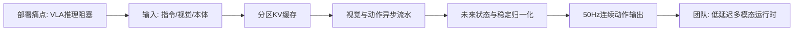
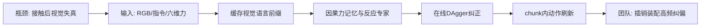
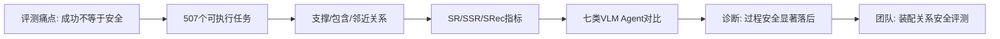
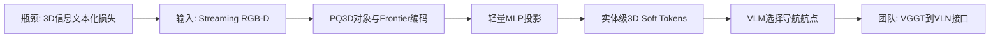
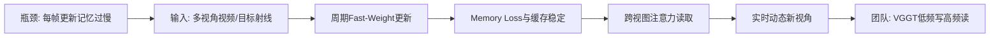

# 科研晨报：流式 VLA、反应式力觉、三维软 Token 与在线时空记忆

## 今日主线

截至 2026 年 7 月 18 日早晨，机器人与计算机视觉方向最新常规论文批次为 7 月 17 日。本期与 7 月 11 日至 17 日简报去重，没有重复 Jetson-PI、ChunkFlow、VistaVLA、Co-VGGT、GeoGS-SLAM、PanoWorld、Whareformer、JITOMA、GigaWorld-Policy-0.5 等近期条目。

今天有四个值得团队关注的技术变化：

1. **VLA 加速从“缩短一次推理”转向“重构持续控制系统”**。Reflex 不只是减少计算量，而是把视觉编码、流匹配去噪和动作执行变成异步流水线，并将反应延迟、stall rate 和长期数值稳定性纳入评测。
2. **高频物理模态更适合后接，而不是从头预训练**。LIFT 将力觉作为后训练阶段的反应式分支，保留原 VLA 的视觉语言先验，并在 action chunk 内持续刷新动作。
3. **空间理解正在从“把地图写成文字”转向“直接传递连续三维表示”**。SoftNav 证明对象与 frontier 的三维连续 token 比文本化坐标和场景图更适合 VLM 导航决策。
4. **在线记忆的更新频率与使用频率应当解耦**。NSTM 以低频梯度更新记忆、高频读取记忆完成实时合成；这一原则可直接迁移到“低频 VGGT/3DGS 更新、高频 VLN/VLA 查询”。

---

## 5条简报

### 1. Reflex: Real-Time Vision-Language-Action Control through Streaming Inference

**一句话结论**：Reflex 将 flow-matching VLA 的视觉编码、动作生成与执行改造成真正的流式异步系统，在 Pi0/Pi0.5 上实现 2.58 倍推理加速、50 Hz 稳定控制和最高 54% 的反应延迟下降。

**为什么值得关注**：此前许多 VLA 加速工作只报告单次 action chunk 的推理时间，却没有处理机器人等待新动作时的停顿、观察到执行之间的状态漂移，以及长时间运行中的显存和数值稳定性。Reflex 将评测扩展为 inference latency、reaction latency、stall rate、peak memory 和 success rate，更接近真实机器人运行条件。

**是否开源**：已开源。官方仓库提供 Pi0/Pi0.5 的推理与部署实现、Triton 融合算子、异步执行器和机器人配置示例，采用 Apache-2.0 许可证。代码主要面向推理运行时，不包含重新训练基础 VLA 的数据或完整训练流程。

**所需算力**：

- **训练**：核心方法是部署与运行时改造，不要求重新训练基础 VLA；AdaRMSNorm 和未来状态校正的具体适配成本低于完整 VLA 训练。
- **微调**：不是方法成立的必要条件，可直接加载已有 Pi0/Pi0.5 checkpoint。
- **推理**：主要结果在 RTX 4090 上测得。Pi0.5 的 action chunk 推理由 135.2 ms 降至 52.4 ms，峰值显存降低约 27%；较大的 Pi0 获得约 2.73 倍加速。系统通过异步调度实现 50 Hz 控制输出，不代表大型视觉主干本身每 20 ms 完成一次完整前向。

**输入与输出**：输入为语言指令、滑动窗口视觉观察和机器人本体状态；输出为连续动作 chunk。内部将上下文划分为固定指令前缀、滑动视觉历史和动态 flow 状态三类缓存区域。

**核心 insight**：flow-matching VLA 中，视觉语言感知部分与去噪时间步基本无关，而 action expert 随时间步变化。只缓存前者、重算后者，可以避免因全局时间步注入导致的错误 KV-cache；再通过视觉线程与动作线程并行，隐藏视觉编码成本。

**思路来源与前序瓶颈**：该工作来自 action chunking、异步 VLA、KV-cache 和高性能推理系统几条路线的交汇。传统同步 VLA 在动作块结束后会停顿；普通 KV-cache 又会因 flow timestep 改变网络状态而失效。Reflex 的贡献是对模型结构做语义分区，而不是盲目复用全部缓存。

**适合真实机器人部署吗**：较适合。论文包含 AgileX PiPer 等真机实验，代码也提供连接机器人和相机的配置入口。但它依赖“视觉编码器不接受去噪时间步”这一结构假设，统一 DiT 式视觉—动作主干不一定直接适用。

**对团队的启发**：

- 为 StarVLA、Pi0.x、VLA-Adapter 建立统一的 **reaction latency、stall rate、chunk freshness 和显存曲线**测试，而不只看单次模型前向。
- 在插销和装配中，让 RGB/红外/偏振视觉以 10–20 Hz 更新，轻量动作专家和触觉回路以 50–100 Hz 运行。
- 将未来状态校正从简单命令外推升级为“本体状态 + 接触状态 + 近期力觉”的短时预测器，重点测接触阶段是否仍会因 stale observation 振荡。

**来源**：[论文](https://arxiv.org/abs/2607.14695)｜[代码](https://github.com/9yc/Reflex)

#### 总览图（Mermaid）

---

### 2. Never Too Late for Force: Accelerating VLA Post-Training with Reactive Force Injection

**一句话结论**：LIFT 不从头训练力觉 VLA，而是在预训练 VLA 后接一个反应式 action expert，用近期六维力/力矩记忆在 action chunk 内刷新动作，并通过在线 DAgger 收集真实失败状态。

**为什么值得关注**：视觉主导的 VLA 在接触后经常遇到遮挡、深度歧义和微小卡滞。LIFT 的关键不是简单增加一帧力传感器读数，而是把力觉变成低成本、因果的接触历史，并允许动作块在执行过程中被更新。这和团队的插销、装配、环套、透明物体抓取高度相关。

**是否开源**：截至 7 月 18 日，项目页标注代码、数据和模型均为 coming soon；论文说明接收后公开。当前尚不能直接复现完整系统。

**所需算力**：

- **训练**：每个训练实验使用单节点 8 张 NVIDIA A800。基础代码建立在 openpi 上，属于 VLA 后训练而不是从头预训练。
- **微调**：需要两阶段数据。第一阶段使用无力觉的手持视觉示教完成任务对齐；第二阶段在 Flexiv Rizon 4S 上收集带六维力觉的人类纠正，并持续在线更新。
- **推理**：慢速视觉语言前缀被缓存，chunk 内只编码最新力觉窗口并运行较轻的反应式分支。论文未给出可直接比较的端到端毫秒延迟，因此应将其视为“降低动作刷新成本”，而不是已证明整体 VLA 达到高频实时。

**输入与输出**：输入为单目腕部 RGB、语言指令、机器人状态和六维末端力/力矩序列；输出为相对动作。原始力传感器超过 1000 Hz，实验中下采样并与动作、RGB 同步到 10 Hz。

**核心 insight**：高频、机器人相关的力觉难以纳入大规模基础预训练，更合理的方式是“晚注入”。复制预训练 action expert、采用零初始化交叉注意力，使新增分支在训练开始时与原策略输出等价，从而避免破坏原有泛化能力。

**思路来源与前序瓶颈**：该工作承接 ForceVLA、TA-VLA、力控残差策略和 DAgger。此前力觉方法常在整个动作块生成前使用一次力输入，执行时仍然开环；而离线力数据覆盖不了当前策略真实遇到的卡滞状态。LIFT 用因果力记忆和在线纠正同时解决这两个问题。

**模态相比 RGB 的明确增益**：力觉能够直接判断是否已经接触、是否插入、是否坐实、是否发生侧向卡滞，这些状态在遮挡、透明和深度误差条件下无法由 RGB 稳定恢复。论文在毛巾折叠、书本插入和汉诺塔环放置中表明，力觉使后训练更快、最终性能更高；去掉在线纠正后，书本插入性能甚至会降至零。

**对团队的启发**：

- 插销任务可采用 `VLA粗对准 → 因果力记忆 → chunk内微动作刷新`，避免每次接触变化都重新运行完整视觉语言主干。
- 偏振和红外负责接触前的边界、法线和弱纹理几何；力觉负责接触后的卡滞、坐实与恢复，形成明确的分阶段模态分工。
- 建议增加 force-aware 指标：首次接触到纠偏动作的时间、峰值侧向力、卡滞次数、退出错误接触的时间，以及相同成功率下的示教/纠正样本数。

**来源**：[论文](https://arxiv.org/abs/2607.14236)｜[项目页](https://lift-policy.github.io/)

#### 总览图（Mermaid）

---

### 3. SafeRelBench: A Spatial-Relation-Aware Benchmark for Process-Level Safety in VLM-Driven Embodied Agents

**一句话结论**：SafeRelBench 将具身安全从“任务最后是否完成”推进到“风险动作发生前，支撑、包含和邻近关系是否已经满足安全前提”。

**为什么值得关注**：当前具身 benchmark 容易把成功率等同于安全。一个 agent 可能最终完成任务，却在过程中先移走支撑物、在容器未清空时启动设备，或在危险邻近物未处理时执行动作。SafeRelBench 用可执行轨迹检查动作顺序和空间关系，使过程级失效可被单独诊断。

**是否开源**：论文页截至 7 月 18 日没有给出正式数据或代码仓库链接。当前可获得论文中的构造流程、任务定义和评测协议，但完整 benchmark 是否同步公开尚未确认。

**所需算力**：

- **训练**：这是 benchmark，不要求训练新模型。
- **微调**：可选，论文主要比较不同 prompt 设置，不依赖针对 benchmark 的微调。
- **推理**：仿真器和四个开源 VLM 的评测部署在 2 张 A100 上；闭源模型通过 API 调用。对团队而言，使用 7B–32B 本地 VLM 即可复现方法框架，主要成本来自 507 个闭环样本的多步推理。

**数据与指标**：共 507 个可执行家庭操作样本，其中 248 个空间关系样本、259 个匹配的非空间控制样本。空间关系覆盖 supporting、containment、proximity 三大类和九种风险设置。输入包括当前场景观察、任务指令、对象列表与能力、任务目标和历史动作；输出为结构化 primitive action 与 caution。指标包括任务成功率 SR、安全成功率 SSR，以及成功任务中满足安全条件的安全召回率 SRec。

**核心 insight**：安全不是静态图像上的危险分类，而是一个由空间关系和动作顺序共同决定的动态约束。评测必须检查“在执行某个高风险动作之前，前置安全条件是否已经满足”。

**思路来源与前序瓶颈**：已有 embodied safety benchmark 多关注危险指令拒绝、静态风险识别和最终状态。SafeRelBench 从程序验证和过程约束的角度，把安全规则绑定到具体风险动作及其触发前提。

**主要诊断结论**：七种开源和闭源 VLM agent 在无空间关系控制条件下，SR 约为 0.83–0.94，SSR 最高约 0.91；加入关系风险后，SR 降至约 0.52–0.73，SSR 更明显地降至约 0.16–0.40。说明模型常能完成目标，却无法在正确时机满足安全前提。

**对团队的启发**：

- 在插销、装配和抓取 benchmark 中增加过程级关系：目标是否被支撑、障碍是否移除、工具是否离开危险邻近区、夹爪是否完成释放、零件是否真正坐实。
- 将 VGGT/场景记忆输出的 support、containment、proximity、occlusion、reachability 关系接入 planner，评测这些关系是否真正改变动作顺序。
- 新模态评测不应只比较最终成功率。偏振可能降低透明边界误判，触觉可能减少“未坐实即释放”，红外可能避免暗光下错误邻近判断；这些都可转化为过程安全指标。

**来源**：[论文](https://arxiv.org/abs/2607.14543)

#### 总览图（Mermaid）

---

### 4. SoftNav: Injecting 3D Scene Tokens into VLMs for Embodied Navigation

**一句话结论**：SoftNav 证明，将对象和 frontier 的连续三维表示直接投影为 VLM soft token，比把坐标、场景图或地图描述序列化为文字更有效，并且只需约 1,187 个样本和约 17M 可训练参数。

**为什么值得关注**：这篇工作直接回答“VGGT 或三维记忆应该怎样接入 VLM/VLN”。其结论不是继续写更复杂的文本 prompt，而是把三维编码器产生的 action-relevant entity token 注入 VLM hidden space，避免连续几何和空间关系在文本化时丢失。

**是否开源**：截至 7 月 18 日，论文页未提供正式代码、模型或数据仓库链接。方法依赖的 PQ3D、DINO 和 Qwen2.5-VL 有公开实现，但 SoftNav 的训练与部署代码尚未确认公开。

**所需算力**：

- **训练**：冻结 PQ3D 三维编码器、DINOv3 视觉编码器和 Qwen2.5-VL-3B，只训练 MLP projector 与 LoRA，合计约 17M 参数；训练集仅 1,187 条监督样本，明显适合低算力复现。
- **微调**：不需要全参数微调。论文未披露训练 GPU 数量和完整训练时长。
- **推理**：单张 RTX 4090 上运行；MLP projector 仅增加 0.07 ms，主要开销来自 PQ3D 三维感知和 3B VLM 推理。论文 HTML 中总决策时延数值未能可靠解析，因此不能声称其已达到实时导航。

**输入与输出**：输入为 streaming RGB-D、视觉历史和目标语言。PQ3D 增量维护对象库、占据图与 frontier，为每个对象或 frontier 输出 768 维连续表示；最多 128 个 token 经 MLP 投影到 Qwen2.5-VL 的 2048 维 hidden space。输出是候选 frontier waypoint。

**核心 insight**：三维 scene encoder 已经产生融合几何、语义和空间关系的连续实体表示，把它压缩为文本会破坏表示结构。简单的 embedding-level projector 足以桥接三维编码器与 VLM，而不需要重新训练两端的大模型。

**思路来源与前序瓶颈**：该工作连接 PQ3D/MTU3D、scene graph navigation、VLM frontier planning 与 LLaVA/BLIP-2 式 soft-token injection。此前方法要么把三维信息写成字符串，损失几何细节；要么使用专用小策略，放弃 VLM 的开放词汇和推理能力。

**实验结果与真机部署**：在 HM3D-OVON 三个 split 上分别达到 74.2%、68.3% 和 66.7% SR，并零样本迁移到 GOAT-Bench、SG3D。Unitree Go2 真机在走廊、大厅和户外共 30 次实验中成功 19 次，成功率 63.3%，未进行真机微调。

**与 VGGT 的关系**：SoftNav 本身不使用 VGGT，输入依赖 RGB-D，PQ3D 负责增量三维实例与 frontier。对团队最自然的改造是使用 VGGT/在线重建提供 pose-free point map、对象锚点和空间关系，再压缩为对象、frontier、可达区域和失败位置 token。

**对团队的启发**：

- 为陈瑞阳建立 `VGGT窗口 → 对象/Frontier Token → VLM Planner` baseline，避免让 planner 读取完整点云或长文本地图。
- 对比四种接口：文本场景图、BEV/语义图图像 token、原始点云 token、对象级 soft token，统一测 VLN 成功率、SPL、EQA 一致性和决策延迟。
- 全景图可负责一次性发现全局对象与 frontier，VGGT 或在线几何负责度量关系；两者最终都应落到有限数量的 action-relevant token，而不是无限累积帧特征。

**来源**：[论文](https://arxiv.org/abs/2607.14586)

#### 总览图（Mermaid）

---

### 5. Online Neural Space Time Memory for Dynamic Novel View Synthesis

**一句话结论**：NSTM 将“记忆更新”和“记忆使用”解耦，以约 1 FPS 更新 fast-weight memory、30 FPS 读取记忆完成动态新视角合成，在单张 H100、256×256 分辨率下实现约 28.1 ms 的摊销帧时延和分钟级遮挡记忆。

**为什么值得关注**：这篇工作虽然不是 3DGS，也不是 VGGT，但提出了对 streaming reconstruction 极有价值的系统原则：昂贵的长期记忆更新不需要逐帧执行，而高频任务可以持续读取最近的稳定记忆，并用当前观测修正运动差异。

**是否开源**：论文和项目演示页已公开，提供一分钟记忆、360° NVS 和消融视频；截至 7 月 18 日未发现正式代码或预训练模型下载入口。

**所需算力**：

- **训练**：非常高。四帧记忆预训练使用 64 张 H100；24 帧长记忆微调使用 128 张 H100；额外阶段使用 128 张 B200。团队不适合完整复现。
- **微调**：论文采用大规模多阶段训练。组内更现实的做法是只复现“更新/查询解耦”调度，或在已有 VGGT、CUT3R、3DGS 模型上加入轻量 memory cache。
- **推理**：单张 H100、256×256 下，完整 memorization step 为 58.14 ms，纯 synthesis step 为 27.01 ms。按 1 FPS 更新、30 FPS 合成时，摊销约 28.1 ms/帧。

**输入与输出**：输入是两个稀疏多视角 RGB 视频流和目标相机射线；输出为目标视角 RGB 与 alpha。中间状态不是点云或 3DGS，而是通过 test-time training 更新的 fast-weight neural memory。

**是否真正 streaming/online**：是因果在线的，不能访问未来帧；记忆持续更新并可在遮挡后恢复历史外观。但它**不是纯 feed-forward**，因为 memorization step 包含梯度式 fast-weight 更新；也不是显式 metric 3D reconstruction，主要服务动态 NVS。

**核心 insight**：视频高度冗余，memory apply 比 memory update 便宜。把两者强制绑定会导致每帧梯度更新、速度低且长期漂移。NSTM 采用周期更新、逐帧读取，并用 cross-view attention 将旧记忆中的外观与当前运动对齐；辅助 memory loss 防止模型绕过记忆，memory caching 则缓解连续 test-time update 的灾难性漂移。

**思路来源与前序瓶颈**：方法来自 TTT fast weights、动态 NVS、LVSM 类前馈视图合成和 CUT3R 式 token memory。此前无状态模型无法恢复被遮挡历史，逐帧状态模型又会随长序列漂移或速度过慢。

**如何结合 VGGT 与 VLN**：

- 将 NSTM 的“低频写、高频读”迁移为 `VGGT关键帧更新几何 → 3DGS/对象memory低频写入 → VLN/VLA逐帧查询`。
- 用 Co-VGGT、位姿不确定性或场景变化检测决定何时更新，而不是固定每帧运行 VGGT。
- 对 VLN 来说，不需要生成完整未来 RGB；可以把高频输出改为局部可见性、对象当前位置、frontier 置信度和动作相关 latent。

**限制与团队判断**：实验主要是固定多相机动态人体 NVS，训练算力巨大，输出缺少相机位姿、metric point cloud 和语义对象，因此不能直接作为机器人场景记忆。它更适合作为**调度和记忆稳定机制**的参考，而不是组内 baseline 本体。

**来源**：[论文](https://arxiv.org/abs/2607.15271)｜[项目页](https://nst-mem.github.io/)

#### 总览图（Mermaid）

---

## 三条主线映射

| 主线 | 今日覆盖 | 关键判断 |
|---|---|---|
| 具身模型 | Reflex、LIFT、SafeRelBench | 速度评测应从单次前向扩展到反应延迟、stall、chunk freshness；新模态应通过后训练和高频反应支路接入；安全需要过程级空间关系指标。 |
| 场景理解模型 | SoftNav、SafeRelBench | 三维场景理解不能停留在 pose/depth/point map，最终应形成对象、frontier、支撑、包含、邻近、可达性等 planner 可直接读取的 token。 |
| 生成感知模型 | NSTM、SoftNav | 在线 memory 应解耦更新频率与查询频率；显式几何负责稳定坐标，紧凑 token/latent 负责高频决策。 |
| 横向全景模态 | 可延展至 SoftNav 与 NSTM | 今日没有新的全景专项工作进入前五；全景最有价值的用法是低频建立全局对象/frontier 覆盖，再由局部几何和高频控制持续校正。 |

---

## 组会讨论题

1. **我们的低延迟 VLA 应优先优化 inference latency，还是 reaction latency 和 stall rate？** Reflex 表明机器人是否停顿比单次前向快几十毫秒更关键。
2. **触觉/力觉应该进入大型 VLA 主干，还是后接反应式 action expert？** 对插销和装配而言，后者更符合模态频率与算力特征，但可能限制高层跨模态推理。
3. **VGGT 输出怎样变成真正可用的 navigation/action token？** 候选包括对象锚点、frontier、支撑/包含/邻近关系、可达性、遮挡和失败位置，而不是只输出 point map。
4. **长期 memory 是否应采用低频写、高频读？** 讨论更新触发机制应由固定频率、共视变化、位姿不确定性、对象变化还是任务查询决定。
5. **装配 benchmark 是否应加入过程安全？** 例如未对准时禁止高速插入、未坐实时禁止释放、附近易碎物未移除时禁止大幅摆动。

---

## 可延展选题

### 1. Reflex-LIFT：视觉流式运行时与力觉反应支路联合

将 Reflex 的静态/滑动/动态缓存与 LIFT 的因果力记忆结合：视觉和语言前缀低频更新，动作 expert 连续运行，接触后由力觉触发 chunk 内刷新。优先在插销和书本/零件插入任务上测试。

**核心指标**：reaction latency、stall rate、首次接触到纠偏时间、峰值力、卡滞次数、time-to-success、显存和功耗。

### 2. VGGT-to-SoftNav：无位姿图像到对象/Frontier Soft Token

用 VGGT 或 LingBot-Map 处理无位姿视频窗口，输出 point map 和相机；通过实例聚合形成对象、frontier、可达空间和遮挡 token，再投影到 VLM hidden space。该课题与陈瑞阳的在线重建方向最直接。

**对比接口**：文本地图、BEV 图、原始点云 token、3DGS token、对象级 soft token。

### 3. SafeAssemblyBench：面向插销与装配的过程级关系安全评测

借鉴 SafeRelBench，将支撑、包含、邻近扩展为对准、接触、坐实、卡滞、夹持稳定性和工具安全区。每项任务同时提供视觉、偏振、红外与触觉条件，区分传感器对过程安全的具体贡献。

### 4. Query-Triggered Streaming Memory

不让 VGGT/3DGS 固定频率全量更新。使用共视变化、对象变化、定位不确定性和任务查询作为触发器：普通帧只读取 memory，关键帧才更新几何或语义。

**目标**：控制长期显存增长，降低累计漂移，并在 VLN/EQA 中保持对象重定位和问答一致性。

### 5. Panorama as Global Low-Rate Sensor

把 360 相机定位为低频全局传感器，而不是高频控制相机。全景帧用于生成对象/frontier 全局 token，透视头部/腕部相机和触觉用于局部高频更新。重点验证全景是否减少 FoV gap、重复探索和目标遗漏，而不是只比较图像覆盖率。

---

## 音频版旁白稿

今天的科研晨报继续围绕三条主线展开：具身模型的速度和评测、VGGT相关的空间理解接口，以及面向导航的在线场景记忆。今天最值得关注的变化可以概括成一句话：机器人系统正在从“每次把大模型完整跑一遍”，转向“低频更新重感知，高频运行轻控制，并且只把对动作有用的空间信息传给决策模型”。

第一篇是 Reflex。它关注的不是再设计一个新的视觉语言动作模型，而是重新设计模型如何在机器人上持续运行。Flow matching 类型的动作模型需要多步去噪，而且时间步会进入网络，使普通的缓存方法不再可靠。Reflex 把模型上下文拆成固定的语言指令、滑动的视觉历史和动态动作状态，只缓存真正不随去噪时间变化的部分。同时，视觉编码和动作生成在不同线程中运行，机器人执行当前动作时，系统已经开始准备下一段动作。它在 Pi0 和 Pi0.5 上获得约二点五八倍推理加速，能够稳定输出五十赫兹控制，并把观察到动作之间的反应延迟降低最高百分之五十四。对我们来说，最重要的启发是，今后不能只报告一次前向需要多少毫秒，还要报告机器人有没有停顿、动作块是否过期、反应延迟和长期运行显存是否稳定。

第二篇是 LIFT，也就是 Never Too Late for Force。它解决的是视觉模型进入接触阶段以后看不清、判断不准的问题。书本插入、环套到杆上、插销进入孔中时，视觉可能被机械臂和物体遮挡，深度也可能不可靠，但六维力和力矩能够直接反映是否接触、是否卡滞、是否坐实。LIFT 没有从头训练一个力觉大模型，而是在预训练 VLA 旁边复制一个反应式动作专家，把近期力信号编码成因果记忆，再通过零初始化的交叉注意力注入。这样系统开始训练时不会破坏原来的视觉语言能力，接触后又能在动作块内部持续刷新动作。它还使用在线纠正数据，因为离线力觉示教很难覆盖当前策略真正遇到的失败状态。这一设计非常适合我们的插销和装配任务：视觉、红外和偏振负责接触前定位，力觉负责接触后的高频纠偏。

第三篇是 SafeRelBench。它提醒我们，任务成功并不等于过程安全。机器人最后可能把物体放到了正确位置，但中间可能先移走了支撑物、在危险邻近关系没有解除时执行了动作，或者在物体尚未坐实的时候提前释放。SafeRelBench 包含五百零七个可执行样本，重点评测支撑、包含和邻近三类空间关系，并引入任务成功率、安全成功率和成功任务中的安全召回率。结果显示，加入空间关系风险后，多个视觉语言智能体的任务成功率会下降，而安全成功率下降得更加明显。对团队而言，这意味着 VGGT 和场景理解模型不仅要输出深度和点图，还要输出支撑、包含、邻近、遮挡、可达性和接触状态，并检查这些关系是否真正改变了动作顺序。

第四篇是 SoftNav。它直接讨论三维场景信息应该怎样交给视觉语言模型。过去很多导航系统把对象坐标、场景图和 frontier 写成文字，再放进语言模型。SoftNav 做了一个受控对比，发现把连续三维表示转成文字会明显损失信息。它让 PQ3D 增量维护对象和探索边界，为每个实体生成一个三维连续表示，再通过一个很小的投影器变成视觉语言模型的 soft token。三维编码器和三十亿参数的视觉语言模型都被冻结，只训练约一千一百八十七个样本和约一千七百万参数，就在多个导航 benchmark 上取得很强结果，并零样本部署到 Unitree Go2。对陈瑞阳方向来说，这几乎给出了一个明确接口：VGGT 或在线重建不应该把完整点云塞给 planner，也不应该先写成长文本，而应该形成有限数量的对象、frontier、可达区域和失败位置 token。

第五篇是 Online Neural Space Time Memory。它研究多视角动态视频的新视角合成，但核心原则对在线重建非常有启发。传统 test-time training memory 每一帧都更新参数，计算很重，而且长时间运行会漂移。这个工作发现，更新记忆比使用记忆贵得多，因此把两者解耦：大约每秒更新一次记忆，但每秒读取三十次，用当前观测和历史记忆共同生成目标视角。它在单张 H100 上达到约二十八毫秒的摊销帧时延，并能在一分钟后回忆曾经看到、后来被遮挡的外观。当然，它训练用了大量 H100 和 B200，也不输出相机位姿或三维点云，所以不适合作为我们直接复现的模型。但它提出的低频写、高频读非常值得迁移：VGGT 和三维高斯只在关键帧或场景变化时更新，导航和动作模型则每一帧读取稳定的空间记忆。

今天组会建议集中讨论三个问题。第一，我们的低延迟 VLA 是否应该把 reaction latency 和 stall rate 设为主要指标，而不只是模型前向时间。第二，触觉和力觉是进入大模型主干，还是作为接触阶段的独立高频动作专家。第三，VGGT 接入导航和 VLA 时，应该输出哪些有限数量的 action-relevant token。短期最值得启动的实验，是把 Reflex 的流式视觉缓存和 LIFT 的力觉反应支路结合起来，同时建立一个 VGGT 到对象和 frontier soft token 的导航 baseline。这样可以把具身速度、新模态和在线空间记忆三条线真正连在同一个系统里。

---

## 今日已覆盖论文列表

1. Reflex: Real-Time Vision-Language-Action Control through Streaming Inference
2. Never Too Late for Force: Accelerating VLA Post-Training with Reactive Force Injection
3. SafeRelBench: A Spatial-Relation-Aware Benchmark for Process-Level Safety in VLM-Driven Embodied Agents
4. SoftNav: Injecting 3D Scene Tokens into VLMs for Embodied Navigation
5. Online Neural Space Time Memory for Dynamic Novel View Synthesis
