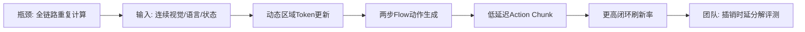
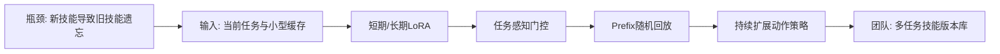
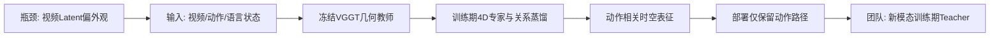
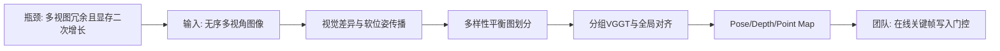
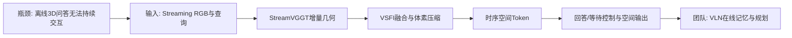

# 科研晨报：VLA全链路加速、VGGT几何蒸馏与在线空间交互

## 今日主线

今天是周日，常规论文发布密度较低。本期优先纳入截至今天早晨可检索到、且最近7天简报尚未覆盖的工作，重点不是再找一个更大的统一模型，而是梳理三条正在变清晰的技术变化：

1. **VLA加速开始从单模块优化走向感知—动作全链路协同。** 最新工作同时利用相邻帧视觉token冗余和flow action head的低秩时间结构，说明仅压缩视觉编码器无法解决端到端瓶颈。
2. **机器人长期学习需要区分短期可塑性与长期技能稳定性。** LifelongVLA说明，技能扩展不一定依赖保存完整历史轨迹，可以用双时间尺度LoRA和紧凑latent replay降低持续适配成本。
3. **VGGT正在从“直接输出几何”变成训练监督、视图组织器和在线空间先验。** MECo-WAM在训练时用VGGT约束动作相关4D几何，部署时移除几何分支；DA-VGGT则说明多视图数量并非越多越好，视角多样性和分组方式本身决定重建质量与计算成本。
4. **在线场景理解开始同时评测“答什么”和“何时回答”。** Stream3D-VLM将StreamVGGT几何先验、长序列token压缩和响应时机建模结合，为VLN、EQA和机器人场景记忆提供了比离线空间VQA更贴近真实运行的评测范式。

---

## 5条简报

### 1. Reducing Temporal Redundancy for Efficient Vision-Language-Action Inference

**一句话结论**：该工作同时压缩相邻帧视觉计算和flow action head采样步数，将10步动作生成压缩为2步，并把端到端推理从约293毫秒降至约112毫秒，说明VLA加速必须优先解决动作专家而非只做视觉token裁剪。

**为什么值得关注**：论文把VLA延迟拆成ViT、语言主干和Action Expert三部分。基线中动作专家约占212.6毫秒，是主要瓶颈；单独做视觉token复用只能将总时延从293.2毫秒降至282.9毫秒，而两步动作策略可降至123.9毫秒，两者结合后达到111.6毫秒、约9 FPS。真实双臂平台上，方法的平均成功率由97.2%小幅降至95.4%，但30秒内成功率由77.1%提高到82.3%，说明更快的闭环刷新能够改善限时任务效率。

**是否开源**：论文明确表示代码将发布，但截至本期检索尚未确认正式GitHub仓库、模型权重和训练数据开放。

**所需算力**：论文给出了推理分解，但HTML正文未明确披露训练GPU配置。谨慎判断：该方法基于已有flow-VLA进行效率导向训练和轻量适配，成本明显低于从头预训练VLA；推理实验报告约1.23 TFLOPs、111.6毫秒总延迟。真实平台输入来自头部和腕部三路RGB-D相机。

**输入/输出**：输入为连续RGB/RGB-D观测、语言指令和机器人状态；输出为笛卡尔或关节空间action chunk。中间过程包括跨帧缓存视觉token、动态区域token更新和两步flow轨迹重建。

**核心 insight**：相邻机器人观测中大部分视觉token余弦相似度超过0.98，而flow velocity序列的能量主要集中在前两个主成分，因此“全帧重复编码”和“多步动作细化”都存在可压缩的时间冗余。

**思路来源与前序瓶颈**：它由VLA-Cache、token pruning、diffusion/flow distillation等路线发展而来。前序方法常只优化视觉或语言模块，但在现代flow-VLA中，Action Expert才是主要延迟来源；因此单模块加速容易发生Amdahl定律式的收益饱和。

**对团队启发**：可在StarVLA、π0.x或VLA-Adapter上建立统一profiling，先测ViT、LLM、Action Expert、通信与机器人执行各自占比。插销和装配任务应增加`SR@固定时间`、reaction latency、卡滞后首次纠偏时间和单位时间成功次数，而不是只比较最终成功率。

**来源**：[arXiv](https://arxiv.org/abs/2607.12287) · [HTML](https://arxiv.org/html/2607.12287)

#### 总览图（Mermaid）

---

### 2. Towards Human-like Physical Intelligence: Lifelong Vision-Language-Action Learning for Robotic Manipulation

**一句话结论**：LifelongVLA用短期与长期两套LoRA通路分别承担新技能学习和旧技能巩固，并用prefix latent cache替代完整轨迹回放，为机器人持续增加抓取、插入和装配技能提供了低存储方案。

**为什么值得关注**：大多数VLA默认训练结束后技能集合固定，但真实实验室机器人会持续增加新对象、新工具和新操作。如果直接顺序微调，论文实验中平均成功率只有7.8%，遗忘率达到76.8%；LifelongVLA在10个连续技能上达到83.2%平均成功率和11.4%遗忘率。相比原始数据回放约167.62 MiB/任务，latent replay降低到95.70 MiB/任务。

**是否开源**：论文与HTML已公开，但截至本期未检索到官方代码仓库、模型权重或数据下载入口。

**所需算力**：论文没有明确报告GPU型号与训练时长。模型冻结VLA主干，只训练双LoRA和任务感知门控，约99.97M可训练参数；因此更接近参数高效连续微调，而非完整VLA重训。推理时在权重层完成两套LoRA组合，仍只需一次VLA前向传播。

**输入/输出**：输入为当前任务的视觉、语言、机器人状态与动作监督，以及有限的历史prefix缓存；输出为连续action chunk。长期记忆不是原始图像视频，而是停止梯度的视觉语言prefix token与紧凑状态—动作监督。

**核心 insight**：新任务快速适应和旧任务稳定保持是不同时间尺度的问题，不应强迫一套adapter同时承担。历史回放也不需要固定缓存完整diffusion suffix；保留prefix锚点、重新采样噪声并用当前模型重建suffix，能够降低过时表示带来的偏差。

**思路来源与前序瓶颈**：该工作结合持续学习、LoRA路由、经验回放和diffusion policy。传统持续学习方法面向分类或短输出任务，未处理图像轨迹存储昂贵、action chunk时序耦合和生成式动作suffix易失效等VLA特有问题。

**对团队启发**：团队可建立“技能版本库”而不是每个任务单独训练一套模型。短期LoRA负责新透明物体、特定插销或新传感器适配；长期LoRA负责稳定抓取、接近、对准和接触恢复。历史缓存可增加失败类型、接触峰值和恢复片段，研究失败样本是否比随机成功样本更值得进入长期记忆。

**来源**：[arXiv](https://arxiv.org/abs/2607.14852) · [HTML](https://arxiv.org/html/2607.14852)

#### 总览图（Mermaid）

---

### 3. Learning 4D Geometric Priors for Inference-Efficient World Action Models

**一句话结论**：MECo-WAM在训练阶段用冻结VGGT监督动作相关4D几何关系，部署阶段完全移除VGGT和4D专家，在不增加推理图复杂度的情况下提升WAM操作性能。

**为什么值得关注**：已有WAM通常联合预测未来视频和动作，但视频latent偏重外观重建，未必保留抓取、接触和相对位姿所需的时间几何。MECo-WAM增加约0.45B参数的训练期4D专家，以VGGT-1B提供当前与未来帧几何关系监督，并用动作相关权重强调机械臂、目标物和接触区域。部署时仅保留原视频与动作专家，在LIBERO达到98.2%，RoboTwin 2.0达到92.6%。

**是否开源**：论文已公开；截至本期没有确认该论文独立代码、模型权重或训练数据正式发布。

**所需算力**：完整训练采用64张NVIDIA H20 96GB，基础视频骨干为Wan2.2-TI2V-5B，动作专家约1B、辅助4D专家约0.45B，并使用冻结VGGT-1B教师。推理采用单张RTX 5090 32GB、10步去噪。该完整配置不适合团队直接从头复现，但其几何蒸馏思想可以缩小到现有VLA/WAM骨干。

**输入/输出**：训练输入是当前与未来RGB帧、语言/状态和动作chunk；VGGT输出训练监督用的几何token与关系矩阵。部署输入恢复为普通观测—语言—状态，输出动作chunk；不输出显式point cloud、depth或3DGS。

**核心 insight**：VGGT最有价值的用法不一定是部署时增加一个昂贵3D分支，而可以作为训练期teacher，约束“物体—夹爪—目标”的相对结构及其时间变化。通过逐渐衰减几何读取权限，能够避免策略在部署时依赖不存在的辅助输入。

**思路来源与前序瓶颈**：它从视频—动作联合建模、Fast-WAM和几何蒸馏路线发展而来。前序WAM容易把能力投入到未来画面纹理与外观预测，而显式4D解码又增加推理成本，且可能优化与动作弱相关的几何区域。

**对团队启发**：可设计轻量版`VGGT-Teacher WAM`：不用训练完整视频生成模型，只蒸馏孔—销相对位姿、对象深度排序、遮挡关系、接触区域和偏振法线变化。红外、偏振与触觉也可作为训练期teacher；部署时根据传感器成本选择移除或只保留高频触觉支路。

**来源**：[arXiv](https://arxiv.org/abs/2607.05468) · [HTML](https://arxiv.org/html/2607.05468)

#### 总览图（Mermaid）

---

### 4. Diversity-aware View Partitioning for Scalable VGGT

**一句话结论**：该工作证明VGGT输入视图并非越多越好；重复或集中在相似位置的图像会稀释有效几何信号，通过无训练的多样性感知分组可同时降低显存、延迟并改善长序列重建。

**为什么值得关注**：现有VGGT长序列路线常优先改attention、token或KV cache，但这篇工作从输入组织入手：根据视觉差异和空间分散度，把无序图像分成平衡且互补的视图组，再分别推理并对齐。500帧ScanNet-50上，VGGT重建延迟由155.97秒降至59.73秒，显存由28.53GB降至19.13GB；1000帧时，VGGT从69.56GB、584.72秒降至18.32GB、87.32秒。

**是否开源**：论文和项目页已经公开；截至本期项目页未显示明确的代码仓库链接，因此代码开放状态仍需继续跟踪。

**所需算力**：方法training-free，不需要额外训练。实验在单张A100 80GB上完成；计算主要来自视觉相似度、软位姿传播、图划分和分组VGGT推理。1000帧仍属于离线批量多视图处理，不应直接称为实时streaming。

**输入/输出**：输入是无序或长序列多视角RGB图像，不要求预先提供完整相机位姿；输出仍为VGGT风格camera pose、multi-view depth、point map和重建结果。中间表示是视觉相似图、近似空间关系和多样性平衡的视图分组。

**核心 insight**：全局attention中的冗余视图不只是浪费算力，还会让大量相似token稀释少量关键基线和新视角的几何信息。长序列系统因此需要“选择什么看、哪些图共同看”，而不仅是压缩每一帧token。

**思路来源与前序瓶颈**：该路线连接经典SfM的视图选择、图划分与VGGT类feed-forward多视图推理。DUSt3R/MASt3R依赖成对预测与全局对齐，VGGT可联合处理多视图，但二次复杂度和视图冗余限制其扩展；现有时间切块方法又依赖有序序列和回环。

**对团队启发**：陈瑞阳方向可把“视图多样性”变成在线写入门控。全景相机提供大FoV，但相邻全景可能高度冗余；应按视差、视线覆盖、对象新出现率和任务相关区域选择写入VGGT/3DGS记忆。还可比较Co-VGGT共视分数、视觉差异和位姿不确定性三种关键帧策略。

**来源**：[arXiv](https://arxiv.org/abs/2607.01885) · [项目页](https://jspark1213.github.io/DA-VGGT/) · [HTML](https://arxiv.org/html/2607.01885)

#### 总览图（Mermaid）

---

### 5. Stream3D-VLM: Online 3D Spatial Understanding with Incremental Geometry Priors

**一句话结论**：Stream3D-VLM把StreamVGGT的增量几何、几何自适应token压缩和“何时响应”决策统一起来，使在线空间理解从离线视频问答转向真正的过去回忆、当前感知和未来条件监测。

**为什么值得关注**：该系统输入逐帧视频流，StreamVGGT持续提供几何与camera token，VSFI模块将其注入视觉语义特征，GAVC依据三维体素位置压缩长上下文。作者构建超过100万条时空3D问答，以及29类任务、518段视频和约1万测试样本的Stream3D-Bench。评测首次系统加入Answer-Timing Accuracy、TTFT、端到端延迟和显存。4B版本在1 FPS设置下TTFT约43毫秒、端到端回答延迟约0.24秒、显存20.7GB；8B版本分别约62毫秒、0.39秒和36.6GB。

**是否开源**：训练与推理代码、Stream3D-VLM-4B权重、Stream3D-1M标注和Stream3D-Bench均已公开。受原始数据许可限制，仓库主要提供标注，源视频需按对应数据集规则自行获取。

**所需算力**：论文未披露完整训练GPU数量与时长。模型由Qwen2.5-VL-3B/7B和StreamVGGT-1B组成，视觉编码器与空间编码器冻结，VSFI和LLM主干参与训练；完整微调仍需要多卡大显存。推理4B模型约20.7GB显存，团队单张4090可尝试，但还需考虑StreamVGGT与视频缓存的峰值占用。

**输入/输出**：运行输入是单目RGB视频流与语言查询；训练数据生成阶段使用RGB-D、相机参数和3D实例标注计算监督。输出包括空间问答、对象—相机关系、路径/旋转估计、对象出现顺序，以及是否继续等待或立即回答的控制token。底层可输出StreamVGGT camera、depth和point cloud用于可视化，但主任务输出是在线语言空间理解结果。

**核心 insight**：在线空间智能不应每帧都回答，也不能反复重算所有历史。模型需要同时学习三件事：当前几何如何与历史对齐、哪些视觉token可以按3D位置合并、当前证据是否足以触发响应。

**思路来源与前序瓶颈**：它把VideoLLM-online的响应时机建模与StreamVGGT的增量几何结合。传统3D LMM依赖完整点云或离线视频片段，普通在线VideoLLM又缺少camera motion、尺度、遮挡和对象空间关系所需的三维先验。

**对团队启发**：这是陈瑞阳方向最值得直接复现的公开baseline。可将输出从语言回答继续扩展到VLN planner所需的对象、frontier、free-space、已探索区域和回环候选；同时把输入替换为全景视频，重点研究ERP畸变下的体素聚合、全局—局部token配额和FoV gap是否真正减少重复探索。

**来源**：[arXiv](https://arxiv.org/abs/2606.06891) · [项目页](https://stream3d-vlm.github.io/) · [代码](https://github.com/hanxunyu/Stream3D-VLM) · [模型](https://huggingface.co/JonnyYu828/Stream3D-VLM-4B)

#### 总览图（Mermaid）

---

## 三条主线映射

| 主线 | 今日覆盖 | 关键判断 |
|---|---|---|
| 具身模型 | Temporal Redundancy VLA、LifelongVLA、MECo-WAM | 高效部署需要同时优化视觉刷新、动作采样和技能更新成本；长期使用还必须控制灾难性遗忘。 |
| 场景理解模型 | DA-VGGT、Stream3D-VLM、MECo-WAM | VGGT不只输出pose/depth/point map，还可以作为视图选择依据、在线几何先验和训练期4D教师。 |
| 生成感知模型 | MECo-WAM、Stream3D-VLM | 世界预测正在从未来RGB转向动作相关时空关系；在线模型需要有界memory、token压缩和响应时机控制。 |
| 横向全景模态 | 延展到DA-VGGT与Stream3D-VLM | 全景真正的增益应体现在更少重复探索和更完整全局覆盖，但相邻ERP帧冗余更高，必须配合视图选择与球面几何压缩。 |

---

## 组会讨论题

1. **我们当前VLA的主要瓶颈究竟在哪一段？** 应在同一真机任务上测量视觉编码、语言主干、动作专家、传输、机器人执行和传感器同步，而不是直接假设大模型主干最慢。
2. **插销和装配是否需要终身学习协议？** 新物体、新孔径、新材质和新传感器加入后，应该报告新技能学习速度、旧技能遗忘率和缓存成本。
3. **VGGT接入WAM时，应作为部署输入还是训练期教师？** 前者保留实时几何能力但增加延迟，后者更轻，但可能在极端红外、偏振和透明场景中丢失在线纠错信息。
4. **长序列VGGT应该优先做token压缩，还是优先做视图选择？** DA-VGGT表明冗余视图会损害几何；建议先减少无效帧，再压缩有效帧内部token。
5. **在线空间理解的评测是否必须包含“何时回答”？** 对EQA、VLN和机器人监测而言，过早回答、过晚回答和答错内容是三类不同失败。

---

## 可延展选题

### 1. 全链路VLA Latency Profiler

为StarVLA、π0.x、VLA-Adapter建立统一profiling工具，逐项记录ViT、LLM、Action Expert、相机同步、网络传输和机器人执行延迟，并增加reaction latency、stall rate、chunk freshness、SR@30s与能耗指标。可进一步比较视觉token复用、两步flow、异步执行和触觉高频支路的可叠加性。

### 2. Lifelong Multimodal VLA

将RGB、红外、偏振、触觉分别视为逐步新增的能力域，研究新模态接入是否导致旧RGB技能退化。使用双时间尺度LoRA：短期分支学习新模态，长期分支保持基础动作；缓存优先保留透明物体失败、插销卡滞和高力峰值片段。

### 3. VGGT-Teacher for Contact-Aware WAM

以MECo-WAM为基础，但不预测完整未来视频。训练目标改为孔—销相对位姿、表面法线变化、接触状态、可达性和遮挡关系；教师可组合VGGT、偏振法线和触觉接触图。部署时比较完全移除教师分支与保留轻量触觉分支的差异。

### 4. Diversity-Gated Streaming VGGT

将DA-VGGT从离线分组改为在线帧接纳策略。根据共视、视差、对象新颖性、位姿不确定性和任务相关性，决定新帧是丢弃、进入短期窗口还是写入长期3DGS/对象memory。重点测长序列显存、漂移、回环误匹配和VLN重复探索率。

### 5. Panorama-Stream3D-VLM

把透视视频替换为360度ERP视频，比较直接ERP编码、切分透视视图和球面token三种方案。新benchmark应覆盖环形边界、极区畸变、目标跨0度边界移动、全局—局部尺度切换和长程对象重定位，并验证全景是否真正降低FoV gap。

---

## 音频版旁白稿

今天的科研晨报继续围绕三条主线展开：具身模型的速度和持续学习，VGGT驱动的空间理解，以及面向在线记忆的生成感知模型。今天是周日，新的常规论文批次较少，因此本期没有为了追求日期而加入相关性较弱的工作，而是从最近可检索论文中筛出五篇尚未在最近七天简报中出现、并且能直接影响团队技术路线的工作。

第一篇关注VLA全链路加速，题目是Reducing Temporal Redundancy for Efficient Vision-Language-Action Inference。它的重要判断是，VLA里有两类时间冗余。第一类来自连续视频，相邻帧里绝大多数视觉token几乎没有变化；第二类来自flow动作生成，多步速度场更新其实主要位于一个很低维的子空间。作者因此只更新动态区域的视觉token，并把动作采样从十步压缩到两步。更关键的是，论文做了完整时延拆解：视觉token复用单独带来的总收益并不大，真正占用时间的是动作专家。两步动作生成加视觉复用后，端到端推理由接近三百毫秒降到一百一十毫秒左右。对我们来说，这说明下一步不应该笼统地说“VLA太慢”，而要先把视觉、语言、动作头、通信和机器人执行逐项测清楚。插销和装配任务也应增加固定时间内成功率、卡滞后的反应时间和单位时间完成数量。

第二篇是LifelongVLA。它解决的不是一次任务做得多好，而是机器人依次学习十个新技能后，前面的技能还能剩多少。直接顺序微调会发生非常严重的遗忘。LifelongVLA把适配拆成短期和长期两套LoRA：短期通路快速吸收当前技能，长期通路通过回放和蒸馏保持旧技能，再由任务感知门控动态组合。它还不保存完整历史图像和扩散suffix，而是只缓存视觉语言prefix与紧凑状态动作信息，在回放时重新采样噪声并重建后续动作表示。这个思路很适合实验室长期维护的机器人系统。未来加入新透明物体、新孔径、新材质或新传感器时，我们需要知道新能力是否破坏基础抓取和装配，而不是每个任务永久保存一套独立模型。

第三篇是MECo-WAM，也就是用四维几何先验训练高效世界动作模型。它直接回答了一个关键问题：VGGT是否必须在机器人部署时一直运行？作者的答案是否定的。训练阶段，冻结的VGGT为当前和未来帧提供几何关系监督，额外的四维专家学习物体、夹爪和目标之间的相对结构及其时间变化；训练结束后，VGGT和四维专家全部移除，部署仍然只保留原来的视频和动作路径。这样既利用了几何知识，又不增加推理成本。完整模型训练需要六十四张H20，团队不适合直接复现，但核心思想可以缩小。我们完全可以让VGGT、偏振法线和触觉接触图只在训练时充当教师，监督孔销相对位姿、接触状态和遮挡关系，最后把知识蒸馏进轻量动作模型。

第四篇是Diversity-aware View Partitioning for Scalable VGGT。它提出一个容易被忽视的结论：输入VGGT的图像并不是越多越好。大量相似视角会制造重复token，反而稀释真正有价值的几何基线。作者根据视觉差异和近似空间分散度，把视图划分成互补而平衡的小组。这个方法不需要训练，在一千帧实验中能够显著降低显存和运行时间，同时保持甚至改善几何精度。它对陈瑞阳的streaming方向非常重要。我们不应该把每一帧都写入长期记忆，而要判断这帧有没有新视角、新对象、新遮挡关系或新的任务信息。全景相机覆盖范围大，但相邻全景帧可能更加冗余，因此更需要视图接纳和关键帧门控。

第五篇是Stream3D-VLM。它把在线三维理解从“给完整视频后回答问题”，推进到逐帧接收视频，并学习什么时候应该回答。底层由StreamVGGT持续提供几何和相机token，中间用几何自适应体素压缩减少长序列视觉冗余，上层语言模型决定继续等待还是立即响应。作者还建立了超过一百万条时空问答和二十九类在线任务，并将回答时机准确率、首token延迟、端到端延迟和显存纳入评测。代码、四十亿参数模型、数据标注和benchmark都已经公开，是陈瑞阳方向最适合直接复现的一项工作。后续可以把它从空间问答扩展到导航规划，让模型输出对象、frontier、可通行区域和回环候选。

今天建议组会重点讨论三个问题。第一，我们的VLA主要延迟来自哪里，是否已经有逐模块的真机数据。第二，VGGT应该作为部署时持续运行的几何模块，还是作为训练期教师把知识蒸馏进动作策略。第三，在线场景记忆是否应从“所有帧都保存”转向“多样性门控写入、三维token压缩、任务查询时读取”。如果安排两个近期实验，建议优先做全链路VLA时延profiling，以及Stream3D-VLM加VGGT关键帧门控的在线导航baseline。

---

## 今日已覆盖论文列表

1. Reducing Temporal Redundancy for Efficient Vision-Language-Action Inference
2. Towards Human-like Physical Intelligence: Lifelong Vision-Language-Action Learning for Robotic Manipulation
3. Learning 4D Geometric Priors for Inference-Efficient World Action Models
4. Diversity-aware View Partitioning for Scalable VGGT
5. Stream3D-VLM: Online 3D Spatial Understanding with Incremental Geometry Priors
