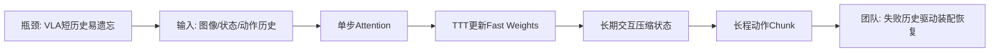
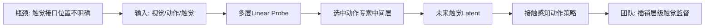
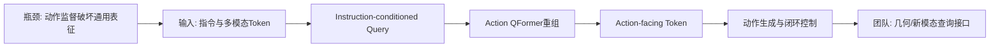
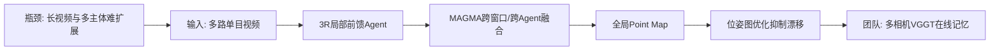
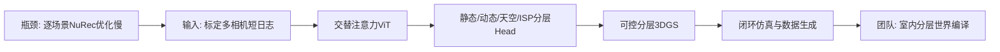

# 科研晨报：长上下文VLA、触觉表示对齐与分布式前馈三维重建

## 今日主线

今天是周一，最新可见论文主要来自上周四提交、周五进入公开列表的批次。本期已避开最近7天覆盖的 LifelongVLA、Stream3D-VLM、Reflex、SoftNav、VistaVLA、Co-VGGT、GeoGS-SLAM 等条目，重点关注五个新的技术信号：

1. **VLA的上下文长度正在成为新的扩展轴**：RoboTTT不再显式保存所有历史帧，而是把长期交互压缩到持续更新的fast weights中，使推理成本不随历史长度线性增长。
2. **新模态融合的关键问题从“接不接入”转向“接在哪一层”**：触觉预测最适合监督动作专家的中间层，而不是视觉语言主干或最终动作输出。
3. **动作监督可能反向破坏语言和目标定位能力**：Action QFormer说明，需要在通用多模态主干与动作生成之间建立专门的action-facing interface。
4. **前馈三维重建正在走向分布式与混合式系统**：MAGiSt3R用多智能体局部点图合并扩大场景覆盖，但仍需位姿图优化抑制长期漂移。
5. **前馈3DGS开始直接服务闭环仿真**：Instant NuRec把短时多相机日志一次前馈转为分层静态/动态Gaussian世界，但它仍是短日志批处理，不是真正逐帧streaming memory。

---

## 5条简报

### 1. RoboTTT: Context Scaling for Robot Policies

**一句话结论**：RoboTTT把最长8K步的机器人历史压缩进测试时持续更新的fast weights，在不让推理延迟随上下文长度增长的情况下，实现长程装配、失败恢复和一次人类视频模仿。

**为什么值得关注**：现有VLA通常只看当前帧或极短历史，长程任务中容易出现阶段混淆、忘记已完成步骤、看不到被遮挡物体时失去状态，以及失败后继续执行错误后续动作。RoboTTT在GR00T N1.7的DiT动作头中加入Test-Time Training层：单步attention处理当前观测，TTT层沿时间更新小型网络的fast weights，将历史压缩进参数空间。论文报告，相对单步上下文基线，三项真实双臂长程装配的平均任务完成度提升87%；8K上下文模型比1K上下文模型高约62%—63%，并首次完成持续约5分钟、包含10个阶段的完整装配任务。

**是否开源**：论文与NVIDIA官方项目页、演示视频已公开；截至本期检索，未确认训练代码、模型权重和完整数据正式发布。

**所需算力**：预训练逐步扩展到8K上下文，使用16张NVIDIA GB200训练30K步；下游任务以1K上下文再训练20K步。完整训练明显超出团队8×4090的合理预算。推理成本理论上对历史长度近似恒定，但仍继承GR00T N1.7视觉语言主干和DiT动作头的基础开销。

**输入/输出**：输入为语言指令、四路RGB图像、本体状态、历史观测和历史动作块；中间状态为每层TTT模块的fast weights；输出为连续动作chunk。

**核心 insight**：长历史不一定要以帧、token或KV cache形式完整保存。机器人历史高度重复，可以通过测试时梯度更新，将“过去发生了什么、之前为什么失败、当前处于哪个阶段”压缩到可持续更新的fast weights中。

**思路来源与前序瓶颈**：该路线来自长上下文语言模型、fast-weight sequence model、Test-Time Training和Algorithm Distillation。相比显式memory bank或短历史VLA，它试图同时解决上下文容量、历史利用和推理成本三个问题；相比普通DAgger，它不只学习人工纠正动作，还把失败动作作为上下文，蒸馏“失败到纠正”的映射。

**对团队启发**：不建议直接复现16×GB200版本，而应做轻量化验证：冻结StarVLA、π0.x或VLA-Adapter的大部分参数，只在action head中加入小型TTT/fast-weight adapter；把插销偏斜、装配漏步骤、抓取失败和触觉卡滞历史作为上下文，观察模型是否减少重复失败。评测应增加阶段识别准确率、失败后二次成功率、历史长度—成功率曲线和长任务累计延迟。

**可靠来源**：[arXiv](https://arxiv.org/abs/2607.15275) · [NVIDIA项目页](https://research.nvidia.com/labs/gear/robottt/)

#### 总览图（Mermaid）

---

### 2. Representation-Aligned Tactile Grounding for Contact-Rich Robotic Manipulation

**一句话结论**：触觉监督并非接得越多越好；未来触觉状态最适合从动作专家的中间表示预测，在该层加入轻量Latent Tactile Predictor比预测原始触觉或多层同时监督更有效。

**为什么值得关注**：接触密集任务中，视觉无法直接看到摩擦、滑移、卡滞、局部受力和插入深度。未来触觉预测可以迫使策略理解“当前动作将导致怎样的接触后果”，但VLA内部不同层承担的功能不同。作者通过linear probe发现，未来触觉在中间action-expert feature上最可预测，在视觉语言特征或最终动作状态上反而较弱。基于此，论文只在最匹配的中间层预测紧凑触觉embedding，避免直接重建高噪声原始触觉图像。

**是否开源**：论文已公开；截至本期检索，未确认正式代码、模型权重和数据集发布。

**所需算力**：论文摘要和公开页面未披露训练GPU。由于新增模块是轻量latent predictor，合理判断其增量训练成本显著低于重新训练VLA主干；但真实触觉数据采集和同步仍是主要成本。具体显存、训练时长和控制频率需等待代码或补充材料。

**输入/输出**：输入为视觉、语言、机器人状态、历史动作及触觉观测；训练时从action expert中间特征预测未来触觉latent；部署时主要输出机器人动作，触觉预测可作为辅助表征或接触风险信号。

**核心 insight**：多模态监督的效果由“表示语义是否对齐”决定。触觉描述的是动作导致的接触后果，因此最自然的监督位置不是通用视觉语义层，而是已经开始编码动作意图、但尚未压缩成最终控制量的中间动作层。

**思路来源与前序瓶颈**：该工作延续DreamTacVLA、触觉世界模型和辅助未来预测路线，但指出此前方法通常按架构直觉选择触觉接口，缺乏系统的层级可预测性分析；直接预测原始触觉也容易被传感器噪声、纹理和跨设备差异干扰。

**对团队启发**：触觉插销方向应先做layer probing，再决定融合位置。可分别从视觉主干、VLA中间动作层和最终action token预测下一时刻接触类别、滑移、偏心力和插入深度，比较线性可分性与下游控制收益。最值得优先验证的是：`中频VLA动作chunk + 中间层未来触觉latent监督 + 高频触觉残差控制器`。

**可靠来源**：[arXiv](https://arxiv.org/abs/2607.14609)

#### 总览图（Mermaid）

---

### 3. Action QFormer: Structured Representation Shaping under Action Supervision in Vision-Language-Action Models

**一句话结论**：Action QFormer在通用多模态主干和动作头之间加入指令条件查询接口，使动作监督主要重塑action-facing representation，而不是大范围改写语言理解与目标定位特征。

**为什么值得关注**：VLA微调通常把动作损失直接反传到视觉语言主干。这样虽然能形成可控制的动作表征，却可能破坏预训练模型原有的语言语义、对象定位和指令泛化能力。Action QFormer使用一组受指令条件控制的query，从继承的视觉语言表示中主动选择并重组与动作相关的信息。论文在零样本sim-to-real导航中，将平均闭环成功率从18.8%提高到56.3%，固定指令的动作生成正确率从22.5%提高到75.5%，并显著减少分布外指令生成。

**是否开源**：论文已公开；截至本期检索，未确认代码、权重或训练数据正式发布。

**所需算力**：公开摘要未给出GPU和训练时长。QFormer式接口通常远小于完整VLM主干，若冻结或低学习率微调主干，适合在8×4090上进行参数高效复现；但具体模型规模和推理延迟仍需等待实现。

**输入/输出**：输入为语言指令、视觉/多模态特征；Action QFormer输出固定数量、面向动作的查询token，再交给动作生成器输出导航或控制动作。

**核心 insight**：动作监督既是训练目标，也是会改变上游表征结构的强力梯度。VLA需要一个缓冲层，把“通用世界知识”和“任务动作表示”组织成可控的信息通道，避免动作模仿数据把预训练语义能力整体覆盖。

**思路来源与前序瓶颈**：该路线源于BLIP-2 Q-Former、Perceiver query和VLA adapter。前序VLA通常在多模态token后直接接action head，或对主干做大范围微调；瓶颈是动作分布容易诱导捷径学习，造成语言侧退化、目标grounding不稳和sim-to-real泛化差。

**对团队启发**：可构建“多源空间Action QFormer”：分别设置RGB、VGGT point-map、偏振法线、红外目标和触觉接触query，只输出固定数量action-relevant token。这样既能控制新模态token预算，也能分析每种模态在接近、对准、接触和恢复阶段被哪些query调用。

**可靠来源**：[arXiv](https://arxiv.org/abs/2607.14635)

#### 总览图（Mermaid）

---

### 4. MAGiSt3R: Multi-Agent Feed-forward 3D Reconstruction from Monocular RGB Videos

**一句话结论**：MAGiSt3R将多个单目视频流分别前馈重建为局部point map，再用MAGMA在智能体内和智能体间融合全局地图，整体接近10 FPS，但仍需pose graph optimization修正累计漂移。

**为什么值得关注**：现有DUSt3R、MASt3R、VGGT和3R类模型擅长处理单个图像集合或局部视频窗口，但长场景、多机器人、多相机并行采集时，单模型全局attention会遇到显存和时间瓶颈。MAGiSt3R把大问题拆成多个局部重建agent，各自处理单目视频并回归局部point map，再用专门的MAGMA融合模块完成intra-agent和inter-agent合并。它说明未来的大规模在线重建可能不是单个超长序列模型，而是“局部前馈专家 + 全局合并器”。

**是否开源**：论文已公开并标注ECCV 2026；截至本期检索，未找到正式代码、模型权重和数据发布入口。

**所需算力**：论文公开摘要只报告整体接近10 FPS，未明确GPU型号、训练资源和显存。由于包含多个3R前馈agent、跨agent合并和位姿图优化，实际成本取决于并行agent数量与窗口长度。对团队而言，单机多GPU或多进程分窗口推理较现实，从头训练合并模型的成本未知。

**输入/输出**：输入为一个或多个智能体采集的单目RGB视频；局部输出为point map和相机轨迹；MAGMA输出融合后的全局point map；pose graph optimization进一步修正相机漂移。

**是否真正streaming/feed-forward**：局部重建是feed-forward，且速度接近实时；但全系统包含全局合并和位姿图优化，因此应定义为**前馈主干驱动的混合式在线重建**，而不是纯feed-forward streaming。

**核心 insight**：长序列和多主体重建的扩展瓶颈可以通过地图级分治解决。与其让所有帧进入统一Transformer，不如让局部agent专注几何恢复，再学习一个能跨时间、跨设备对齐局部point map的合并器。

**思路来源与前序瓶颈**：该工作来自DUSt3R/MASt3R/VGGT/3R的局部feed-forward geometry，以及传统多机器人SLAM的子地图融合和pose graph optimization。前序基础模型速度快但全局漂移明显，传统多机器人SLAM可扩展却依赖手工特征和显式匹配；MAGiSt3R尝试把两者结合。

**对团队启发**：陈瑞阳方向可做 `Multi-Agent VGGT Memory`：单个机器人内部按窗口运行VGGT，多个相机、全景切片或多机器人各自产生局部point map；再用对象锚点、共视关系和语义特征融合子地图。VLN评测增加跨agent目标重定位、地图合并延迟、重复探索率和错误融合率。

**可靠来源**：[arXiv](https://arxiv.org/abs/2607.15211)

#### 总览图（Mermaid）

---

### 5. Instant NuRec: Feed-Forward 3D Gaussian Reconstruction for Driving Scene Simulation

**一句话结论**：Instant NuRec将10—20秒的标定多相机日志在约1.5秒内一次前馈转为可仿真的分层3DGS世界，证明feed-forward reconstruction可以直接成为闭环策略评测和合成数据基础设施。

**为什么值得关注**：传统NuRec和神经场景重建通常需要逐场景优化，难以快速把新采集日志转成可交互仿真环境。Instant NuRec使用类似Depth Anything v3的交替注意力ViT编码器和多个轻量decoder head，同时输出静态背景Gaussian、动态目标Gaussian、天空cubemap、相机ISP修正和运动相关属性，并通过3DGUT支持非针孔相机。论文报告在Waymo Open Dataset上比最强对比方法高2.01 dB，并可与AlpaSim集成做闭环仿真。

**是否开源**：代码、模型权重和NVIDIA NuRec集成文档均已公开。Hugging Face模型卡给出202M参数模型和约838 MB权重。

**所需算力**：模型支持最多90张输入图像，即5个视角×18帧，分辨率504×280。官方模型卡建议推理显存不少于30 GB、训练显存约80 GB，并建议单GPU算力达到约300 TFLOPS；因此4090 24 GB直接运行完整配置可能受限，团队可先减少相机数、帧数和分辨率，或采用多卡/更大显存GPU。论文报告特定设置下10—20秒场景约1.5秒完成，官方通用模型卡则更保守地描述为数分钟以内，实际速度需按数据预处理和Gaussian合并流程实测。

**输入/输出**：输入为已标定多相机RGB日志、相机6DoF位姿与内参，可选动态目标3D box轨迹；输出为静态/动态3D Gaussian PLY、天空表示、ISP校正和语义层信息。

**是否真正streaming/feed-forward**：它是单次feed-forward且无逐场景训练，但输入是完整短日志并可使用标定和可选动态轨迹，因此不属于严格因果streaming。它更接近“快速批量场景编译器”。

**核心 insight**：对闭环仿真而言，单一Gaussian集合不够，需要显式分离静态世界、动态参与者、天空和相机成像差异。前馈3DGS模型只有输出这些可控层，才能被策略评测系统真正使用。

**思路来源与前序瓶颈**：该工作继承Depth Anything式通用几何编码、GS-LRM式前馈Gaussian生成、NuRec逐场景神经重建和自动驾驶多相机仿真。前序方法要么快速但缺少动态/相机层建模，要么质量高却需要每个场景长期优化。

**对团队启发**：可将其“分层世界编译”思想迁移到室内具身场景：静态3DGS存家具与房间，动态层存人手、机械臂和可移动物体，传感器层存RGB、红外和偏振成像参数。对陈瑞阳方向，重点不是复现自动驾驶规模，而是探索 `短时多相机/VGGT几何 → 分层3DGS → VLN或VLA闭环回放`。

**可靠来源**：[arXiv](https://arxiv.org/abs/2607.14203) · [NVIDIA模型与权重](https://huggingface.co/nvidia/instant-nurec) · [NuRec文档](https://docs.nvidia.com/nurec/nurec/model.html)

#### 总览图（Mermaid）

---

## 三条主线映射

| 主线 | 今日覆盖 | 关键判断 |
|---|---|---|
| 具身模型 | RoboTTT、触觉表示对齐、Action QFormer | VLA下一阶段不只是更快：还要能利用长历史、保护预训练语义，并把触觉监督放到正确的动作表示层。 |
| 场景理解模型 | MAGiSt3R、Action QFormer | 3D基础模型的输出正从局部point map扩展到多agent全局融合；几何进入VLA时需要固定长度、动作导向的查询接口。 |
| 生成感知模型 | MAGiSt3R、Instant NuRec | 当前路线分成两类：因果/在线局部地图持续更新，以及短日志一次前馈编译为可仿真的3DGS世界；二者不能混称streaming。 |
| 横向全景模态 | 今日无新的高优先级全景论文 | 多agent局部地图融合天然适用于全景切片或多个鱼眼相机，但必须显式处理ERP/鱼眼投影、跨视角重叠和全局尺度一致性。 |

---

## 组会讨论题

1. **长程VLA应该采用fast weights、显式3D memory还是对象事件memory？** 三者分别擅长策略适应、几何一致性和任务可解释性，是否需要分层组合？
2. **触觉监督到底应该放在哪一层？** 是否应先用linear probe测未来触觉、接触状态和力误差在各层的可预测性，再决定网络连接？
3. **VGGT、新模态与VLA之间是否需要统一Action QFormer？** 点云、偏振法线、红外和触觉是否都压缩为固定数量的action-facing query token？
4. **MAGiSt3R式多agent融合能否解决长序列VGGT显存问题？** 哪些局部地图应合并，哪些应保留为独立子图，错误融合如何检测？
5. **Instant NuRec式短日志场景编译和真正streaming memory应如何分工？** 前者用于快速仿真与离线回放，后者用于真实机器人持续决策，二者是否共享同一3DGS表示？

---

## 可延展选题

### 1. TTT-VLA-Lite：失败历史驱动的轻量测试时适应

冻结VLA视觉语言主干，只在action head加入小型fast-weight模块。用插销偏斜、抓取滑落、装配漏步骤和触觉卡滞轨迹训练“失败—纠正”映射，比较短历史、显式memory token和TTT fast weights。

### 2. Layer-Probed Multimodal VLA

对RGB、VGGT geometry、偏振法线、红外和触觉分别做层级linear probe，测量对象位姿、接触状态、可达性和未来力信号在哪些网络层最可预测，再据此设计分层融合，而不是经验式拼接。

### 3. Geometry Action QFormer

将VGGT point map、对象级3D位置、frontier、偏振法线和触觉接触点，通过不同query组压缩为固定数量action-facing token。分析不同任务阶段的query注意力和模态调用率。

### 4. Multi-Agent StreamVGGT

每个相机、全景切片或机器人运行局部VGGT窗口，学习MAGMA式跨窗口融合器，并用轻量pose graph或对象锚点做全局校正。重点评测10分钟以上序列的显存、漂移、错误合并和VLN路径效率。

### 5. Indoor Instant-NuRec

将短时多相机室内日志快速编译为静态背景、可动物体、机械臂和传感器成像层。以真实抓取、插销和装配数据构建可回放闭环模拟器，用于策略回归测试和新模态消融。

### 6. 全景跟踪点

近期全景主线应重点寻找“全景局部前馈重建 + 子地图融合”而非单纯全景生成。可先把ERP切分为重叠透视/鱼眼视图，测试MAGiSt3R式融合是否比整幅ERP直接编码更稳定，并加入FoV gap、接缝区域漂移和跨房间错误融合指标。

---

## 音频版旁白稿

今天的科研晨报继续围绕具身模型、场景理解模型和生成感知模型三条主线展开。今天的五篇工作都指向一个共同趋势：机器人系统正在从只处理当前观测，转向利用长期历史、动作后果和分布式空间记忆；同时，新模态和三维表示也不再简单拼接到模型输入，而是开始强调应该放在哪一层、以什么形式进入动作决策。

第一篇是RoboTTT。现在大多数视觉语言动作模型只看当前帧或者很短的历史，这在抓放任务中可能够用，但在五分钟、十个阶段的装配任务里，模型很容易忘记已经完成了什么，也可能在某一步失败后直接跳到下一阶段。RoboTTT的核心做法不是保存八千步的完整历史token，而是在动作头里加入测试时训练层，把历史持续压缩进一组fast weights。每到一个新时刻，模型都会用当前交互更新这组快速参数，再利用更新后的参数生成动作。这样，历史长度可以增加，但推理成本不会随上下文线性增长。它在真实双臂装配中明显提升了任务完成度，还完成了此前基线无法完成的五分钟十阶段装配。对我们来说，最值得借鉴的不是直接复现十六张GB200的大规模训练，而是把小型fast-weight模块接到现有VLA动作头上，让模型记住插销偏斜、抓取滑落、装配漏步骤和触觉卡滞，并学习失败之后应该怎样修正。

第二篇关注触觉，但它提出的问题非常具体：触觉到底应该监督VLA的哪一层。作者先对不同网络层做线性探测，发现未来触觉状态在动作专家的中间层最容易预测，在视觉语言主干和最终动作输出上反而没有那么清晰。基于这个结果，他们只在中间动作表示上增加轻量的未来触觉latent预测，而不是重建高噪声的原始触觉图像。这个结论对我们的触觉插销任务非常重要。我们不应该一开始就把触觉图像和RGB一起塞进大模型，而应该先测接触类别、滑移、偏心力和插入深度在各层的可预测性，再决定接口位置。一个合理的结构是，中频VLA负责动作块，中间层通过未来触觉监督学习接触后果，高频残差控制器再根据实时触觉进行纠偏。

第三篇是Action QFormer。它研究的是动作监督对多模态主干的反作用。VLA微调时，动作损失会直接修改视觉语言表示，这有助于控制，却也可能破坏模型原本的语言理解、对象定位和指令泛化。Action QFormer在通用多模态主干和动作生成器之间加入一组受指令控制的查询token，只选择并重组对当前动作有用的信息。这样，动作监督主要改变面向动作的接口，而不是大范围重写上游表征。它在零样本仿真到真实导航中带来了明显提升。对团队来说，这可以进一步扩展成几何和新模态的统一入口：RGB、VGGT点图、偏振法线、红外目标和触觉接触分别由不同查询组读取，最后压缩成固定数量的action token。这样不仅节省算力，也能分析不同任务阶段到底使用了哪些模态。

第四篇是MAGiSt3R，它和陈瑞阳的在线重建方向高度相关。传统三维基础模型通常处理一个图像集合或者局部视频窗口，序列变长、相机变多以后，显存和全局漂移都会成为问题。MAGiSt3R采用多智能体结构，每个agent负责一段单目视频，前馈输出局部点图，再由MAGMA模块在智能体内部和智能体之间合并局部地图，最后用位姿图优化修正累计漂移。整体速度接近每秒十帧。它不是纯前馈系统，因为最后仍有优化，但它给出了很明确的扩展思路：长序列不一定要交给一个超长上下文Transformer，可以拆成多个局部VGGT窗口，再在地图层做融合。对于全景相机，也可以把不同方向或不同时间段看成多个局部agent。

第五篇是Instant NuRec。它把十到二十秒的标定多相机日志，在一次前馈中转成可仿真的三维Gaussian世界。与普通前馈3DGS不同，它不只输出一组Gaussian，而是区分静态背景、动态目标、天空和相机成像修正，因此可以直接接入闭环仿真系统。代码和模型权重已经公开，模型大约两亿参数，但完整配置建议至少三十GB推理显存。需要注意，它虽然是feed-forward，却不是真正逐帧streaming，因为它会一次读取完整短日志。对我们来说，它更适合作为快速场景编译器：把真实多相机采集转成可回放的室内环境，用来测试抓取、插销和装配策略；真实机器人在线决策仍需要另一套持续更新的场景记忆。

今天组会建议重点讨论三个问题。第一，长程任务的记忆应该分别由fast weights、显式三维地图和对象事件记忆承担什么功能。第二，新模态进入VLA之前，是否必须先做层级可预测性分析，再决定融合位置。第三，陈瑞阳的方向是否可以从单一长序列模型转向多窗口、多相机或多机器人局部重建，再通过学习式合并器和少量位姿图优化维护全局记忆。短期最值得启动的两个实验，一个是轻量TTT动作头的失败恢复实验，另一个是多窗口VGGT加地图融合器的在线VLN baseline。

---

## 今日已覆盖论文列表

1. RoboTTT: Context Scaling for Robot Policies
2. Representation-Aligned Tactile Grounding for Contact-Rich Robotic Manipulation
3. Action QFormer: Structured Representation Shaping under Action Supervision in Vision-Language-Action Models
4. MAGiSt3R: Multi-Agent Feed-forward 3D Reconstruction from Monocular RGB Videos
5. Instant NuRec: Feed-Forward 3D Gaussian Reconstruction for Driving Scene Simulation
