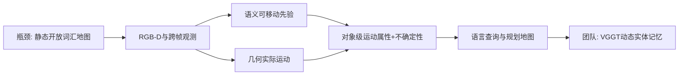
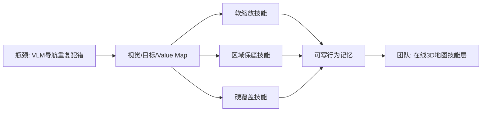
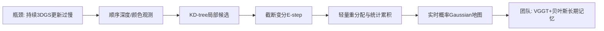

# 科研晨报 2026-07-21

## 今日主线

今天的5条工作来自2026年7月20日可见的最新arXiv机器人批次，并避开最近7天已经覆盖的RoboTTT、MAGiSt3R、Instant NuRec、Stream3D-VLM、Reflex、SoftNav、VistaVLA、Co-VGGT、GeoGS-SLAM等条目。

今天有三个明确判断：

1. **具身模型的下一轮扩展首先是数据规模，而不是继续堆复杂模块。** Xiaomi-Robotics-1用超过10万小时真实UMI轨迹证明，数据规模仍未明显饱和；同时，模型大小从2B扩展到10B也带来持续收益。
2. **具身评测正从“会不会执行”转向“能否理解物理约束并形成可执行策略”。** IMBench把感知、物理推理、动作生成和迭代执行放到同一任务链中，暴露VLM“会说不会做”和VLA“会模仿但不理解约束”的共同缺口。
3. **在线空间记忆需要同时表达几何、运动属性、行为规则与不确定性。** VLMM、SkillNav和ImprovedVBGS分别对应动态语义地图、可写行为记忆和持续三维地图更新，可组合成面向VLN的分层在线记忆系统。

## 5条简报

### 1. Xiaomi-Robotics-1：VLA的主要瓶颈仍然是规模化真实动作数据

**一句话结论**：Xiaomi-Robotics-1以超过10万小时真实UMI轨迹进行预训练，再用约1万小时跨本体数据做后训练，表明机器人策略在数据规模和模型规模上仍表现出持续、可迁移的scaling趋势。

**为什么值得关注**：该工作不是围绕某个小模块做改进，而是系统回答“大规模动作预训练是否能像语言模型一样转化为通用能力”。预训练数据覆盖1700多个场景，使用视觉语言模型自动标注夹爪和交互对象的状态变化；后训练则把“状态变化描述条件下的动作生成”对齐到机器人本体和命令式人类指令。模型在未见环境中可直接执行多类移动操作，并能以每项平均不足10小时的数据适配手机装箱、纸张补充、洗衣和装箱等新任务。

**是否开源**：GitHub仓库和Hugging Face入口已经建立，但截至7月21日，正式代码与Xiaomi-Robotics-1权重仍标注为即将发布；论文和项目页已公开。

**所需算力**：模型提供2.6B、5.1B和10.5B三种规模，动作通过5步Euler flow integration生成。论文未披露完整训练GPU规模；考虑10万小时数据、2B至10B参数和两阶段训练，完整复现属于工业级集群任务，明显超出8×4090。团队可重点复现2B版本的微调接口、自动状态转移标注和跨本体动作对齐，而非从头预训练。

**输入/输出**：输入为当前视觉观测、语言指令和机器人本体状态；输出为统一动作向量中的连续action chunk。架构由Qwen3-VL视觉语言主干和较小的DiT动作专家组成。

**核心insight**：UMI数据的价值不只是数量大，而是能脱离固定机器人本体扩大环境和任务多样性；通过状态转移语言标注，模型学习“如何把当前场景变成目标状态”，再在后训练中对齐具体机器人。

**思路来源**：延续Open X-Embodiment、UMI、π0和Mixture-of-Transformers路线。前序瓶颈是机器人遥操作数据昂贵、环境单一、语言标注难扩展，模型容易在小规模本体数据上过拟合。

**对团队启发**：团队无法复制10万小时规模，但可以复制其数据逻辑：统一采集不同机械臂、不同模态和不同场景的“状态变化片段”，用VLM自动生成细粒度状态转移描述，再以少量真实机器人数据完成本体对齐。偏振、红外和触觉应成为状态变化的附加证据，而不是每项任务独立重训一个模型。

**来源**：[论文](https://arxiv.org/abs/2607.15330) · [项目页](https://robotics.xiaomi.com/xiaomi-robotics-1.html) · [代码仓库](https://github.com/XiaomiRobotics/Xiaomi-Robotics-1)

#### 总览图（Mermaid）

### 2. IMBench：具身评测开始测“直觉物理”，而不只是模仿成功率

**一句话结论**：IMBench用35个任务、7类直觉物理原则和1.4万条示教，联合评估场景理解、物理推理、可执行规划和闭环操作，揭示现有VLM与策略模型在“理解—推断—行动”链条上存在明显断裂。

**为什么值得关注**：现有benchmark通常把推理和控制分开：VLM回答物理问题但不执行，VLA执行动作却不需解释物理约束。IMBench覆盖几何受限抓取、运动轨迹预测、间接因果作用、工具使用、隐藏状态探测、扰动恢复和稳定性控制。官网显示，最佳VLM在早期推理阶段得分仍不足75%，而策略基线最佳成功率仅约24%。

**是否开源**：数据集、评测工具、脚本化oracle轨迹、OOD划分和LeRobot格式示教已通过项目页开放。

**所需算力**：benchmark本身不要求训练统一大模型。VLM评测可通过API或本地模型完成；策略训练取决于所选ACT、Diffusion Policy或VLA。1.4万轨迹规模适合单机多卡或8×4090训练中型策略，但论文未给出统一训练硬件。

**输入/输出**：输入根据任务包括RGB/状态/任务描述和物理环境；输出可以是VLM的结构化推理答案，也可以是策略的连续动作序列。最终指标同时看物理约束满足和任务完成。

**核心insight**：具身智能真正缺少的是把物理理解转成可执行动作，并在扰动后重新推理的能力；单纯的视觉语义理解或轨迹模仿都不足以覆盖这一链条。

**思路来源**：连接物理推理benchmark、工具使用、接触密集操作和反应式控制。前序benchmark通常只测静态问答、标准抓放或固定轨迹分布，无法判断模型是否理解为什么某种动作会失败。

**对团队启发**：插销、装配、透明与反光操作可以按IMBench重构评测：先测孔轴线、接触可行性和遮挡理解，再测动作计划，最后测闭环执行与失败恢复。红外、偏振和触觉的信息增益应分别落到“理解、推断、行动”哪一环，而不是只报最终成功率。

**来源**：[论文](https://arxiv.org/abs/2607.15641) · [项目与数据](https://imbench.org/)

#### 总览图（Mermaid）

### 3. Vision-Language-Motion Maps：三维地图需要回答“什么会动、什么正在动”

**一句话结论**：VLMM为三维场景中的每个对象维护语义可移动先验、实际跨帧运动、运动类别和不确定性，使机器人能够用自然语言查询“什么正在移动”“哪些东西可能移动”以及“哪些区域保持静止”。

**为什么值得关注**：开放词汇地图过去主要回答what和where，但VLN、EQA与操作规划还需要理解场景元素的动态属性。VLMM明确区分两种不能互相替代的信息：语义先验能回答对象是否可能移动，但不能确认当前是否在动；跨帧几何能观测当前运动，却不能判断尚未发生运动的对象是否可移动。论文还显式维护不确定性，减少噪声位姿和动态分割造成的误报。

**是否开源**：论文未给出正式代码仓库，当前按代码、模型和处理脚本未确认公开处理。

**所需算力**：系统在单张RTX 4060 8GB上完成全部实验。其语义通道使用OpenCLIP ViT-B/16，运动通道使用RAFT，实例分割使用YOLOv8-seg；通过缓存关键帧特征和按类别缓存可移动先验，将显存控制在笔记本GPU范围内。

**输入/输出**：输入为RGB-D序列、相机位姿或估计位姿、实例掩码与跨帧光流；输出是对象级三维地图，每个对象带有movability prior、observed motion、motion class和uncertainty，可按需栅格化为规划地图。

**核心insight**：动态空间理解不应被压缩成一个“运动分数”。可能移动、已经移动和确定静止是不同语义，且必须附带置信度，才能被导航和操作系统安全使用。

**思路来源**：来自开放词汇语义地图、动态SLAM、光流和对象级scene graph。前序系统通常只有语义或几何运动中的一种，且缺少可校准不确定性。

**对团队启发**：可将VGGT或StreamVGGT作为几何层，替代当前RGB-D与外部pose模块；对象层再维护“可移动性、实际运动、最后位置和置信度”。这会让VLN规划器区分固定障碍、可能开启的门、被移动的椅子和动态人员，也适合EQA查询场景变化。

**来源**：[论文](https://arxiv.org/abs/2607.16173)

#### 总览图（Mermaid）

### 4. SkillNav：把导航经验写进地图，而不是不断扩大prompt

**一句话结论**：SkillNav将VLM导航器已有的curiosity value map变成可写行为记忆，使用分数缩放、区域保底和硬覆盖三类技能直接干预地图，从而以零训练、零额外地图token成本修复死胡同、房间内循环和目标绕行。

**为什么值得关注**：许多VLM导航器使用单帧或短上下文做决策，反复出现同类错误。继续向prompt中堆历史不仅成本高，也难表达角度、地图单元和视点坐标。SkillNav把空间行为信息留在地图上，只用短prompt保留类别语义，实现“空间记忆在地图、语义记忆在文本”的双表示。

**是否开源**：arXiv页面尚未列出正式代码、模型或benchmark脚本入口，当前公开状态未确认。

**所需算力**：方法本身training-free，不需要微调VLM；额外计算只是对已有value map进行分数级修改，主要算力仍取决于底层VLM导航器。论文未披露具体GPU和单步延迟。

**输入/输出**：输入为目标类别、当前视觉观测、已有curiosity/value map和历史行为状态；输出为被技能干预后的导航分数图或强制动作。技能包括软缩放、区域下界提升和阈值触发的硬覆盖。

**核心insight**：导航中的许多失败不是缺少更强语义模型，而是缺少可组合的行为记忆与优先级规则；地图本身可以作为低成本、结构化的技能载体。

**思路来源**：来自VLM ObjectNav、frontier/value map、行为树和ASPIRE式可沉淀技能。前序prompt修复方法token成本高，技能之间优先级不清晰，也难编码连续空间信号。

**对团队启发**：这与陈瑞阳的在线重建路线可以直接结合：VGGT/3DGS负责构建可达区域与对象位置，SkillNav式技能层负责写入“死路惩罚、未探索区域提升、目标附近精搜、失败位置回避”等分数。新技能无需重新训练空间模型或VLM。

**来源**：[论文](https://arxiv.org/abs/2607.15758)

#### 总览图（Mermaid）

### 5. ImprovedVBGS：持续3DGS可在消费级GPU上进入实时更新区间

**一句话结论**：ImprovedVBGS通过空间截断变分推断、候选重分配复用和静态张量填充，将持续Variational Bayes Gaussian Splatting的核心逐帧更新从约84秒降到约0.05秒，并保持无需回放缓冲区的持续学习特性。

**为什么值得关注**：多数在线3DGS依赖梯度优化和历史帧回放，长期运行时显存和计算量随序列增长。VBGS通过累积充分统计量进行顺序无关的贝叶斯更新，理论上不会灾难性遗忘，也无需保存旧帧；但原始实现需要让每个点和所有Gaussian计算责任度，速度太慢。ImprovedVBGS用KD-tree只保留空间邻近候选，并消除动态形状导致的JAX重复编译。

**是否开源**：代码已经公开，采用CC BY 4.0论文许可；仓库提供实现与构建记录。

**所需算力**：所有实验在单张RTX 3070 Ti 8GB上完成。核心截断E-step可到约0.05秒/帧；包含重分配的完整配置依实现选择约0.107至0.133秒/帧。需要强调：当前实验主要基于NeRF Synthetic的带位姿、带深度点数据，不等同于从无位姿RGB流端到端实时建图。

**输入/输出**：输入为顺序到达的三维位置与颜色观测，实际系统通常需要深度和相机位姿；输出为持续更新的概率Gaussian混合场，可用于新视角合成。它不直接估计pose，也不使用VGGT式feed-forward几何。

**核心insight**：在线3DGS不一定依赖反向传播和历史回放；如果用贝叶斯充分统计量维护场景，只需将新观测分配给局部Gaussian候选，就可以获得有界历史成本的持续更新。

**思路来源**：来自VBGS、持续Gaussian Splatting和边缘端地图更新。前序方法要么依赖全历史回放，要么进行局部梯度优化，仍会增加长期内存或计算成本。

**对团队启发**：可构建“VGGT负责无位姿几何初始化，ImprovedVBGS负责持续概率更新”的混合系统。VGGT输出point map、pose和置信度，VBGS累积局部Gaussian及不确定性；再将对象和语义层交给VLMM/SkillNav。这比把全部历史帧保存在attention或replay buffer中更适合长程VLN。

**来源**：[论文](https://arxiv.org/abs/2607.15542) · [代码](https://github.com/damanimc/ImprovedVBGS)

#### 总览图（Mermaid）

## 三条主线映射

| 主线 | 今日覆盖 | 关键判断 |
|---|---|---|
| 具身模型 | Xiaomi-Robotics-1、IMBench | VLA能力继续受益于数据规模；评测必须覆盖物理推理到闭环执行的完整链条。 |
| 场景理解模型 | Vision-Language-Motion Maps | 场景理解应从静态what/where扩展到可移动性、实际运动及不确定性。 |
| 生成感知模型 | ImprovedVBGS、SkillNav | 长期系统应将几何更新、动态对象属性与行为技能分层维护，而不是把所有历史存入单一神经记忆。 |
| 横向全景模态 | 今日无高优先级新全景论文 | 可在延展实验中使用360图初始化全局地图，再由VGGT和贝叶斯Gaussian持续更新。 |

## 组会讨论题

1. 团队是否应从“每个任务采一套数据”转为积累跨任务、跨本体的状态变化片段，并统一自动语言标注？
2. 插销和装配benchmark能否拆为理解、推断、行动、恢复四阶段，从而明确偏振、红外和触觉分别贡献在哪一环？
3. 在线空间记忆是否应固定为三层：VGGT/3DGS几何层、VLMM动态实体层、SkillNav行为技能层？
4. ImprovedVBGS的概率更新能否作为StreamVGGT的长期地图后端，并利用其不确定性决定何时重新调用VGGT？
5. SkillNav的规则式技能与ASPIRE的程序技能能否合并：前者快速修改地图分数，后者负责高层失败诊断和技能生成？

## 可延展选题

### 选题1：State-Transition Pretraining Lite

把组内不同机器人、仿真和人手UMI视频切为固定时长片段，自动生成“当前状态—动作—目标状态”描述。先冻结VLM，只训练轻量action prior或adapter，检验跨任务数据是否改善透明抓取、插销和装配的少样本适配。

### 选题2：IMBench-style Multimodal Assembly

围绕插销、板件装配、透明膜和反光物体设计理解题、策略题和执行任务。分别屏蔽RGB、偏振、红外、深度和触觉，测量空间判断、物理计划、动作成功率和失败恢复的变化。

### 选题3：VGGT–VLMM Dynamic Memory

VGGT处理局部无位姿窗口，输出point map与相机；对象层融合语义可移动先验、跨帧实际运动和不确定性，形成可查询动态三维地图。评测EQA中的状态变化问题与VLN中的动态障碍重规划。

### 选题4：Skill-Writeable 3D Navigation Map

将SkillNav从二维curiosity map扩展到对象级3D memory：死路、失败位置、目标附近精搜区和未探索frontier均作为可写字段，比较prompt历史、规则技能和学习式技能对SPL与token成本的影响。

### 选题5：VGGT + Bayesian Gaussian Memory

VGGT低频输出pose、point map和置信度；ImprovedVBGS高频或事件触发地累积Gaussian充分统计；对象与语义仅在查询时激活。重点测长序列显存增长、地图更新时间、回环误差、对象重定位和VLN路径效率。

## 音频版旁白稿

今天的科研晨报继续围绕具身模型、场景理解模型和生成感知模型三条主线展开。今天的五项工作共同指向一个趋势：具身智能正在同时向两个方向扩展。一端是更大规模的动作数据和更完整的物理能力评测，另一端是更紧凑、更可持续更新的在线空间记忆。

第一项是Xiaomi-Robotics-1。这项工作的核心不是某个新的动作头，而是超过十万小时真实UMI轨迹带来的规模效应。模型先用手持夹爪数据学习如何把当前场景变成语言描述的目标状态，再用跨本体机器人数据完成对齐。论文显示，数据从小规模增加到两万小时实验子集时，性能仍持续提升；模型从二十多亿参数扩大到一百多亿参数时，未见环境成功率也继续上升。对我们来说，最值得复制的不是数据绝对规模，而是状态变化片段的组织方式。以后不同学生采集的机器人、仿真、红外、偏振和触觉数据，可以统一描述为当前状态、动作和目标状态，而不是各自形成封闭任务数据集。

第二项是IMBench。它试图回答机器人是否拥有直觉物理能力。很多视觉语言模型能够解释一个任务为什么困难，却无法产生真正可执行的动作；很多操作策略能够重复示教，却不理解几何、因果和稳定性约束。IMBench设计了几何受限抓取、运动预测、工具使用、隐藏状态探测、扰动恢复和稳定控制等三十五项任务，把理解、推断和行动放在同一个评测链中。这个框架特别适合我们的插销和装配任务。我们可以先问模型孔在哪里、为什么不能直接插入、应该如何对准，再看它能否真正完成动作，并在卡滞后恢复。

第三项是Vision-Language-Motion Maps。传统开放词汇地图主要回答场景中有什么、东西在哪里，但动态环境还需要知道什么可能移动、什么正在移动以及判断有多可靠。这个工作给每个三维对象附加语义可移动先验、实际跨帧运动、运动类别和不确定性。语义先验和实际运动不能互相替代：一扇门可能可以打开，但当前并没有动；一个人正在移动，但不能只靠类别先验判断他的当前轨迹。对于在线VLN，这种对象级动态属性比单纯的语义点云更接近规划需求。

第四项是SkillNav。它不重新训练视觉语言模型，而是把导航器已有的价值地图变成可写的行为记忆。遇到死胡同，可以降低对应区域的分数；出现房间内循环，可以保证新区域获得最低探索权重；目标已经发现时，可以用硬规则覆盖普通探索策略。其重要启发是，空间行为记忆不必全部转成文本prompt。地图负责角度、位置和区域优先级，短prompt只负责类别语义。这个思路可以直接接在陈瑞阳的在线三维地图后面，形成一个不需要频繁微调的技能层。

第五项是ImprovedVBGS。它把持续Gaussian地图更新从几十秒级压缩到消费级显卡上的零点一秒左右。与常规3DGS不同，Variational Bayes Gaussian Splatting通过累积充分统计量持续吸收新观测，不需要保存历史帧，也不会因为只看新数据而覆盖旧场景。原始方法的问题是每个点都要和所有Gaussian比较，成本随地图增长。新方法只检查空间邻近候选，并消除重复编译开销。它还不能从无位姿RGB视频直接工作，但非常适合作为VGGT之后的长期地图后端：VGGT提供位姿和点图，贝叶斯Gaussian负责持续更新和不确定性。

今天建议组会集中讨论三个问题。第一，我们是否应该建立跨任务的状态变化数据格式，为未来的大规模动作预训练做准备。第二，插销、装配、透明和反光操作是否应采用理解、推断、执行和恢复四阶段评测。第三，在线VLN记忆是否可以固定成三层：底层是VGGT和Gaussian几何，中层是对象运动与不确定性，上层是可写的导航技能。这样的结构能够把我们的三条研究主线真正连接起来。

## 今日已覆盖论文列表

1. Xiaomi-Robotics-1: Scaling Vision-Language-Action Models with over 100K Hours of Real-World Trajectories
2. IMBench: A Benchmark for Intuitive Robotic Manipulation
3. Vision-Language-Motion Maps: An Open-Vocabulary, Uncertainty-Aware, Queryable Motion Attribute for 3D Scene Maps
4. SkillNav: Score-Level Skill Intervention for Zero-Shot Object Goal Navigation
5. ImprovedVBGS: Real-time Continual Variational Bayes Gaussian Splatting
